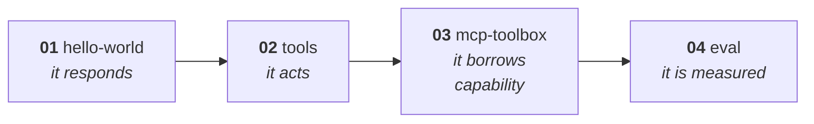
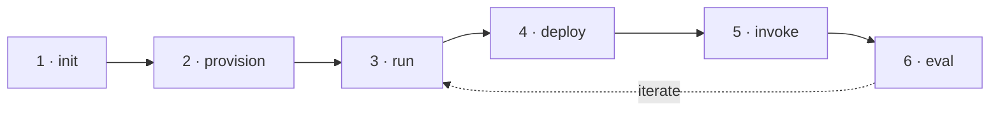

# Getting Started with Microsoft Foundry Toolkit

> **Ship your first AI agent to Azure in about ten minutes — then understand every command you just ran.**

[](https://gist.githubusercontent.com/shinyay/56e54ee4c0e22db8211e05e70a63247e/raw/f3ac65a05ed8c8ea70b653875ccac0c6dbc10ba1/LICENSE)
[](https://learn.microsoft.com/azure/developer/azure-developer-cli/install-azd)
[](samples/python/)
[](samples/csharp/)
[](docs/guide-cli/README.md)

A hands-on guide to the **Microsoft Foundry Toolkit** covering **both** the `azd ai agent` CLI
and the VS Code extension, with a 4-step sample ladder in **Python and C#**. Every command and
every output block was captured from a **real run against real Azure** — not copied from docs.

> [!NOTE]
> Verified **2026-08-08** against `azd 1.30.0` + `azure.ai.agents 1.0.0-beta.9`.
> Hosted agents and `azd ai agent` are in **preview**; details shift between versions.

---

## 🚀 Quick Start

```bash
# 0. Prerequisites — the version floor is not optional
#    Don't have azd yet? See docs/setup/ for Linux/Windows/macOS install.
#    macOS w/ Homebrew:
brew update && brew upgrade azd     # need >= 1.27.1
#    Linux / WSL:  curl -fsSL https://aka.ms/install-azd.sh | bash
#    Windows:      winget install microsoft.azd
azd extension upgrade --all
az login && azd auth login

# 1. Scaffold
mkdir my-agent && cd my-agent
azd ai agent init -m "https://github.com/microsoft-foundry/foundry-samples/blob/main/samples/python/hosted-agents/agent-framework/responses/01-basic/azure.yaml"

# 2. Provision  (~1m25s, creates 2 Azure resources)
azd env set AZURE_SUBSCRIPTION_ID <your-subscription-id>
azd env set AZURE_LOCATION eastus2
azd provision
azd env set AZURE_AI_MODEL_DEPLOYMENT_NAME gpt-5.4-mini   # ⚠️ provision does NOT set this

# 3. Run locally  → http://localhost:8088
azd ai agent run --no-client

# 4. Talk to it (second terminal)
azd ai agent invoke --local "What is Microsoft Foundry?"

# 5. Deploy  (~2m3s)
azd deploy && azd ai agent invoke "What is Microsoft Foundry?"

# 6. ⚠️ Always clean up
azd down --force --purge
```

---

## 💡 Why this repo exists

The Foundry Toolkit is **four different products sharing one name**, documented in four
different places — and the most capable one is barely documented at all.

| | Product | Where it's documented |
|---|---|---|
| **A** | VS Code extension | [VS Code docs](https://code.visualstudio.com/docs/intelligentapps/overview) (16 pages) |
| **B** | **`azd ai agent` CLI** | ⚠️ **`azd` appears 0 times across all 16 doc pages** |
| **C** | `microsoft-foundry` Copilot skill | a skill repo, written for agents not humans |
| **D** | Foundry Canvas | a bundled Copilot App plugin |

This repo documents **A and B equally**, from verified runs, and maps the ecosystem so you know
[which official pages to trust](docs/reference/ecosystem.md#vs-code-docs-staleness-map).

---

## 🧭 I want to…

**Learn**

| Goal | Go here |
|---|---|
| …understand the mental model first | [📘 Concepts](docs/concepts/README.md) |
| …get my machine ready | [🛠️ Setup](docs/setup/README.md) |
| …not know what a word means | [📚 Glossary](docs/reference/glossary.md) ⭐ |

**Build**

| Goal | Go here |
|---|---|
| …build an agent from the terminal | [⌨️ CLI guide](docs/guide-cli/README.md) ⭐ |
| …build an agent in VS Code | [🖱️ GUI guide](docs/guide-gui/README.md) |
| …build an agent with no code | [💬 Prompt agents](docs/guide-prompt-agents/README.md) |
| …learn by running code | [🧪 Samples ladder](samples/README.md) |
| …have agents call each other | [🕸️ Multi-agent & A2A](docs/concepts/multi-agent.md) |

**Look up**

| Goal | Go here |
|---|---|
| …look up a manifest field | [🧾 `azure.yaml` reference](docs/reference/azure-yaml.md) |
| …look up a CLI flag | [⚙️ CLI reference](docs/reference/azd-cli.md) |
| …fix an error | [🔧 Troubleshooting](docs/reference/troubleshooting.md) ⭐ |
| …know which docs to believe | [🗺️ Ecosystem map](docs/reference/ecosystem.md) |

**Ship it for real**

| Goal | Go here |
|---|---|
| …deploy from GitHub Actions | [🔄 CI/CD guide](docs/guide-cicd/README.md) |
| …fix a 403 that only happens in the cloud | [🔐 Identity & RBAC](docs/reference/identity-and-rbac.md) ⭐ |
| …know what it costs | [💰 Cost](docs/reference/cost.md) |
| …read logs and traces | [📊 Observability](docs/reference/observability.md) |
| …choose code vs container deploy | [🚢 Deploy modes](docs/reference/deploy-modes.md) |
| …customise the infrastructure | [🏗️ Infrastructure](docs/reference/infrastructure.md) |

---

## ✨ What's inside

```text
docs/
├── concepts/           the 6 ideas everything else assumes · multi-agent & A2A
├── setup/              install → auth → `doctor` all green
├── guide-cli/          the golden path, every output verified ⭐
├── guide-gui/          the same journey in VS Code
├── guide-prompt-agents/ agents with no code at all
├── guide-cicd/         deploying from GitHub Actions with OIDC
└── reference/          12 pages · manifest schema · 40 CLI commands · identity
                        cost · observability · deploy modes · infra · glossary
samples/
├── python/       01-hello-world → 02-tools → 03-mcp-toolbox → 04-eval
└── csharp/       the same ladder in .NET 10
```

### The sample ladder



---

## 🏗️ How it works

Six verbs, whichever track you pick:



| Verb | CLI | VS Code |
|---|---|---|
| init | `azd ai agent init` | **Create Agent** wizard |
| provision | `azd provision` | Foundry Project Setup |
| run | `azd ai agent run` → **:8088** | `F5` → Agent Inspector → **:8087** |
| deploy | `azd deploy` | **Deploy Hosted Agent** wizard |
| invoke | `azd ai agent invoke` | Agent Playground |
| eval | `azd ai agent eval` | **Evaluation** view |

<details>
<summary><b>What actually gets created in Azure</b> (reassuringly little)</summary>

```text
cog-czn5ugi4jtvzs                    Microsoft.CognitiveServices/accounts
cog-czn5ugi4jtvzs/<project>          …/accounts/projects
```

That's it — no ACR, no Key Vault, no storage account, unless you opt into container mode.
Each deployed agent gets **its own managed identity**, and agents are versioned by name
(`my-agent:1`, `my-agent:2`, …).
</details>

---

## 🔧 Top 3 things that will break

<details open>
<summary><b>1. Your <code>azd</code> is too old</b> — the #1 first-run failure</summary>

```text
ERROR: … must contain 'template' field
```

Nothing is wrong with your YAML. `azd` gates the extension version, which gates the manifest
format it can parse. Worse, the extension **silently downgrades** with only a warning:

```text
WARNING: 1.0.0-beta.9 is incompatible with azd 1.25.6 (requires ">=1.27.1"),
installing 0.1.41-preview instead
```

```bash
brew update && brew upgrade azd     # brew update is required — a stale tap capped at 1.26.0
azd extension upgrade --all
```
</details>

<details>
<summary><b>2. <code>AZURE_AI_MODEL_DEPLOYMENT_NAME</code> is never set for you</b></summary>

`azure.yaml` interpolates it and the code requires it, but `azd provision` only writes the JSON
blob `AI_PROJECT_DEPLOYMENTS`.

```bash
azd env set AZURE_AI_MODEL_DEPLOYMENT_NAME gpt-5.4-mini
```
</details>

<details>
<summary><b>3. The scary <code>169.254.169.254</code> traceback is harmless</b></summary>

`DefaultAzureCredential` probing the Azure Instance Metadata Service, which doesn't exist on
your laptop. It falls back to `az login`. Ignore it.
</details>

→ [13 more, all real](docs/reference/troubleshooting.md)

> [!TIP]
> **`azd ai agent doctor` is the best tool in the toolkit.** 13 checks across local config,
> authentication and remote state — it names the exact variable or role that's missing.
> There is no GUI equivalent.

---

## 📖 Verified timings & cost

| Step | Time |
|---|---|
| `azd provision` | 1 min 25 s |
| `azd deploy` | 2 min 3 s |
| `azd ai agent eval run` | 3 min 15 s (15 cases → 13 passed) |
| `azd down --force --purge` | 2 min 11 s |

Cost is token-based plus hosted-agent compute (`0.5 vCPU / 1Gi` in these samples).

> [!CAUTION]
> Always finish with **`azd down --force --purge`**. Without `--purge`, the Cognitive Services
> account is soft-deleted for 48 hours and keeps its name, blocking re-provisioning.

---

## 📚 References

| Source | Trust |
|---|---|
| `azd ai agent --help` | ⭐ always matches your installed version |
| [`WHATS_NEW.md`](https://github.com/microsoft/foundry-toolkit/blob/main/WHATS_NEW.md) | ⭐ the only continuously-maintained source |
| [Microsoft Learn — Foundry agents](https://learn.microsoft.com/azure/ai-foundry/agents/) | ✅ service + CLI |
| [VS Code docs](https://code.visualstudio.com/docs/intelligentapps/overview) | ⚠️ GUI only; several stale pages |
| [`microsoft-foundry` skill](https://github.com/microsoft/azure-skills) | ✅ CLI workflows |
| [`foundry-samples`](https://github.com/microsoft-foundry/foundry-samples) | ✅ the 34 samples |

> [!TIP]
> Install the **Microsoft Foundry Skill** for your coding agent. Microsoft's published
> benchmark on an identical task: **33 min → 10.5 min** (−69%) and **410 → 100 credits** (−76%).
> ```bash
> npx skills add https://github.com/microsoft/azure-skills --skill microsoft-foundry
> ```

---

## 🤝 Contributing

Found a bug, or has the preview moved on? [Open an issue](https://github.com/shinyay/getting-started-with-foundry-toolkit/issues/new).

Because this guide's value is that its output is **real**, please re-run the command and paste
the actual output when correcting a verified block.

---

## ⭐ Support

If this project helps you, please consider:
- ⭐ Starring this repository
- 🐛 [Reporting issues](https://github.com/shinyay/getting-started-with-foundry-toolkit/issues/new)
- 📢 Sharing with others

---

## Licence

Released under the [MIT license](https://gist.githubusercontent.com/shinyay/56e54ee4c0e22db8211e05e70a63247e/raw/f3ac65a05ed8c8ea70b653875ccac0c6dbc10ba1/LICENSE)

## Author

- github: <https://github.com/shinyay>
- bluesky: <https://bsky.app/profile/yanashin.bsky.social>
- twitter: <https://twitter.com/yanashin18618>
- mastodon: <https://mastodon.social/@yanashin>
- linkedin: <https://www.linkedin.com/in/yanashin/>
