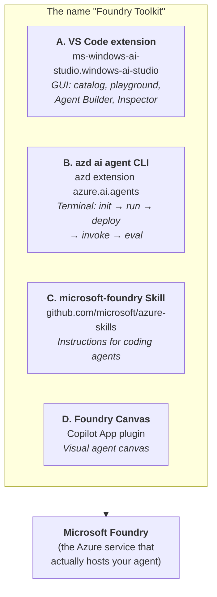
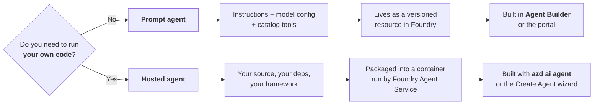
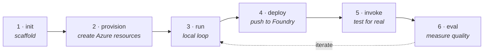
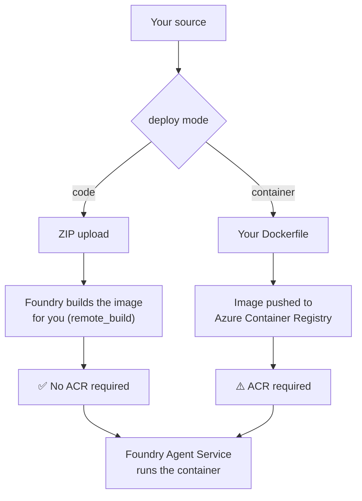

# 📘 Concepts — the mental model

> Read this once. Everything else in this repository assumes these five ideas.

---

## 1. "Foundry Toolkit" is four products wearing one name

This is the single most confusing thing about the ecosystem, and no official page says it
out loud. When someone says "Foundry Toolkit" they may mean any of these:



| | What it is | Where it is documented | Maturity |
|---|---|---|---|
| **A. VS Code extension** | GUI for models, prompts, agents, eval | [code.visualstudio.com/docs/intelligentapps](https://code.visualstudio.com/docs/intelligentapps/overview) | GA-ish, docs partly stale |
| **B. `azd ai agent`** | Full agent lifecycle from the terminal | **Nowhere on the VS Code site** — only `--help` + Learn | Preview, moves fastest |
| **C. Foundry Skill** | 187 files of guidance that make a coding agent good at Foundry | `microsoft/azure-skills` | Preview |
| **D. Foundry Canvas** | Copilot **App** plugin (not CLI) | bundled in `microsoft/foundry-toolkit` | Early preview |

> [!IMPORTANT]
> The repository <https://github.com/microsoft/foundry-toolkit> contains **no toolkit source
> code**. It is a docs / changelog / issue-tracker / sample-distribution repo. The extension
> itself is closed-source. Do not go there looking for the implementation.

**This guide covers A and B in equal depth**, because those are the two you actually build with.

---

## 2. Two kinds of agent: *prompt* vs *hosted*

Almost every question of the form "why can't I do X?" resolves to picking the wrong one.



| | Prompt agent | Hosted agent |
|---|---|---|
| You author | Instructions, model, temperature, tools | **Code** (Python / C#) |
| Framework | none — declarative | Agent Framework, LangGraph, OpenAI Agents SDK, Pydantic AI, Claude Agent SDK, or nothing |
| Artifact | a config record | a container image / ZIP |
| Versioning | auto-increments on Save | auto-increments on deploy (`name:1`, `name:2`, …) |
| Local run | playground only | real HTTP server on your machine |
| Custom logic | ❌ | ✅ |
| Typical tool | Agent Builder (GUI) | `azd ai agent` (CLI) |

Two more kinds exist in preview and are out of scope for a getting-started guide:
**Workflows** (graph of agents) and **Routines** (deterministic multi-step procedures).

> This repository is about **hosted agents**. That is where the developer story lives.

---

## 3. The lifecycle is always the same six verbs

Whatever track you take, GUI or CLI, you are doing these six things:



| Verb | CLI | VS Code |
|---|---|---|
| 1 · init | `azd ai agent init` | **Create Agent** wizard |
| 2 · provision | `azd provision` | Foundry Project Setup |
| 3 · run | `azd ai agent run` | `F5` → Agent Inspector |
| 4 · deploy | `azd deploy` | **Deploy Hosted Agent** wizard |
| 5 · invoke | `azd ai agent invoke` | Agent Playground |
| 6 · eval | `azd ai agent eval` | **Evaluation** view |

Memorise this table and both tracks become the same product.

---

## 4. The protocol is the contract

A hosted agent is *just an HTTP server*. Foundry only cares which **wire protocol** it speaks.
You declare that in `azure.yaml`, and it determines what can talk to your agent.

| Protocol | Shape | Use it for | Notes |
|---|---|---|---|
| **`responses`** | OpenAI Responses API, REST + SSE | **Default. Start here.** | Required by Agent Optimizer |
| `invocations` | Foundry-native request/response | Custom frameworks, streaming control | |
| `invocations_ws` | Duplex WebSocket | Voice, realtime, bidirectional | |
| `activity` | Bot Framework Activity | Teams / M365 Copilot | ⚠️ cannot use `azd ai agent invoke` |

```yaml
protocols:
  - protocol: responses
    version: 2.0.0
```

> [!TIP]
> If you are not sure, choose `responses`. It is the default, has the widest tooling support,
> and is the only one the optimizer accepts.

---

## 5. Where your code actually runs

Two deploy modes, and the choice changes what Azure resources you need.



| | `--deploy-mode code` | `--deploy-mode container` |
|---|---|---|
| You provide | source + `requirements.txt` | source + `Dockerfile` |
| Build happens | in Azure (`remote_build`) or locally (`bundled`) | on your machine / CI |
| Registry | **not needed** (`AZD_AGENT_SKIP_ACR=true`) | ACR needed |
| Iteration speed | fast | slower, but total control |
| Good for | getting started, most agents | native deps, custom base images |

**Start with `code`.** This guide's golden path uses it, and it means the only Azure resource
you create is the Foundry account itself.

---

## 6. What actually gets created in Azure

Reassuringly little. A verified `azd provision` on the basic sample produced exactly **two**
resources:

```text
cog-czn5ugi4jtvzs                                   Microsoft.CognitiveServices/accounts
cog-czn5ugi4jtvzs/agent-framework-agent-basic-resp  …/accounts/projects
```

- The **account** is the Foundry resource (models live here).
- The **project** is the workspace your agent, connections and evals belong to.
- Your **agent** is then a child of the project, versioned by name.
- Each deployed agent gets **its own managed identity** (`instance_identity.principal_id`).

No ACR, no Key Vault, no storage account, no App Service — unless you opt into container mode
or add connections that need them.

---

## Next

- 👉 [Setup](../setup/README.md) — get the tools installed
- 👉 [CLI guide](../guide-cli/README.md) — the golden path, verified end to end
- 👉 [GUI guide](../guide-gui/README.md) — the same journey in VS Code

Once these six ideas are solid:

- 👉 [**Multi-agent & A2A**](multi-agent.md) — the seventh idea: agents calling agents
- 👉 [Glossary](../reference/glossary.md) — every term, cross-linked
- 👉 [Identity & RBAC](../reference/identity-and-rbac.md) — the managed identity above, in depth
