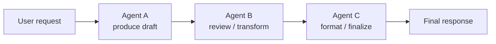
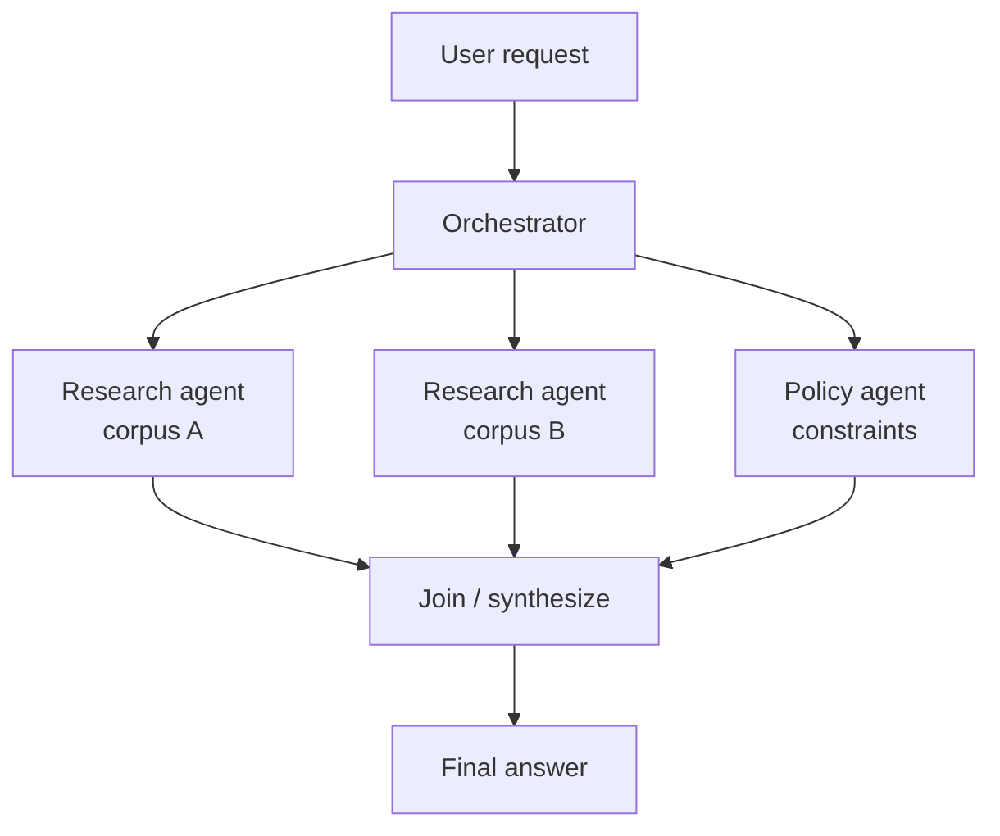
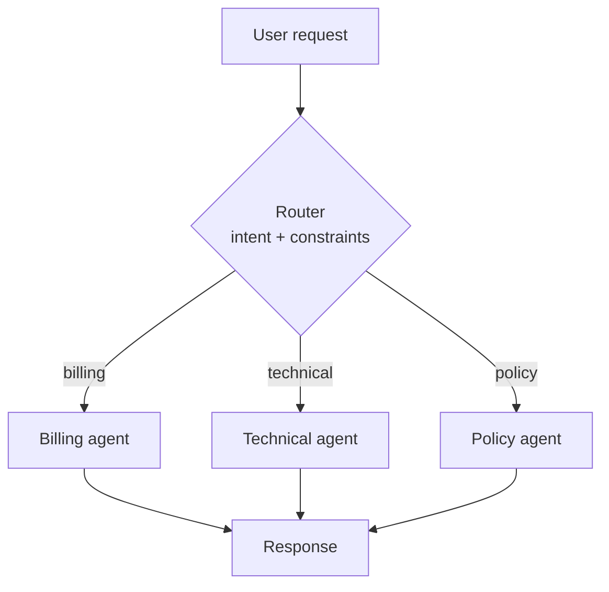
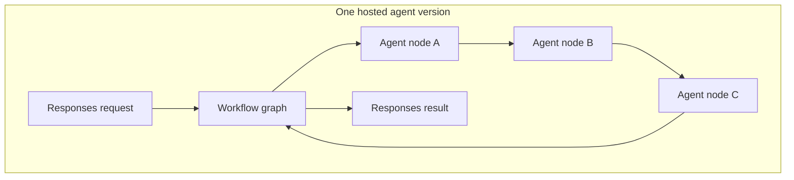
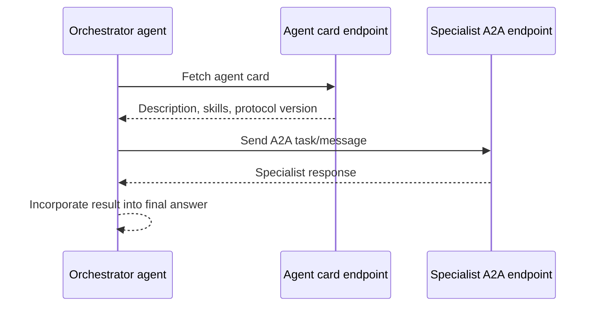
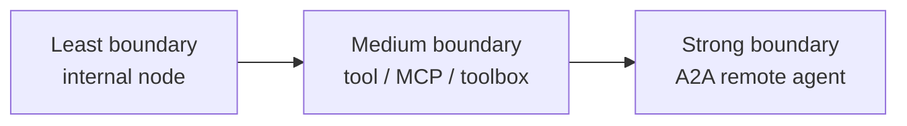
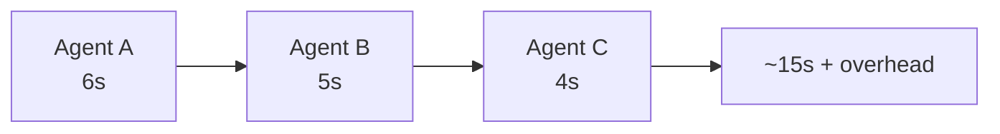
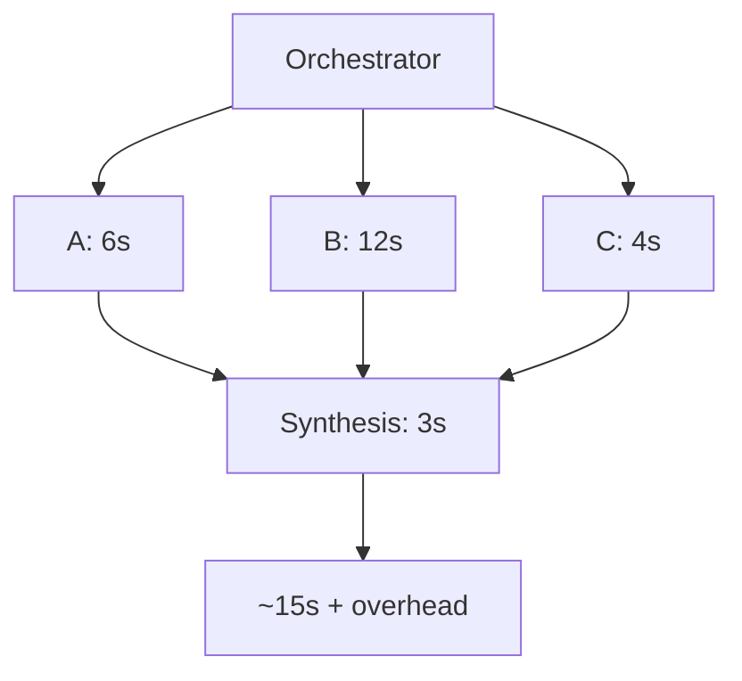

# 🧩 Multi-agent patterns — workflows, hand-offs and A2A

> A multi-agent system is not automatically better. Split only when the boundary gives you a
> clearer prompt, a safer permission model, a reusable specialist or a measurable quality win.

---

## What was verified for this page

I kept this investigation read-only. I did **not** run `azd provision`, `azd deploy`, invoke a
live A2A endpoint, or create Azure resources.

<details open>
<summary><b>✅ Verified sample catalog commands</b></summary>

```bash
AZURE_DEV_USER_AGENT=microsoft_foundry_skill azd ai agent sample list --language python --output json
AZURE_DEV_USER_AGENT=microsoft_foundry_skill azd ai agent sample list --language dotnetCsharp --output json
```

Those commands returned **21 Python** templates and **13 C#** templates. Filtering titles and
paths for workflow / multi-agent / A2A found:

| Language | Verified sample | Path |
|---|---|---|
| Python | **Workflow agent (Responses, Agent Framework, Python)** | `python/hosted-agents/agent-framework/responses/05-workflows` |
| C# | **Translation Workflow agent (Responses, Agent Framework, C#)** | `csharp/hosted-agents/agent-framework/workflows` |

No sample title or path in the captured catalog contained `A2A` or `agent-to-agent`.
</details>

<details>
<summary><b>✅ Verified upstream source files inspected</b></summary>

| Sample | Files inspected via `raw.githubusercontent.com` |
|---|---|
| Python Workflow agent | `README.md`, `azure.yaml`, `src/agent-framework-workflows-responses/main.py`, `requirements.txt` |
| C# Translation Workflow agent | `README.md`, `azure.yaml`, `src/workflows/Program.cs`, `src/workflows/workflows.csproj` |

The source inspection below is based on those files, not on a live deployment.
</details>

> [!IMPORTANT]
> Blocks in this page are labelled carefully. Catalog discovery and upstream source inspection
> are verified. Architecture diagrams are **illustrative** unless explicitly tied to the two
> inspected samples.

---

## When splitting into multiple agents is worth it

| Split when… | Why it helps | Example |
|---|---|---|
| A step needs a **different instruction set** | Smaller prompts reduce ambiguity and make eval failures easier to localise. | Writer → legal reviewer → formatter. |
| A step needs **different permissions** | Each deployed agent can have its own managed identity and role assignments. | Planner agent has read-only project access; executor agent can write tickets. |
| A capability is **reusable** | A specialist can serve several orchestrators through A2A or a toolbox-like boundary. | Translation, policy review, search, summarisation. |
| You need **independent versioning** | One specialist can change without redeploying the whole system. | Upgrade the legal reviewer from `:3` to `:4` only. |
| You need **parallel work** | Fan-out can reduce wall-clock time if tasks are independent. | Ask three retrieval agents to search separate corpora. |
| You need **auditability** | A trace can show which specialist made which decision. | Compliance approval chains. |

Do **not** split only because the diagram looks more sophisticated. Every extra agent call adds
latency, model tokens, possible cold starts, auth checks and another failure mode.

---

## Pattern 1 — sequential chain

The output of one agent becomes the input to the next. This is the simplest workflow and the
one both verified samples use.



| Use it for | Watch out for |
|---|---|
| Translation pipelines, review chains, enrichment, classify → act → explain | Error compounding: a bad early output becomes the next agent's truth. |

### ✅ Verified Python sample: slogan writer → legal reviewer → formatter

The Python sample at `python/hosted-agents/agent-framework/responses/05-workflows` creates
three `Agent` instances that share one `FoundryChatClient`:

| Agent name | Instruction role |
|---|---|
| `writer` | Create new slogans from the user's topic. |
| `legal_reviewer` | Correct the slogan so it is legally compliant. |
| `formatter` | Format the slogan in a cool retro terminal style. |

The source wraps each agent in an `AgentExecutor` with `context_mode="last_agent"`, then wires
edges with `WorkflowBuilder`:

```text
writer_executor → legal_executor → format_executor
```

It sets `output_executors=[format_executor]`, so only the final formatted result is returned to
the caller. The workflow is converted to one callable agent with `.build().as_agent()` and is
served by `ResponsesHostServer(workflow_agent)`.

| Verified manifest field | Value |
|---|---|
| `services.agent-framework-workflows-responses.kind` | `hosted` |
| `services.agent-framework-workflows-responses.protocols[0].protocol` | `responses` |
| `services.agent-framework-workflows-responses.codeConfiguration.runtime` | `python_3_13` |
| `services.agent-framework-workflows-responses.codeConfiguration.entryPoint` | `main.py` |
| `services.agent-framework-workflows-responses.container.resources` | `0.5` CPU / `1Gi` memory |

> [!NOTE]
> The upstream README says this sample needs a more advanced model because it continues from
> an assistant message, and says it was tested with `gpt-5.4`. The inspected `azure.yaml`
> still declares `gpt-5.4-mini`. I did not deploy the sample, so I cannot say which model is
> sufficient in practice.

### ✅ Verified C# sample: English → French → Spanish → English

The C# sample at `csharp/hosted-agents/agent-framework/workflows` creates three `AIAgent`
instances from one `AIProjectClient`:

| Agent name | Instruction role |
|---|---|
| `english-to-french` | Translate user input into French only. |
| `french-to-spanish` | Translate the French output into Spanish only. |
| `spanish-to-english` | Translate the Spanish output back into English only. |

The source builds the chain with:

```text
AgentWorkflowBuilder.BuildSequential("translation-chain", englishToFrench, frenchToSpanish, spanishToEnglish)
```

Then it exposes the result with `AddFoundryResponses(agent)` and
`RegisterProtocol("responses", endpoints => endpoints.MapFoundryResponses())`.

| Verified manifest field | Value |
|---|---|
| `services.workflows.displayName` | `Translation Workflow Agent` |
| `services.workflows.description` | sequential translation through English → French → Spanish → English |
| `services.workflows.kind` | `hosted` |
| `services.workflows.protocols[0].protocol` | `responses` |
| `services.workflows.codeConfiguration.runtime` | `dotnet_10` |
| `services.workflows.codeConfiguration.entryPoint` | `workflows.dll` |

> [!WARNING]
> The source defaults `AZURE_AI_MODEL_DEPLOYMENT_NAME` to `gpt-4o` if the env var is missing,
> while the manifest declares `gpt-5.4-mini`. In this repo's golden path, set
> `AZURE_AI_MODEL_DEPLOYMENT_NAME` explicitly after provision so the runtime and manifest agree.

---

## Pattern 2 — parallel / fan-out

The orchestrator asks multiple agents to work independently, then merges their answers.



| Use it for | Watch out for |
|---|---|
| Independent searches, multiple reviewers, compare-and-rank tasks | Cost multiplies with branch count; synthesis must handle disagreement. |

**Implementation choices:**

| Choice | When it fits |
|---|---|
| One hosted agent containing an Agent Framework workflow | Branches are internal implementation details and share one deployed identity/version. |
| Orchestrator calls separate deployed agents | Branches need different identities, owners, versions or scaling. |
| Orchestrator calls tools instead of agents | Branches are deterministic capabilities, not separate reasoning loops. |

> [!NOTE]
> I did not find a fan-out sample in the verified `azd ai agent sample list` output. The diagram
> is illustrative, based on common orchestration shape rather than a repository sample.

---

## Pattern 3 — router / hand-off

A router decides which specialist should handle the request. Only one branch usually runs.



| Use it for | Watch out for |
|---|---|
| Large support surfaces, product-specific specialists, least-privilege delegation | Misrouting is silent unless you trace and evaluate the router. |

Router decisions should be observable. At minimum, log or trace:

| Trace field | Why |
|---|---|
| Selected specialist | Lets you diagnose wrong hand-offs. |
| Confidence or reason | Helps improve router instructions. |
| Specialist version | Makes regressions explainable after independent deployments. |
| User identity / tenant boundary | Prevents accidental cross-tenant delegation. |

> [!TIP]
> Router evals should include near-miss cases. If "refund policy" and "billing error" route to
> different specialists, write cases that use both phrases together.

---

## Pattern 4 — workflow agent

A workflow hides many agents behind one hosted endpoint. From Foundry's perspective, callers
invoke one agent; inside the process, Agent Framework coordinates the graph.



| Benefit | Trade-off |
|---|---|
| One endpoint, one deploy command, one `responses` contract | Internal agents share the hosted agent's container, identity and version. |
| Easy local debugging with Agent Inspector | Per-specialist RBAC is not available unless you split into separate deployed agents. |
| Good for tightly coupled transformations | Changing one internal node redeploys the whole workflow agent. |

The verified Python and C# workflow samples are this pattern.

---

## Pattern 5 — A2A (agent-to-agent) and agent cards

A2A is for agent-to-agent delegation across an endpoint boundary. One agent can discover a
remote agent's advertised capabilities and call it through the A2A protocol.



| A2A concept | Meaning in Foundry |
|---|---|
| **A2A base path** | `.../agents/<agent>/endpoint/protocols/a2a` |
| **Agent card URL** | Versioned discovery URL under the A2A endpoint, for example `agentCard/v1.0` |
| **Calling identity** | The identity that must be allowed to call the target agent. |
| **Target role** | For incoming Foundry A2A, the caller needs a role such as Foundry Agent Consumer or higher on the target project. |
| **Protocol dependency** | Hosted agents must implement `responses` before incoming A2A can be enabled. |

> [!IMPORTANT]
> A2A is a trust boundary, not just a function call. Treat the remote agent like an external
> service: authenticate it, authorise the caller, version it, monitor it and decide what user
> context may cross the boundary.

### What I could not verify

| Claim | Status |
|---|---|
| A live Foundry-hosted A2A call from one deployed agent to another | **Not verified** — would require deployed agents / Azure resources. |
| A live agent card response from this repo's samples | **Not verified** — incoming A2A is not enabled by the sample manifests inspected. |
| `azd ai agent endpoint update` exact output for A2A/card patching | **Not verified** — no write commands were run. |

---

## How agents call other agents

There are three practical levels. Pick the lowest level that gives you the boundary you need.

| Level | What happens | Best for | Identity/version story |
|---|---|---|---|
| **Internal workflow node** | One process creates several Agent Framework agents and chains them. | Tight pipeline, same owner, same permissions. | One hosted agent identity and one deployed version. |
| **Tool-like specialist** | Orchestrator calls a tool, MCP server, toolbox or hosted MCP server tool. | Deterministic capabilities or external APIs. | Tool has its own auth/config; agent version may not change. |
| **Remote agent / A2A** | Orchestrator calls another deployed agent endpoint. | Independent teams, independent permissions, reusable specialists. | Each agent has its own identity and version; callers need access. |



---

## Managed identity and trust between agents

Every deployed hosted agent gets its own managed identity. In `azd ai agent show --output json`,
that identity appears as `instance_identity.principal_id` and `instance_identity.client_id`.

| Design | What it means |
|---|---|
| One workflow agent with internal nodes | All nodes run as the same hosted-agent identity. Simple, but no per-node RBAC. |
| Separate deployed specialists | Each specialist has its own identity. You can grant different roles per specialist. |
| Orchestrator calls target A2A endpoint | The target project must trust the calling identity. Grant only the least role needed. |
| Tool works locally but not hosted | You probably granted your user access, not the deployed agent's `principal_id`. |

> [!CAUTION]
> Do not use multi-agent boundaries to bypass access control. If Agent A is not allowed to read
> a resource, routing the request through Agent B must be an intentional, audited delegation with
> explicit roles.

---

## Versioning agents independently

Foundry agent ids include a version suffix, for example:

```text
my-agent:1
my-agent:2
```

Redeploying the same `services.<agent>.name` creates a new version. Changing the name creates a
separate agent.

| Pattern | Versioning effect |
|---|---|
| Internal workflow | Any code or prompt change redeploys the whole workflow as a new version. |
| Remote specialist | Specialist can move from `translator:3` to `translator:4` without redeploying the router, if the router targets the active endpoint by name. |
| Eval baseline | Pin `agent.version` in `eval.yaml` when you need to compare `:1` against `:2`. |
| A2A card | Keep the card description and skills aligned with the deployed version callers will reach. |

> [!TIP]
> For production, record the specialist version selected by a router or orchestrator in traces.
> Otherwise a later regression may look like "the orchestrator got worse" when only one
> downstream specialist changed.

---

## Cost and latency implications of chaining

| Cost driver | Why it grows in multi-agent systems | Mitigation |
|---|---|---|
| Model calls | Sequential chains call a model once per step. | Combine steps only when separation adds no value; cache deterministic work. |
| Tokens | Each agent has its own instructions and context. | Keep specialist prompts short; pass only the fields the next agent needs. |
| Tool calls | Each specialist may call tools independently. | Centralize expensive retrieval or share summarized evidence. |
| Cold starts | Separate hosted agents can each need a session/sandbox. | Reuse sessions for related work; avoid over-splitting tiny tasks. |
| Network hops | A2A and remote tools add endpoint latency. | Prefer internal workflows for tightly coupled low-latency pipelines. |
| Evaluation | More branches require more test cases to cover routes and failures. | Evaluate each specialist plus the orchestrator path. |

Sequential latency is roughly additive:



Parallel latency is closer to the slowest branch plus synthesis, but cost still grows with every
branch:



The numbers above are illustrative. Measure your actual agents with traces and eval runs.

---

## Evaluation strategy for multi-agent systems

| Evaluate | Question to answer | Example metric |
|---|---|---|
| Each specialist alone | Does the specialist do its narrow job well? | Translation quality, legal compliance, retrieval precision. |
| Router / orchestrator | Did it choose the right specialist and pass the right context? | Route accuracy, hand-off completeness. |
| Whole workflow | Does the user get a correct final answer? | End-to-end rubric pass rate. |
| Failure paths | Does the system degrade safely? | Refusal correctness, fallback quality, timeout handling. |
| Cost/latency | Is the split worth the overhead? | p50/p95 latency, model-call count, tokens per request. |

A good eval suite for the verified Python workflow would include at least:

| Case type | Why |
|---|---|
| Normal slogan request | Baseline writer → reviewer → formatter path. |
| Regulated claims | Tests whether legal reviewer removes risky claims. |
| Formatting constraints | Tests whether formatter preserves meaning while changing style. |
| Empty or vague request | Tests whether the chain asks for clarification or handles ambiguity. |

A good eval suite for the verified C# translation workflow would include:

| Case type | Why |
|---|---|
| Simple sentence | Verifies the three-step path works. |
| Idiom | Reveals semantic drift across languages. |
| Named entities | Checks that names and product terms survive the round trip. |
| Safety-sensitive content | Ensures translators do not add explanations or unsupported claims. |

---

## Local development checklist

| Check | Why |
|---|---|
| Start with `responses` unless you need another protocol. | It has the widest tooling support and is required by optimizer and incoming A2A. |
| Run with `azd ai agent run --no-client`. | Starts the local server on `8088`; add the Inspector when you need UI. |
| Use the Agent Inspector for workflow graphs when available. | The GUI guide notes Agent Framework workflows render as a graph. |
| Keep intermediate outputs inspectable. | Debugging a chain is impossible if you only see the final answer. |
| Set `AZURE_AI_MODEL_DEPLOYMENT_NAME`. | The first-run failure applies to workflow samples too. |
| Do not background the local server in a throwaway shell. | It can receive SIGHUP and disappear. |

---

## Design checklist before you split an agent

| Question | If the answer is no… |
|---|---|
| Does the specialist need a materially different prompt? | Keep it in one agent. |
| Does it need different permissions or identity? | An internal workflow may be enough. |
| Will another product or team reuse it? | Avoid A2A until reuse is real. |
| Can you evaluate it independently? | Add evals before adding routing complexity. |
| Is the added latency acceptable? | Prefer a local tool or single-agent prompt. |
| Do you know what context crosses the boundary? | Define a minimal hand-off schema first. |

---

## What this repo can honestly say today

| Statement | Evidence |
|---|---|
| The `azd` catalog contains a Python Workflow agent and a C# Translation Workflow agent. | Verified by running `azd ai agent sample list --language ... --output json`. |
| Both workflow samples expose the `responses` protocol. | Verified in upstream `azure.yaml` files. |
| The Python workflow is writer → legal reviewer → formatter. | Verified in upstream `main.py`. |
| The C# workflow is English → French → Spanish → English. | Verified in upstream `Program.cs`. |
| A2A exists in Foundry docs and CLI surface, but no A2A sample was present in the captured catalog. | Verified catalog filter; A2A docs inspected, no live A2A call run. |
| Per-agent managed identity matters for multi-agent trust. | Verified in this repo's deployed `show` example and documented hosted-agent behavior. |

---

## Next

- 👉 [Glossary](../reference/glossary.md) — definitions for every term used above
- 👉 [Concepts](README.md) — prompt vs hosted, protocol choice and deploy modes
- 👉 [Sample catalog](../reference/sample-catalog.md) — all verified upstream samples
- 👉 [CLI guide](../guide-cli/README.md) — run, deploy, invoke and eval the golden path
- 👉 [Troubleshooting](../reference/troubleshooting.md) — real failures, including ports and versioning
