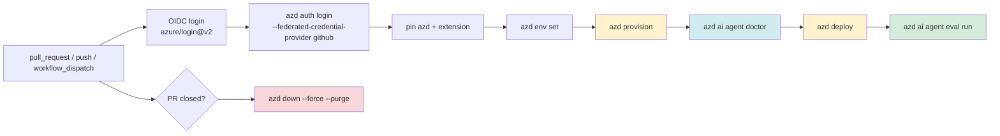
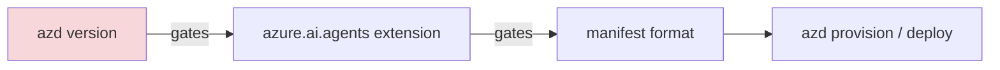

# 🚀 CI/CD guide — deploy Foundry agents safely

> Goal: make `azd provision` → `azd deploy` repeatable in GitHub Actions without hidden
> prompts, version skew, or the model-name trap that breaks first CI runs.
>
> This page is based on this repository's verified CLI track, local `--help` output captured
> with `azd 1.30.0` / `azure.ai.agents 1.0.0-beta.9`, and Microsoft Learn references. The
> workflow YAML below is **illustrative**: it was syntax-validated locally, but it was **not
> executed** and did not create Azure resources.



---

## 1. The CI contract

The hosted-agent lifecycle is the same in CI as it is on your laptop:

```bash
azd env set AZURE_SUBSCRIPTION_ID <subscription-id>
azd env set AZURE_LOCATION <region>
azd env set AZURE_AI_MODEL_DEPLOYMENT_NAME <deployment-name>
azd provision --no-prompt
azd deploy --no-prompt
```

> [!WARNING]
> **`AZURE_AI_MODEL_DEPLOYMENT_NAME` is not written by `azd provision`.**
> The samples declare it in `azure.yaml` and the code reads it, but `provision` writes only the
> JSON blob `AI_PROJECT_DEPLOYMENTS`. In CI, this fails harder than local development because
> there is no human prompt or interactive shell context to recover from.
>
> Always set it explicitly before `provision`, `doctor`, `run`, `deploy` or `eval`:
>
> ```bash
> azd env set AZURE_AI_MODEL_DEPLOYMENT_NAME gpt-5.4-mini
> ```
>
> See [troubleshooting → model deployment name](../reference/troubleshooting.md#2-model-deployment-name-is-not-configured).

| Phase | Command | Must already be true |
|---|---|---|
| Select environment | `azd env select <name>` or `azd env new <name>` | Repo has `azure.yaml` |
| Configure | `azd env set ...` | Subscription, location and model deployment name are known |
| Provision | `azd provision --no-prompt` | OIDC principal can create or update Foundry resources |
| Diagnose | `azd ai agent doctor --local-only` / `doctor` | Extension version can parse the manifest |
| Deploy | `azd deploy --no-prompt` | Project endpoint and required env vars exist |
| Gate quality | `azd ai agent eval run --no-prompt` | `eval.yaml` exists or was generated earlier |
| Teardown | `azd down --force --purge` | Only for ephemeral environments |

---

## 2. Authenticate with OIDC — no client secrets

Use GitHub's OpenID Connect token exchange with `azure/login@v2`, then log `azd` in with the
same federated identity.

```yaml
permissions:
  id-token: write
  contents: read

steps:
  - uses: azure/login@v2
    with:
      client-id: ${{ vars.AZURE_CLIENT_ID }}
      tenant-id: ${{ vars.AZURE_TENANT_ID }}
      subscription-id: ${{ vars.AZURE_SUBSCRIPTION_ID }}

  - run: |
      azd auth login \
        --client-id "$AZURE_CLIENT_ID" \
        --tenant-id "$AZURE_TENANT_ID" \
        --federated-credential-provider github
```

<details>
<summary>✅ Verified locally: `azd auth login --help` includes GitHub federation</summary>

```text
--federated-credential-provider string  : The provider to use to acquire a federated token to authenticate with. Supported values: github, azure-pipelines, oidc
--client-id string                      : The client id for the service principal to authenticate with.
--tenant-id string                      : The tenant id or domain name to authenticate with.
```
</details>

> [!NOTE]
> `client-id`, `tenant-id`, and `subscription-id` are identifiers, not client secrets. Store
> them as GitHub **environment variables** (`vars`) when possible. Do not create or store a
> service principal password for this workflow.

### Required role assignments

| Need | Minimum role from current Foundry docs | Practical CI note |
|---|---|---|
| Create Foundry account and project | **Foundry Account Owner** on the Foundry resource scope, or a broader role that can create the account/project | If CI creates the whole stack from scratch, it needs provisioning permissions, not only agent permissions. |
| Assign RBAC during setup | **Role Based Access Control Administrator** or Azure **Owner** where assignments are made | Missing this often leaves resources created but unusable by the project or agent identity. |
| Create and edit agents | **Foundry User** | Needed for prompt-agent CRUD and many project data-plane operations. |
| Publish/manage agents | **Foundry Project Manager** or stronger | Required when CI promotes agents into shared environments. |
| Invoke only | **Foundry Agent Consumer** | Least privilege for smoke-test callers that should not edit agents. |
| Purge soft-deleted Foundry accounts | Azure **Contributor** at subscription scope according to current RBAC notes | Needed when teardown uses `--purge` or manual purge cleanup. |

> [!WARNING]
> The live run for this repo found **zero role assignments at resource-group scope** after
> `azd provision`; the sample worked because the deploying user inherited broad subscription
> permissions (`Owner` plus Foundry data-plane roles). A least-privilege GitHub OIDC service
> principal will not automatically inherit that. Treat the role table above as the starting
> point to validate in your tenant, not proof that the workflow is least-privilege complete.

> [!TIP]
> Use separate GitHub environments (`dev`, `staging`, `prod`) with different federated
> credentials and reviewers. A PR environment can have create/delete rights; production should
> usually deploy into an existing project with tightly scoped permissions.

---

## 3. Pin versions twice

Version skew is the most expensive CI failure in this toolkit:



Two guards are needed.

### Guard A — pin in CI

Install a known `azd` version and a known extension version, then print both before deploying.
The workflow below pins:

| Component | Example in workflow | Why |
|---|---|---|
| `azd` | `AZD_VERSION: "1.30.0"` | Core CLI gates compatible extension versions. |
| `azure.ai.agents` | `AZD_AI_AGENTS_EXTENSION_VERSION: "1.0.0-beta.9"` | Extension gates manifest parsing and command behavior. |
| `azure.ai.projects` | `AZD_AI_PROJECTS_EXTENSION_VERSION: "1.0.0-beta.5"` | Current samples contain `host: azure.ai.project`; install it explicitly so CI never hits an extension-install prompt. |

<details>
<summary>✅ Verified locally: installed versions used while writing this page</summary>

```text
azd version 1.30.0 (commit eea6db684821093daabd8bf357b6c9b636168abf) (stable)
azure.ai.agents 1.0.0-beta.9
azure.ai.inspector 1.0.0-beta.3
azure.ai.projects 1.0.0-beta.5
```
</details>

### Guard B — declare the floor in `azure.yaml`

`azure.yaml` supports `requiredVersions.extensions`. Keep this block in every agent project:

```yaml
requiredVersions:
  extensions:
    azure.ai.agents: ">=1.0.0-beta.4"
```

> [!CAUTION]
> `azd extension upgrade` can **silently downgrade** the extension when the installed `azd`
> is too old, printing only a warning such as “installing 0.1.x instead”. Do not rely on
> “upgrade latest” in CI. Pin, print, and fail early.

> [!IMPORTANT]
> `azd ai` is split across four extensions: `azure.ai.agents`, `azure.ai.projects`,
> `azure.ai.inspector`, and `azure.ai.toolboxes`. If a workflow calls a namespace whose
> extension is missing, `azd` offers to install it interactively. That is convenient locally
> and a hard failure in CI. Install every namespace your workflow or `azure.yaml` uses.

---

## 4. Use `doctor` as a CI gate

`azd ai agent doctor` is not just a support command. It has documented exit codes, so CI can
make decisions from it.

<details open>
<summary>✅ Verified locally: `azd ai agent doctor --help` exit codes and flags</summary>

```text
Exit codes:
  0 — at least one check passed and no checks failed
  1 — any check failed
  2 — all checks were skipped (e.g. preconditions unmet)

Flags:
      --local-only   Skip remote (network-dependent) checks. Useful when offline, behind a proxy, or for a fast local triage.
      --unredacted   Show raw principal IDs, scope ARNs, and UPNs in the report.
```
</details>

Recommended gates:

| When | Command | Meaning in CI |
|---|---|---|
| Before provisioning | `azd ai agent doctor --local-only` | Fast parse/config check. Catches missing `azure.yaml`, bad service shape, missing manual env vars. |
| After provisioning | `azd ai agent doctor` | Full local/auth/remote check. Catches RBAC, endpoint reachability and hosted-agent readiness. |
| Debug rerun only | `azd ai agent doctor --unredacted` | Useful for a private runner log when principal IDs are needed. Do not use on public logs. |

> [!WARNING]
> Treat exit code `2` as a failure in CI. It means every check was skipped, usually because
> preconditions were missing. A green pipeline with zero checks is worse than a red one.

---

## 5. Complete GitHub Actions workflow

> [!IMPORTANT]
> The workflow is **illustrative, not verified**. It was parsed locally as YAML and, when
> available, checked with `actionlint`; it was **not executed** and did not run
> `azd provision`, `azd deploy`, `eval run`, or `azd down` against Azure.

Create `.github/workflows/foundry-agent-cicd.yml` in a real project:

```yaml
name: Foundry agent CI/CD

on:
  pull_request:
    types: [opened, synchronize, reopened, closed]
  push:
    branches: [main]
  workflow_dispatch:
    inputs:
      environment:
        description: "azd environment to deploy"
        required: true
        default: "dev"
      run_eval:
        description: "Run azd ai agent eval run after deploy"
        required: true
        default: "true"

permissions:
  id-token: write
  contents: read

concurrency:
  group: foundry-${{ github.workflow }}-${{ github.event.pull_request.number || github.ref_name }}
  cancel-in-progress: false

env:
  AZD_VERSION: "1.30.0"
  AZD_AI_AGENTS_EXTENSION_VERSION: "1.0.0-beta.9"
  AZD_AI_PROJECTS_EXTENSION_VERSION: "1.0.0-beta.5"
  AZURE_CLIENT_ID: ${{ vars.AZURE_CLIENT_ID }}
  AZURE_TENANT_ID: ${{ vars.AZURE_TENANT_ID }}
  AZURE_SUBSCRIPTION_ID: ${{ vars.AZURE_SUBSCRIPTION_ID }}
  AZURE_LOCATION: ${{ vars.AZURE_LOCATION }}
  AZURE_AI_MODEL_DEPLOYMENT_NAME: ${{ vars.AZURE_AI_MODEL_DEPLOYMENT_NAME }}

jobs:
  deploy:
    name: Provision, deploy, and evaluate
    if: github.event_name != 'pull_request' || github.event.action != 'closed'
    runs-on: ubuntu-latest
    environment: ${{ github.event_name == 'pull_request' && 'dev' || inputs.environment || 'staging' }}
    timeout-minutes: 60

    steps:
      - name: Checkout
        uses: actions/checkout@v4

      - name: Install pinned azd
        shell: bash
        run: |
          set -euo pipefail
          curl -fsSL -o azd.tar.gz "https://github.com/Azure/azure-dev/releases/download/azure-dev-cli_${AZD_VERSION}/azd-linux-amd64.tar.gz"
          mkdir -p "$HOME/.azd/bin"
          tar -xzf azd.tar.gz -C "$HOME/.azd/bin"
          echo "$HOME/.azd/bin" >> "$GITHUB_PATH"

      - name: Verify azd version
        shell: bash
        run: |
          set -euo pipefail
          azd version
          azd version | grep "azd version ${AZD_VERSION} "

      - name: Install pinned Foundry extensions
        shell: bash
        run: |
          set -euo pipefail
          azd extension install azure.ai.agents --version "$AZD_AI_AGENTS_EXTENSION_VERSION" --no-prompt
          azd extension install azure.ai.projects --version "$AZD_AI_PROJECTS_EXTENSION_VERSION" --no-prompt
          azd extension list --installed --output json

      - name: Azure login with OIDC
        uses: azure/login@v2
        with:
          client-id: ${{ env.AZURE_CLIENT_ID }}
          tenant-id: ${{ env.AZURE_TENANT_ID }}
          subscription-id: ${{ env.AZURE_SUBSCRIPTION_ID }}

      - name: azd login with GitHub federated credential
        shell: bash
        run: |
          set -euo pipefail
          azd auth login \
            --client-id "$AZURE_CLIENT_ID" \
            --tenant-id "$AZURE_TENANT_ID" \
            --federated-credential-provider github
          azd auth login --check-status

      - name: Select azd environment
        shell: bash
        run: |
          set -euo pipefail
          if [[ "${{ github.event_name }}" == "pull_request" ]]; then
            echo "AZD_ENV_NAME=pr-${{ github.event.pull_request.number }}" >> "$GITHUB_ENV"
          elif [[ "${{ github.event_name }}" == "workflow_dispatch" ]]; then
            echo "AZD_ENV_NAME=${{ inputs.environment }}" >> "$GITHUB_ENV"
          else
            echo "AZD_ENV_NAME=staging" >> "$GITHUB_ENV"
          fi

      - name: Configure azd environment
        shell: bash
        run: |
          set -euo pipefail
          azd env select "$AZD_ENV_NAME" || azd env new "$AZD_ENV_NAME" --no-prompt
          azd env set AZURE_SUBSCRIPTION_ID "$AZURE_SUBSCRIPTION_ID"
          azd env set AZURE_LOCATION "$AZURE_LOCATION"
          azd env set AZURE_AI_MODEL_DEPLOYMENT_NAME "$AZURE_AI_MODEL_DEPLOYMENT_NAME"
          azd env get-values

      - name: Fast local doctor gate
        shell: bash
        run: |
          set -euo pipefail
          azd ai agent doctor --local-only --no-prompt

      - name: Provision Foundry resources
        shell: bash
        run: |
          set -euo pipefail
          azd provision --no-prompt

      - name: Full doctor gate
        shell: bash
        run: |
          set -euo pipefail
          azd ai agent doctor --no-prompt

      - name: Deploy agent
        shell: bash
        run: |
          set -euo pipefail
          azd deploy --no-prompt
          azd ai agent show --output json

      - name: Quality gate with eval run
        if: ${{ github.event_name != 'workflow_dispatch' || inputs.run_eval == 'true' }}
        shell: bash
        run: |
          set -euo pipefail
          if [[ -f eval.yaml ]]; then
            azd ai agent eval run --no-prompt
          else
            echo "No eval.yaml found; skipping eval gate. Generate one with azd ai agent eval generate."
          fi

  teardown-pr:
    name: Tear down closed PR environment
    if: github.event_name == 'pull_request' && github.event.action == 'closed'
    runs-on: ubuntu-latest
    environment: dev
    timeout-minutes: 30

    steps:
      - name: Checkout
        uses: actions/checkout@v4

      - name: Install pinned azd
        shell: bash
        run: |
          set -euo pipefail
          curl -fsSL -o azd.tar.gz "https://github.com/Azure/azure-dev/releases/download/azure-dev-cli_${AZD_VERSION}/azd-linux-amd64.tar.gz"
          mkdir -p "$HOME/.azd/bin"
          tar -xzf azd.tar.gz -C "$HOME/.azd/bin"
          echo "$HOME/.azd/bin" >> "$GITHUB_PATH"

      - name: Install pinned Foundry extensions
        shell: bash
        run: |
          set -euo pipefail
          azd extension install azure.ai.agents --version "$AZD_AI_AGENTS_EXTENSION_VERSION" --no-prompt
          azd extension install azure.ai.projects --version "$AZD_AI_PROJECTS_EXTENSION_VERSION" --no-prompt

      - name: Azure login with OIDC
        uses: azure/login@v2
        with:
          client-id: ${{ env.AZURE_CLIENT_ID }}
          tenant-id: ${{ env.AZURE_TENANT_ID }}
          subscription-id: ${{ env.AZURE_SUBSCRIPTION_ID }}

      - name: azd login with GitHub federated credential
        shell: bash
        run: |
          set -euo pipefail
          azd auth login \
            --client-id "$AZURE_CLIENT_ID" \
            --tenant-id "$AZURE_TENANT_ID" \
            --federated-credential-provider github

      - name: Purge PR resources
        shell: bash
        run: |
          set -euo pipefail
          azd env select "pr-${{ github.event.pull_request.number }}"
          azd down --force --purge --no-prompt
```

### Why the workflow does these things

| Line of defense | Why it is there |
|---|---|
| `permissions.id-token: write` | Required for GitHub OIDC token minting. |
| Pinned `azd`, `azure.ai.agents`, and `azure.ai.projects` | Prevents manifest-format drift, missing-extension prompts, and silent extension downgrades. |
| `azd auth login --federated-credential-provider github` | Gives `azd` its own login; `azure/login` alone authenticates Azure CLI. |
| `azd env set AZURE_AI_MODEL_DEPLOYMENT_NAME` | Carries through the provisioning gap documented in this repo. |
| `doctor --local-only` before provision | Fails fast on parse/config problems before touching Azure. |
| Full `doctor` after provision | Verifies auth, project reachability and remote state before deploy. |
| `eval run` after deploy | Makes quality a release criterion, not a manual afterthought. |
| `azd down --force --purge` on PR close | Removes ephemeral resources and purges soft-deleted accounts that block reuse. |

> [!TIP]
> If your `eval.yaml` lives under `src/<agent>/`, change the eval step to `azd ai agent eval run
> --config src/<agent>/eval.yaml --no-prompt`.

---

## 6. Multi-environment promotion

Use one committed `azure.yaml` and multiple `azd` environments:

```bash
azd env new dev
azd env new staging
azd env new prod

azd env select staging
azd env set AZURE_LOCATION eastus2
azd env set AZURE_AI_MODEL_DEPLOYMENT_NAME gpt-5.4-mini
azd provision --no-prompt
azd deploy --no-prompt
```

| Environment | Typical trigger | Typical permissions | Notes |
|---|---|---|---|
| `pr-123` | Pull request opened/synchronized | Can create and delete a temporary resource group | Always tear down with `--purge`. |
| `dev` | Manual dispatch | Developer-owned project | Good for smoke and eval experiments. |
| `staging` | Push to `main` | Deploy to shared test project | Run full `doctor` and eval gate. |
| `prod` | Manual dispatch + GitHub environment approval | Least privilege; often no provisioning | Prefer deploying into an existing, governed Foundry project. |

> [!NOTE]
> `azd env` values live under `.azure/<environment>/.env` locally. In CI they are recreated
> from GitHub variables each run, which keeps secrets and environment-specific values out of
> `azure.yaml`.

---

## 7. Evaluation as a release gate

The CLI guide shows the full generate/run loop. In CI, prefer a checked-in `eval.yaml` and a
stable dataset/evaluator pair.

```bash
azd ai agent eval run --no-prompt
```

<details>
<summary>✅ Verified locally: `azd ai agent eval run --help`</summary>

```text
Execute an evaluation run from eval.yaml.

Flags:
      --config string   Local eval config YAML (default "eval.yaml")
      --name string     Name for the eval run (defaults to eval config name)
      --no-wait         Start the run and return immediately without waiting for results
```
</details>

| Gate style | Command | Use when |
|---|---|---|
| Blocking quality gate | `azd ai agent eval run --no-prompt` | PR or staging should fail if the eval fails. |
| Async observation | `azd ai agent eval run --no-wait --no-prompt` | You want a run record but do not want to block deploy. |
| Named release run | `azd ai agent eval run --name "release-${GITHUB_SHA}" --no-prompt` | You compare releases in the Foundry evaluation UI. |

> [!WARNING]
> Generated eval assets can be intentionally strict. Do not make production deployment depend
> on a brand-new generated suite until the team has reviewed the dataset, rubric and pass
> threshold.

---

## 8. Teardown for ephemeral PR environments

Always use purge for temporary Foundry stacks:

```bash
azd env select pr-123
azd down --force --purge --no-prompt
```

> [!CAUTION]
> Cognitive Services / Foundry accounts are soft-deleted. If you omit `--purge`, the account
> name can remain reserved and a later `azd provision` can fail with a conflict even though
> your resource group looks empty. This is especially confusing in PR environments that reuse
> deterministic names.

If purge still conflicts, inspect deleted accounts manually:

```bash
az cognitiveservices account list-deleted -o table
az cognitiveservices account purge -n <name> -g <resource-group> -l <location>
```

### Timeout sizing from the captured run

The C# hello-world live run used for this repository took:

| Operation | Captured duration |
|---|---:|
| `azd provision` | 1m43s |
| `azd deploy` | 3m1s |
| `azd down --force --purge` | 1m45s |

Keep the workflow's 60-minute deploy timeout for quota, cold remote builds, extension install
latency and eval runs; do not tune it down to the happy-path timings.

---

## 9. Troubleshooting CI failures

| Symptom | Likely cause | Fix |
|---|---|---|
| `No subscriptions found` or `Please run azd auth login` | `azure/login` succeeded but `azd` was not logged in | Run `azd auth login --client-id ... --tenant-id ... --federated-credential-provider github`. |
| OIDC login fails before Azure commands | Missing `permissions.id-token: write` or federated credential subject mismatch | Check the GitHub environment/branch/PR subject configured in Entra ID. |
| `must contain 'template' field` | Old `azd` forced old `azure.ai.agents` extension | Pin `azd`, install the extension with `--version`, and keep `requiredVersions.extensions`. |
| `Model deployment name is not configured` | `AZURE_AI_MODEL_DEPLOYMENT_NAME` was not set | Set it explicitly from GitHub vars before `doctor`, `provision`, `deploy` and eval. |
| `doctor` exits `2` | Preconditions missing; all checks skipped | Treat as failure; print `azd env get-values` and check cwd/environment. |
| Provisioning quota failure | Model region lacks quota/capacity | Set `AZURE_AI_DEPLOYMENTS_LOCATION` to a region with quota or lower `deployments[].sku.capacity`. |
| Deploy succeeds but eval fails | Agent version changed behavior, dataset too strict, or evaluator/model unavailable | Open the eval report URL, inspect failed cases, then fix agent or adjust reviewed eval assets. |
| Two runs overwrite each other | Same azd environment deployed concurrently | Use `concurrency` groups and one env per PR/stage. |
| PR teardown fails with name conflict later | Soft-deleted account was not purged | Use `azd down --force --purge`; manually `list-deleted` and `purge` if needed. |
| `RoleAssignmentUpdateNotPermitted` | Existing role assignment conflicts or CI lacks role assignment permissions | Verify resource creation succeeded, then fix IAM or pre-create assignments. |

---

## Next

- 👉 [CLI guide](../guide-cli/README.md) — verified local lifecycle.
- 👉 [Troubleshooting](../reference/troubleshooting.md) — real failure texts and fixes.
- 👉 [Environment variables](../reference/environment-variables.md) — what `azd provision` and `azd deploy` write.
- 👉 [azure.yaml reference](../reference/azure-yaml.md) — schema and version guard details.
