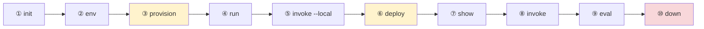

# ⌨️ CLI guide — the golden path

> Every command and every output block on this page was captured from a **real run against
> real Azure** on 2026-08-08 with `azd 1.30.0` / `azure.ai.agents 1.0.0-beta.9`.
> Total elapsed: ~10 minutes. Total resources created: **2**.



---

## ① Pick a sample

The CLI ships a curated catalog — **21 Python** and **13 C#** samples today.

```bash
azd ai agent sample list --language python
azd ai agent sample list --language dotnetCsharp
```

> [!TIP]
> `--language` takes the *short* form (`python`, `dotnetCsharp`).
> `--runtime` elsewhere takes the *full* token (`python_3_13`). They are not interchangeable —
> a bare `python` will fail as a runtime.

Machine-readable form, which is how you get the `manifestUrl` to feed into `init`:

```bash
azd ai agent sample list --language python --output json
```

```json
{
  "templates": [
    {
      "title": "Basic agent (Responses, Agent Framework, Python)",
      "manifestUrl": "https://github.com/microsoft-foundry/foundry-samples/blob/main/samples/python/hosted-agents/agent-framework/responses/01-basic/azure.yaml",
      "featured": true,
      "initCommand": "azd ai agent init -m \"…/01-basic/azure.yaml\""
    }
  ]
}
```

Full catalog → [reference/sample-catalog.md](../reference/sample-catalog.md).

---

## ② `init` — scaffold

```bash
mkdir my-agent && cd my-agent

azd ai agent init --no-prompt \
  -m "https://github.com/microsoft-foundry/foundry-samples/blob/main/samples/python/hosted-agents/agent-framework/responses/01-basic/azure.yaml" \
  --deploy-mode code \
  --runtime python_3_13 \
  --entry-point main.py
```

<details open>
<summary>✅ Verified output</summary>

```text
Downloading sample from GitHub...
  AGENTS.md
  CLAUDE.md
  README.md
  azure.yaml
  src/agent-framework-agent-basic-responses/.azdignore
  src/agent-framework-agent-basic-responses/.dockerignore
  src/agent-framework-agent-basic-responses/.env.example
  src/agent-framework-agent-basic-responses/Dockerfile
  src/agent-framework-agent-basic-responses/main.py
  src/agent-framework-agent-basic-responses/requirements.txt
Adopting the sample's azure.yaml as your project manifest...

Initializing an app to run on Azure (azd init)
  (✓) Done: Initialized git repository
  (✓) Done: Copying template code from local path to: …/agent-framework-agent-basic-responses

Installing required extensions...
  (-) Skipped: Installing azure.ai.agents extension (version 1.0.0-beta.9 already installed)
Missing Azure environment values: AZURE_SUBSCRIPTION_ID, AZURE_LOCATION. Continuing because --no-prompt was specified.

Adopted the sample's azure.yaml as the project manifest at azure.yaml.
```
</details>

**What you get:**

```text
my-agent/
├── azure.yaml                    ← the contract; read this first
├── AGENTS.md  CLAUDE.md  README.md
├── .azure/                       ← azd environment state (gitignored)
└── src/agent-framework-agent-basic-responses/
    ├── main.py
    ├── requirements.txt
    ├── Dockerfile                ← only used in container mode
    ├── .env.example
    ├── .azdignore  .dockerignore
    └── .venv/                    ← created later by `run`
```

> [!NOTE]
> **`--agent-name` does not rename the scaffold.** When `-m` points at a sample's unified
> `azure.yaml`, that file is *adopted verbatim*, so the folder and service keep the sample's
> name. To rename, edit `name:` in `azure.yaml` before deploying — the Foundry agent identity
> comes from there.

### Two manifest flavours

`init` accepts either. Knowing which you have explains most `init` errors.

| Flavour | Detected by | Behaviour |
|---|---|---|
| **Unified `azure.yaml`** (current) | declares a service with `host: azure.ai.agent` | adopted as your project manifest |
| **Agent manifest** (`agent.manifest.yaml`) | AgentManifest shape, has `template:` | an `azure.yaml` is *generated* from it |

A `must contain 'template' field` error means an **old extension** is trying to read a new
unified manifest as an agent manifest. Fix the version, not the file.

---

## ③ `env` — point at your subscription

```bash
azd env set AZURE_SUBSCRIPTION_ID <your-subscription-id>
azd env set AZURE_LOCATION eastus2
```

Values land in `.azure/<env-name>/.env`. That file is **gitignored** and is where secrets
belong — never in `azure.yaml`.

---

## ④ `provision` — create Azure resources

```bash
azd provision --no-prompt
```

<details open>
<summary>✅ Verified output — 1 min 25 s</summary>

```text
Reading subscription and location from environment...
Subscription: MCAPS-Hybrid-REQ-…
Location: East US 2

Preparing Foundry provisioning template...
Starting ARM deployment "azd-foundry-…"...
Foundry deployment in progress
…
Foundry deployment complete

SUCCESS: Your application was provisioned in Azure in 1 minute 25 seconds.
```
</details>

Exactly two resources appear:

```bash
az resource list -g <rg> --query "[].{name:name,type:type}" -o table
```

```text
cog-czn5ugi4jtvzs                                   Microsoft.CognitiveServices/accounts
cog-czn5ugi4jtvzs/agent-framework-agent-basic-resp  …/accounts/projects
```

Provision writes ~15 variables back into your environment. The one that matters:

```bash
azd env get-values | grep FOUNDRY_PROJECT_ENDPOINT
```

```text
FOUNDRY_PROJECT_ENDPOINT="https://cog-czn5ugi4jtvzs.services.ai.azure.com/api/projects/agent-framework-agent-basic-resp"
```

### 🐛 Gotcha: the model name is *not* set for you

`azure.yaml` declares `AZURE_AI_MODEL_DEPLOYMENT_NAME: ${AZURE_AI_MODEL_DEPLOYMENT_NAME}` and
`main.py` requires it — but `provision` only writes `AI_PROJECT_DEPLOYMENTS` (a JSON blob).
The plain variable is left unset, so the very next step crashes:

```text
RuntimeError: Model deployment name is not configured.
Set AZURE_AI_MODEL_DEPLOYMENT_NAME or FOUNDRY_MODEL_NAME.
```

Set it once, using the deployment name from `azure.yaml`:

```bash
azd env set AZURE_AI_MODEL_DEPLOYMENT_NAME gpt-5.4-mini
```

---

## ⑤ `run` — the local loop

```bash
azd ai agent run --no-client
```

<details open>
<summary>✅ Verified output</summary>

```text
Detected python project. Start command: python main.py
Setting up Python environment...
Using CPython 3.14.3
Creating virtual environment at: .venv
Installing dependencies (requirements.txt)...
  ✓ Dependencies installed (requirements.txt)
Starting agent on http://localhost:8088 (Ctrl+C to stop)

INFO azure.ai.agentserver: AgentServerHost starting on 0.0.0.0:8088
INFO azure.ai.agentserver: Platform environment: is_hosted=False, port=8088
INFO azure.ai.agentserver: Connectivity: project_endpoint=https://cog-….services.ai.azure.com
[INFO] Running on http://0.0.0.0:8088 (CTRL + C to quit)
```
</details>

Things worth noticing:

- **azd downloads its own Python** (`CPython 3.14.3` via `uv`). Your system Python is irrelevant.
- The venv is created **inside `src/<project>/`**, next to `requirements.txt` — not at the repo
  root. If you make one somewhere else, azd will quietly build a second one.
- Wait for **`Running on http://0.0.0.0:8088`**. `Starting agent…` is not ready yet.
- Drop `--no-client` to have the **Agent Inspector** open automatically.

> [!WARNING]
> Run this in a **real foreground terminal** (or a proper background job manager).
> Backgrounding it with `&`/`nohup` in a throwaway shell gets it SIGHUP'd and it dies silently.

> [!NOTE]
> **The scary traceback you can ignore.** On a dev machine you will see a large
> OpenTelemetry span with `ConnectTimeout … 169.254.169.254 … /metadata/instance/compute`.
> That is `DefaultAzureCredential` probing for an Azure managed identity that does not exist
> locally. It falls back to your `az login` credential and the agent works fine.

---

## ⑥ `invoke --local` — talk to it

In a second terminal:

```bash
azd ai agent invoke --local "In one short sentence, what is Microsoft Foundry?"
```

<details open>
<summary>✅ Verified output</summary>

```text
Target:       localhost:8088 (local)
Message:      "In one short sentence, what is Microsoft Foundry?"
Session:      68cd8680-fe5d-4db9-b42a-8e8d9176df1c
Conversation: 7f35cafd-8ae0-45c3-be19-1293cac45295

[local] Microsoft Foundry is Microsoft's platform for building, customizing, and
deploying AI apps and agents using foundation models.

Server responded in 9.966s (first byte: 9.966s)
```
</details>

> `curl http://localhost:8088/` returns **404** — that is correct. There is no root route;
> the protocol lives under the Responses API paths. Use `invoke` or the Inspector.

---

## ⑦ `deploy` — push to Foundry

```bash
azd deploy --no-prompt
```

<details open>
<summary>✅ Verified output — 2 min 3 s</summary>

```text
  agent-framework-agent-basic-responses: Packaging (Packaging code)
  agent-framework-agent-basic-responses: Publishing
  ai-project: Done [3s]
  agent-framework-agent-basic-responses: Deploying (Deploying hosted agent (code deploy)) [12s]
  agent-framework-agent-basic-responses: Deploying (Creating agent) [12s]
  agent-framework-agent-basic-responses: Deploying (Waiting for agent to become active) [29s]
  agent-framework-agent-basic-responses: Deploying (Polling agent status (1/30)) [39s]
  …
  agent-framework-agent-basic-responses: Deploying (Registering agent environment variables) [2m3s]
  agent-framework-agent-basic-responses: Done [2m3s]

- Agent playground (portal): https://ai.azure.com/nextgen/r/…/build/agents/…?version=1
- Agent endpoint (responses): https://cog-….services.ai.azure.com/api/projects/…/agents/…/endpoint/protocols/openai/responses?api-version=v1

SUCCESS: Your application was deployed to Azure in 2 minutes 3 seconds.
```
</details>

Deploy also injects per-service env vars back into your environment:

```text
AGENT_AGENT_FRAMEWORK_AGENT_BASIC_RESPONSES_NAME
AGENT_AGENT_FRAMEWORK_AGENT_BASIC_RESPONSES_VERSION
```

(`AGENT_<SERVICE_NAME_UPPERCASED>_NAME` / `_VERSION`.)

---

## ⑧ `show` — inspect what landed

```bash
azd ai agent show --output json
```

<details open>
<summary>✅ Verified output (trimmed)</summary>

```json
{
  "id": "agent-framework-agent-basic-responses:1",
  "version": "1",
  "definition": {
    "code_configuration": {
      "dependency_resolution": "remote_build",
      "entry_point": ["python", "main.py"],
      "runtime": "python_3_13",
      "content_hash": "1c2f4d9afa…"
    },
    "cpu": "0.5",
    "memory": "1Gi",
    "environment_variables": { "AZURE_AI_MODEL_DEPLOYMENT_NAME": "gpt-5.4-mini" },
    "kind": "hosted",
    "protocol_versions": [{ "protocol": "responses", "version": "2.0.0" }]
  },
  "status": "active",
  "instance_identity": { "principal_id": "2debe4d4-…", "client_id": "2debe4d4-…" },
  "agent_endpoints": { "responses": "https://…/endpoint/protocols/openai/responses?api-version=v1" }
}
```
</details>

Three things this proves:

1. **camelCase → snake_case.** Your local `codeConfiguration`/`entryPoint` becomes
   `code_configuration`/`entry_point` server-side. Both are correct in their own place.
2. **Auto-versioning.** The id is `…:1`. Deploy again with the same `name:` and you get `:2`,
   not a second agent.
3. **Per-agent managed identity.** `instance_identity` is the principal to grant roles to when
   the agent needs Azure resources.

> `azd ai agent list` does **not** exist. Use `show`, or the portal.

---

## ⑨ `invoke` — call the deployed agent

Same command, no `--local`:

```bash
azd ai agent invoke "In one short sentence, what is Microsoft Foundry?"
```

<details open>
<summary>✅ Verified output</summary>

```text
Agent:        agent-framework-agent-basic-responses (remote)
Session:      (new -- server will assign)
Conversation: conv_98fc078fd61adb6700sK4wWwLfqDWaB9QFH4mRra4PP2jrAUVZ

Session:      a68cf520617b24d768…  (assigned by server)
Trace ID:     8b0dc00e6f7758d4c3774034b5be2fb8
[agent-framework-agent-basic-responses] Microsoft Foundry is Microsoft's AI platform for
building, customizing, and deploying generative AI applications and agents with enterprise
tools and governance.

Server responded in 13.875s (first byte: 7.330s)
```
</details>

Note the **Trace ID** — remote invocations are traced automatically; paste it into the portal
to see the span tree.

Live logs:

```bash
azd ai agent monitor
```

---

## ⑩ `doctor` — when something is wrong

```bash
azd ai agent doctor
```

Checks local config, authentication *and* remote state (endpoint reachability, your RBAC role,
whether hosted agents are enabled). Run it first, always. Full green output is in
[setup](../setup/README.md#7-verify-everything).

---

## ⑪ `eval` — measure quality

```bash
azd ai agent eval generate --no-prompt \
  --gen-instruction "Generate 5 short factual questions a developer new to Microsoft Foundry would ask."
```

One of `--gen-instruction`, `--gen-instruction-file`, `--config`, or both `--dataset` and
`--evaluators` is **required** — a bare `eval generate` errors out.

Generated artifacts:

```text
src/<project>/
├── eval.yaml
├── datasets/smoke-core/smoke-core_dg.jsonl     ← LLM-authored test cases
├── evaluators/smoke-core/rubric_dimensions.json
└── .agent_configs/baseline/metadata.yaml
```

```yaml
# eval.yaml
name: smoke-core
agent:
    name: agent-framework-agent-basic-responses
    kind: hosted
    config: .agent_configs/baseline/metadata.yaml
dataset:
    name: smoke-core
    version: "1.0"
    local_uri: datasets/smoke-core
evaluators:
    - name: smoke-core
      version: "1"
      local_uri: evaluators/smoke-core/rubric_dimensions.json
options:
    eval_model: gpt-5.4-mini
max_samples: 15
```

The dataset is **LLM-authored from your agent's own description** — each row is a test
*intent*, not a hard-coded string:

```json
{
  "id": 1,
  "description": "Test whether the assistant answers a very short identity question at the
   correct level of specificity, using only what is supported by the assistant spec…"
}
```

Then run it:

```bash
azd ai agent eval run --no-prompt
```

<details open>
<summary>✅ Verified output — 3 min 15 s</summary>

```text
Resolving eval context...
  Updated eval.yaml with current environment values
Eval run started
   Eval: eval_8733d703d074418c826f4d9529c6b635
   Run:  evalrun_3f2742f28aa343d5a8e8408c246058e7
   Report: https://ai.azure.com/nextgen/r/…/build/evaluations/eval_…/run/evalrun_…

(✓) Done  Eval run  (3m 15s)

Eval:       eval_8733d703d074418c826f4d9529c6b635
Run:        evalrun_3f2742f28aa343d5a8e8408c246058e7
Name:       smoke-core
Status:     Completed
Agent:      agent-framework-agent-basic-responses v1

Results:    15 total, 13 passed, 2 failed, 0 errored

Per-criteria results:
  smoke-core: 13 passed, 2 failed, 0 errored
```
</details>

13/15 on a stock sample is normal — the generated rubric is deliberately strict. The point is
that you now have a **repeatable number** to move.

```bash
azd ai agent eval list      # history
azd ai agent eval show      # details of a run
azd ai agent eval update    # push edited evaluators/datasets
```

> [!TIP]
> `eval run` prints a **portal Report URL**. That page shows per-case pass/fail with the
> rubric's reasoning — far more useful than the terminal summary when you are trying to
> improve a score.

---

## ⑫ `down` — **always clean up**

```bash
azd down --force --purge
```

> [!CAUTION]
> `--purge` matters. Cognitive Services accounts are **soft-deleted** for 48 hours by default,
> and the name stays reserved. Without `--purge` a re-provision into the same name can fail.

---

## Command cheat sheet

| Command | Purpose |
|---|---|
| `azd ai agent init` | scaffold from sample / manifest / local src |
| `azd ai agent sample` | browse the catalog |
| `azd provision` | create the Foundry account + project |
| `azd ai agent run` | local server on `:8088` |
| `azd ai agent invoke [--local]` | send a message |
| `azd deploy` | package + push + version |
| `azd ai agent show` | deployed agent status/definition |
| `azd ai agent monitor` | stream logs |
| `azd ai agent doctor` | 13-point diagnostic |
| `azd ai agent eval` | generate / run / list / show / update |
| `azd ai agent optimize` | evaluate-and-improve instructions |
| `azd ai agent code` | manage agent source |
| `azd ai agent endpoint` | endpoint + agent-card config |
| `azd ai agent sessions` | session management |
| `azd ai agent files` | files in a hosted session |
| `azd ai agent delete` | delete a hosted agent |
| `azd down --force --purge` | destroy everything |

Full flag-by-flag surface → [reference/azd-cli.md](../reference/azd-cli.md).

---

## Next

- 👉 [The same journey in VS Code](../guide-gui/README.md)
- 👉 [Samples ladder 01 → 04](../../samples/README.md)
- 👉 [Troubleshooting](../reference/troubleshooting.md)
