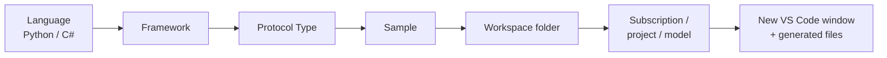

# 🖱️ GUI guide — VS Code Foundry Toolkit

> The same six verbs as the [CLI guide](../guide-cli/README.md), done visually.
> Sourced from the official docs (all 16 pages reviewed) cross-checked against `WHATS_NEW.md`
> v1.6.7. Where the official docs are wrong, this page says so.

> [!IMPORTANT]
> **The two tracks are not the same tool.** The VS Code extension and `azd ai agent` are
> parallel implementations that even use **different ports** (8087 vs 8088). Pick one per
> project. See [§7](#7-the-two-agent-inspectors--8087-vs-8088).

---

## 1. Install

```bash
code --install-extension ms-windows-ai-studio.windows-ai-studio
code --install-extension ms-python.python          # for Python debugging
```

The extension **requires the .NET Runtime** and installs it on first activation — expect a slow
cold start.

Then, from the Command Palette (`Ctrl/Cmd+Shift+P`):

| Command | Purpose |
|---|---|
| `Foundry Toolkit: Install environment prerequisites` | sets up **Foundry Local** |
| `Foundry Toolkit: Validate environment prerequisites` | status report |

Both gate all local-model features. Run the validate one whenever local models misbehave.

---

## 2. The sidebar — the product's own mental model

```text
MY RESOURCES
├── Local Resources          local models, agents, tools
├── Your Foundry Project     Models · Prompt Agents · Workflows ·
│                            Hosted Agents (Preview) · Tools · Knowledge · Classic
└── Connected Resources      external providers

DEVELOPER TOOLS
├── Discover   Model Catalog · Tool Catalog
├── Build      Create Agent · Agent Inspector · Deploy to Microsoft Foundry ·
│              Hosted Agent Playground · Model Playground · Model Conversion · Fine-tuning
└── Monitor    Tracing · Evaluation · Model Profiling (Windows ML) (Preview)

HELP AND FEEDBACK
```

> [!NOTE]
> The official `overview` page's tree is roughly **two minor versions behind**. Shipping builds
> replaced `Models`/`Knowledge` tree nodes with tabbed webviews and **removed**
> `Connected Resources`. Trust the UI in front of you, not the screenshot.
>
> The old separate "Foundry sidebar" retired **1 June 2026**; everything is in the Foundry
> Toolkit sidebar now.

---

## 3. Model Catalog & Playground

**Discover → Model Catalog** → filter by publisher/task/host → **Try in Playground**.

Providers: Azure AI Foundry, Foundry Local, Ollama, ONNX, custom endpoints, plus bring-your-own
(Azure OpenAI, OpenAI, Anthropic, Google).

> [!WARNING]
> **GitHub Models is retired.** Four official pages (`overview`, `models`, `tracing`,
> `copilot-tools`) still present it as the free on-ramp, and `faq` still refers to the
> "GitHub model market". It was removed from the Model
> Catalog, playground, comparison, Prompt Builder and evaluations in v1.6.7.
> **Today's no-Azure path is Foundry Local / Ollama / ONNX.**

Custom endpoints live in the setting:

```text
windowsaistudio.remoteInfereneEndpoints
```

The misspelling (*Inferene*) is in the **product**, not a typo here. Type it exactly.

---

## 4. Agent Builder — *prompt* agents

**Build → Create Agent → Open Agent Builder**, or click any existing Prompt Agent.

| Capability | Detail |
|---|---|
| **Instructions** | supports `{{variable}}` templating, with a Variables section |
| **Tools — catalog** | featured MCP servers, one click |
| **Tools — existing MCP** | `stdio` (command) or `HTTP`+SSE |
| **Tools — reuse VS Code tools** | creates a `VSCode Tools` MCP entry from tools already in VS Code |
| **Scaffold an MCP server** | Python or TypeScript; `F5` → *Debug in Agent Builder* auto-connects |
| **Function calling** | define a Custom Tool from a JSON-schema example or upload |
| **Mock responses** | per-tool mocks — **reusable in the Evaluation tab** for deterministic tests |
| **View Code / View Snippet** | full generated project vs a single file |
| **Versioning** | **every Save creates a new version** in Foundry; use the version selector to roll back |
| **Conversations tab** | historical test conversations |

MCP servers need Node (`npm install -g npx`) and/or Python (`uv` recommended).

> 💡 The mock-response → evaluation path is the most under-used feature in the whole extension.
> It gives you deterministic tool behaviour while you tune instructions.

---

## 5. Create a hosted agent

**Build → Create Agent**, then:



> [!CAUTION]
> The official page **`create-agents`** describes an **older wizard** — "choose Microsoft Agent
> Framework *or LangGraph*", two fixed templates (*Single Agent Hotel Assistant*,
> *Writer-Reviewer Agent Workflow*), no protocol step. That is not what ships.
> **Trust the `hosted-agents` page instead**; it matches the real filtered sample gallery
> (52 templates across `agent-framework` / `bring-your-own` / `copilot-sdk`).

---

## 6. Run & debug — `F5`

Press **`F5`**. The agent starts and the **Agent Inspector** opens automatically. Chat with it
there.

Manual alternative:

1. Set env vars and `az login`.
2. `python main.py` (listens on `http://localhost:8088`).
3. Command Palette → **Foundry Toolkit: Open Agent Inspector**.

The generated `tasks.json` uses the legacy task type — a fossil of the "AI Toolkit" era:

```json
{ "type": "aitk", "command": "ai-mlstudio.openTestTool" }
```

The Inspector also renders a **workflow graph** for Agent Framework workflows.

---

## 7. The two Agent Inspectors — 8087 vs 8088

Same name, two implementations — *and* two ports inside the azd track alone. Mixing them up
is the most common GUI confusion, so be precise about which of the three things you mean.

`azd ai agent run` opens **both** of these at once:

| Port | What it is | Flag |
|---|---|---|
| **8088** | Your agent's HTTP endpoint — what `invoke`/`curl` talk to | `--port` |
| **8087** | The Agent Inspector **UI** — what the browser opens | `--inspector-port` |

The VS Code AI Toolkit is a wholly separate stack:

| | VS Code extension track | `azd` track |
|---|---|---|
| Runtime | `agentdev` CLI | `azd` + `azure.ai.inspector` extension |
| **Ports** | `debugpy` on `5679` | **8088** agent · **8087** Inspector UI |
| Launch | `F5`, task `"type": "aitk"` | `azd ai agent run` |
| Command id | `ai-mlstudio.openTestTool` | — |

If the Inspector is blank, you are almost certainly on the other port.

---

## 8. Deploy — the matrix that matters

**Build → Deploy to Microsoft Foundry** (or Command Palette → *Foundry Toolkit: Deploy Hosted
Agent*). The wizard reads your manifest and pre-fills settings.

| Method | Sub-option | Meaning |
|---|---|---|
| **Code** (ZIP) | **Remote** ⭐ | Azure installs deps from `requirements.txt` / project files |
| | **Bundled** | ZIP runs as-is; deps pre-placed in `packages/` or publish output |
| **Container** (ACR) | **Default ACR** | Foundry-managed registry |
| | **Custom ACR** | you supply the registry URL |
| | **Custom ACR image** | you supply a prebuilt image URL |

Then: new vs existing agent → **Review + Deploy** (language, runtime version, entry point,
**CPU/Memory**).

> [!WARNING]
> 💰 **CPU and Memory choice affects billing.** The docs warn about this twice. Valid tiers:
> `0.25 / 0.5Gi`, `0.5 / 1Gi`, `1 / 2Gi`, `2 / 4Gi`.

Defaults worth knowing: v1.6.0 made **Code** the default method; v1.6.5 made **remote** package
mode the recommendation. The docs present both neutrally — prefer Code + Remote.

After deploying: invoke in the **Agent Playground** and stream live logs from the **Logs** tab.

---

## 9. Evaluation & Tracing

**Monitor → Evaluation** — built-in and custom evaluators, datasets, metrics; mock responses
from Agent Builder are reusable here.

**Monitor → Tracing** — local OTLP collector plus SDK instrumentation.

<details>
<summary>Instrumented SDKs</summary>

- **Python:** `agent-framework`, `azure-ai-inference`, `azure-ai-agents`, `azure-ai-projects`,
  `openai`, `openai-agents`, `langchain`, `google-genai`, `anthropic`
- **JS/TS:** `azure-ai-inference`, `azure-ai-projects`, `openai`, `langchain`, `anthropic`
</details>

> Known issue [#550]: tracing is broken on **linux-arm64** (the VSIX bundles an x86-64 native
> `@vscode/sqlite3`).

---

## 10. Copilot integration — the real bridge

The extension registers **four VS Code Language Model API tools**, selectable in Copilot Chat
agent mode via *Configure Tools…*:

| Tool | Purpose |
|---|---|
| **Agent Code Gen** | Scaffolds agent code (Agent Framework SDK). Function calling, MCP, streaming, workflows (Sequential, Switch-case, Loop, Human-in-the-Loop) |
| **AI Model Guide** | Recommends models by input type, context length, cost, quality/speed/safety — feeds Agent Code Gen |
| **Evaluation Code Gen** | Plan → metric suggestion → synthetic query gen → batch run → Azure AI Eval SDK code |
| **Tracing Code Gen** | Instrumentation best practices per SDK |

It also **auto-installs two Foundry Skills**:

- `microsoft-foundry-agent-framework-code-gen`
- **`microsoft-foundry`** — the full lifecycle skill

> [!TIP]
> That second skill is **the same one published at `microsoft/azure-skills`** and used by the CLI
> track. The extension and the CLI **share one skill** — that is the genuine integration point
> between the two tracks.

---

## 11. Platform constraints

| Constraint | Detail |
|---|---|
| .NET Runtime | required by the extension |
| OS | Windows, macOS, Linux |
| **Windows-only** | Model Conversion, Model Profiling (Windows ML) |
| **ARM Copilot+ PC** | required for fine-tuned Phi Silica local inference |
| **WSL** | saving projects while connected to a WSL remote session is *not supported* |
| MCP | needs Node.js and/or Python |

---

## 12. Official docs — what to trust

| Trust | Pages |
|---|---|
| ✅ **Trust** | `hosted-agents`, `agentbuilder`, `agent-inspector`, `playground`, `evaluation`, `tracing`, `finetune`, `modelconversion`, `profiling` |
| ⚠️ **Verify** | `overview` (sidebar ~2 versions behind), `models` (GitHub Models), `tool-catalog` (preview-gated), `copilot-tools` (broken install link) |
| ❌ **Ignore** | `create-agents` (old wizard), `faq` (dead repos, claims container support is "in progress" — it shipped) |
| ⚫ Historical | `finetune-legacy` |

Known bad links, verified:

| On page | Broken | Correct |
|---|---|---|
| `copilot-tools` | `itemName=ms-ai.vscode-ai-toolkit` → **404** | `ms-windows-ai-studio.windows-ai-studio` |
| `faq` | `AI-Mou/windows-ai-studio` | dead |
| `faq` | `microsoft/vscode-ai-toolkit` | dead |

> `WHATS_NEW.md` in `microsoft/foundry-toolkit` is the **only continuously-maintained source**.
> Check any surprising doc claim against it.

---

## 13. GUI ↔ CLI equivalence

| Step | VS Code | CLI |
|---|---|---|
| Scaffold | Create Agent wizard | `azd ai agent init` |
| Provision | Foundry Project Setup | `azd provision` |
| Run | `F5` → Inspector (**:8087**) | `azd ai agent run` (**:8088**) |
| Test | Inspector chat | `azd ai agent invoke --local` |
| Deploy | Deploy Hosted Agent wizard | `azd deploy` |
| Invoke | Agent Playground | `azd ai agent invoke` |
| Logs | Logs tab | `azd ai agent monitor -f` |
| Evaluate | Evaluation view | `azd ai agent eval` |
| Diagnose | — | `azd ai agent doctor` ⭐ *(no GUI equivalent)* |
| Optimize | — | `azd ai agent optimize` ⭐ *(no GUI equivalent)* |

The CLI is strictly the larger surface. The GUI is better for exploration, prompt iteration and
tracing visualisation.

---

## Next

- 👉 [CLI guide](../guide-cli/README.md)
- 👉 [Troubleshooting](../reference/troubleshooting.md)
- 👉 [Official docs](https://code.visualstudio.com/docs/intelligentapps/overview)
