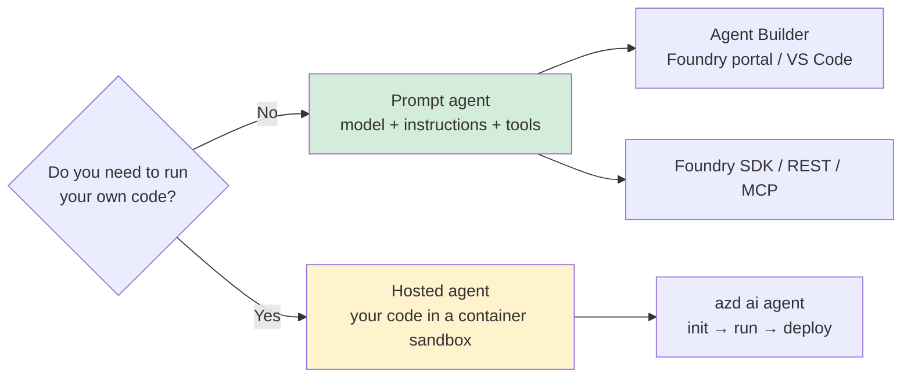
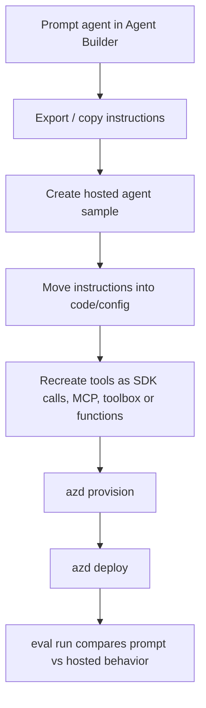

# 🧩 Prompt agents — the declarative path

> Hosted agents dominate this repo, but Foundry has another agent type: **prompt agents**.
> A prompt agent is a versioned Foundry resource defined by model, instructions and tool
> configuration — not by your containerized application code.
>
> This page is deliberately honest about the preview surface. Anything labelled **verified**
> was checked locally or read from a cited source while writing this page. Anything labelled
> **illustrative** is a pattern to adapt, not captured CLI output.



---

## 1. The precise distinction

The [concepts page](../concepts/README.md#2-two-kinds-of-agent-prompt-vs-hosted) gives the
short version. The deeper distinction is about **where behavior lives**.

| Question | Prompt agent | Hosted agent |
|---|---|---|
| What do you author? | Instructions, model choice, tool/knowledge configuration | Source code, dependencies, protocol server and runtime behavior |
| What is deployed? | A declarative agent definition in Foundry | A Foundry-hosted container/sandbox version |
| Does it need a `Dockerfile`? | No | Sometimes; code deploy can avoid ACR, container deploy uses Docker/ACR |
| Does it listen on port `8088`? | No | Yes locally with `azd ai agent run`; hosted runtime exposes protocol endpoints |
| Does it have custom code? | No custom server code | Yes — Python, C#, LangGraph, Agent Framework, OpenAI Agents SDK, etc. |
| Main authoring UI | VS Code / portal **Agent Builder** | `azd ai agent init`, VS Code Hosted Agent wizard |
| Main programmatic surface | Foundry SDK, REST, Foundry MCP tools | `azd provision`, `azd deploy`, `azd ai agent invoke` |
| Versioning | Creating/updating creates agent versions | Each `azd deploy` creates a version for the same agent name |
| Best first step | Build in Agent Builder, then copy SDK snippet | Start with [CLI guide](../guide-cli/README.md) |

> [!NOTE]
> Microsoft Learn defines a prompt agent as a declaratively defined agent that combines a
> Foundry model, instructions, tools and natural-language prompts to drive behavior. Hosted
> agents are for custom code and managed container execution.

---

## 2. What I could verify about the current surface

### CLI investigation

<details open>
<summary>✅ Verified locally: `azd ai agent --help` focuses on hosted-agent lifecycle commands</summary>

```text
Available Commands:
  code        Manage agent source code. (Preview)
  delete      Delete a hosted agent.
  doctor      Diagnose problems with an azd ai agent project.
  endpoint    Manage agent endpoint and card configuration.
  eval        Create and run quick evals for an agent.
  files       Manage files in a hosted agent session.
  init        Initialize a new AI agent project. (Preview)
  invoke      Send a message to your agent.
  monitor     Monitor logs from a hosted agent.
  run         Run your agent locally for development.
  sample      Browse the curated catalog of agent samples and azd templates.
  sessions    Manage sessions for a hosted agent endpoint.
  show        Show the status of a hosted agent.
```
</details>

<details>
<summary>✅ Verified locally: `azd ai agent init --help` has no prompt-agent mode flag</summary>

```text
Usage:
  agent init [<path>] [-m <manifest pointer>] [--src <source directory>] [flags]

Flags include:
  --deploy-mode string        Deployment mode: 'container' (Docker image) or 'code' (ZIP upload).
  --runtime string            Runtime for code deploy (e.g., 'python_3_13', 'python_3_14', 'dotnet_10').
  --entry-point string        Entry point file for code deploy.
  --image string              Pre-built container image URL.
```
</details>

<details>
<summary>✅ Verified locally: Python sample catalog is hosted-only</summary>

```text
azd ai agent sample list --language python --output json

21 templates
21 manifest URLs contain hosted-agents
0 titles/descriptions/URLs contain prompt
all template types are azure.yaml
```
</details>

### SDK / REST / MCP investigation

| Source checked | What it says |
|---|---|
| Microsoft Learn quickstart, “Create a prompt agent” | Uses `PromptAgentDefinition` in Python, `DeclarativeAgentDefinition` in C#, TypeScript `kind: "prompt"`, and REST `definition.kind: "prompt"`. |
| Microsoft Foundry Skill from `microsoft/azure-skills` | Says prompt agents are created/updated through Foundry MCP tools (`agent_definition_schema_get`, `agent_update`, `agent_get`, `agent_delete`) with SDK fallback. |
| This repo's `docs/concepts/README.md` | Explains prompt agents as instructions + model config + catalog tools, usually built in Agent Builder or portal. |
| This repo's `docs/reference/azure-yaml.md` | Shows `kind: hosted` in the verified manifest and notes `kind: hosted | prompt`, but does not give a verified prompt-agent `azure.yaml` schema. |

> [!WARNING]
> I could **not** verify a complete prompt-agent `agent.yaml` or `azure.yaml` schema from the
> local `azd ai agent` CLI. Do not invent one. For now, treat prompt-agent authoring as a
> Foundry SDK / REST / MCP / Agent Builder workflow, not an `azd ai agent init` workflow.

---

## 3. When to choose prompt vs hosted

| Choose prompt agent when... | Choose hosted agent when... |
|---|---|
| The behavior is mostly instruction-following and tool selection. | You need custom orchestration code, custom protocols or framework integration. |
| You want to iterate in Agent Builder with immediate playground feedback. | You need `azd ai agent run`, local HTTP debugging, package control or source-level tests. |
| Built-in tools cover the job: code interpreter, file search, web search, MCP, Azure AI Search, memory, etc. | You need arbitrary Python/C# packages, custom auth flows, long-running jobs or nonstandard APIs. |
| You do not need a container, `Dockerfile`, or port `8088`. | You need a container sandbox, CPU/memory tuning, session files or custom endpoints. |
| You want non-developers to edit instructions and test versions. | You want code review, CI builds, dependency scanning and application tests. |
| The agent can be expressed as “model + instructions + tools”. | The agent needs “model + code + state machine + external services”. |

> [!TIP]
> Start prompt-first when the uncertainty is **what the agent should say or which tools it
> should call**. Start hosted-first when the uncertainty is **how to implement the runtime**.

---

## 4. The verified prompt-agent definition core

The most concrete shape I could verify from Microsoft Learn is the agent definition object:

```json
{
  "name": "MyAgent",
  "definition": {
    "kind": "prompt",
    "model": "gpt-5-mini",
    "instructions": "You are a helpful assistant that answers general questions"
  }
}
```

| Field | Verified? | Meaning |
|---|---:|---|
| `name` | ✅ | Agent name within the Foundry project. Updates create versions under this name. |
| `definition.kind` | ✅ | `"prompt"` for prompt agents. |
| `definition.model` | ✅ | Model deployment/name used by the prompt agent. Learn examples use `gpt-5-mini`. |
| `definition.instructions` | ✅ | System/developer instructions that define behavior. |
| `temperature` | ⚠️ Skill-only in my investigation | The Foundry Skill mentions it as optional for MCP creation, but I did not verify the wire field from schema output. |
| `tools` | ✅ as a concept, ⚠️ shape varies | Tool support is documented; exact JSON shape depends on tool type and SDK/API version. |
| `knowledge` / file search | ✅ as file search/vector store concept, ⚠️ field shape not fully verified here | File search requires vector stores and `vector_store_ids`; do not add it without checking the current schema. |

> [!CAUTION]
> **Do not copy hosted-agent fields into a prompt agent.** A prompt agent has no
> `codeConfiguration`, `entryPoint`, `runtime`, `container.resources`, `Dockerfile`, or port
> `8088` server. Those belong to hosted agents.

---

## 5. Author instructions like production code

For prompt agents, instructions are the runtime. Keep them reviewable.

| Instruction area | What to include | Example |
|---|---|---|
| Role | What the agent is | “You are a support triage assistant for the Contoso billing team.” |
| Scope | What it may and may not answer | “Answer only billing-policy questions. For legal advice, say you cannot help.” |
| Tool policy | When to call tools | “Search files before answering policy questions; do not rely on memory.” |
| Output contract | Shape and tone | “Return a short answer, then a `Sources` bullet list.” |
| Safety | Refusal and escalation | “If confidence is low, ask one clarifying question or escalate.” |
| Evaluation hooks | Behaviors that can be scored | “Cite at least one retrieved document for policy answers.” |

Illustrative instruction block:

```text
You are a concise support triage assistant for Contoso billing.

Rules:
1. Answer only from connected knowledge sources.
2. If the source does not contain the answer, say: "I do not know from the available sources."
3. Never invent policy, pricing, refund or legal commitments.
4. Return:
   - Answer: one short paragraph
   - Sources: bullet list of documents or tool results used
```

> [!NOTE]
> Agent Builder supports variables in instructions. The VS Code docs show using variables to
> insert dynamic values while testing prompts.

---

## 6. Models, tools and knowledge

Prompt agents are useful because Foundry owns the model call and tool orchestration. The exact
schema should come from the current SDK, REST schema, or MCP `agent_definition_schema_get`.

| Capability | Verified status | Notes |
|---|---|---|
| Model | ✅ | Required in Learn examples. Must refer to a deployed/available Foundry model. |
| Instructions | ✅ | Required for meaningful behavior; field is shown in Learn examples. |
| Code Interpreter | ✅ concept | Listed by the Foundry Skill as a prompt-agent tool category. |
| Function calling | ✅ concept | Agent Builder can define custom tools from JSON-schema examples and mock responses. |
| File Search | ✅ concept + prerequisite | Requires vector stores; creating file search without `vector_store_ids` fails. |
| Web Search | ✅ concept | Skill says use `WebSearchPreviewTool` by default; use Bing Grounding only when explicitly required. |
| Bing Grounding | ✅ concept | Requires a Bing connection; do not use as the default web-search path. |
| Azure AI Search | ✅ concept | Use for private data search; requires project connection/configuration. |
| MCP tools | ✅ concept | Agent Builder can connect featured MCP servers, stdio commands, or HTTP/SSE servers. |
| Memory | ✅ concept | Skill lists memory as a prompt-agent option; verify prerequisites before using. |

> [!WARNING]
> Tool shapes are preview and tool-specific. For example, file search requires a vector store
> created before the agent and a `vector_store_ids` reference. Always check the current tool
> reference or schema before committing JSON.

---

## 7. Create a prompt agent programmatically

### Python SDK — illustrative, from Microsoft Learn shape

This is **illustrative** because it was not executed in this repo and would create a Foundry
agent version.

```python
from azure.identity import DefaultAzureCredential
from azure.ai.projects import AIProjectClient
from azure.ai.projects.models import PromptAgentDefinition

PROJECT_ENDPOINT = "https://<resource>.services.ai.azure.com/api/projects/<project>"
AGENT_NAME = "support-triage"

project = AIProjectClient(
    endpoint=PROJECT_ENDPOINT,
    credential=DefaultAzureCredential(),
)

agent = project.agents.create_version(
    agent_name=AGENT_NAME,
    definition=PromptAgentDefinition(
        model="gpt-5-mini",
        instructions="You are a concise support triage assistant.",
    ),
)

print(agent.name, agent.version)
```

### REST — illustrative, from Microsoft Learn shape

```bash
curl -X POST "https://<resource>.services.ai.azure.com/api/projects/<project>/agents?api-version=v1" \
  -H "Content-Type: application/json" \
  -H "Authorization: Bearer <token>" \
  -d '{
    "name": "support-triage",
    "definition": {
      "kind": "prompt",
      "model": "gpt-5-mini",
      "instructions": "You are a concise support triage assistant."
    }
  }'
```

### Foundry MCP — verified from the Skill, not executed

The Microsoft Foundry Skill describes this flow:

1. Resolve the project endpoint: `https://<resource>.services.ai.azure.com/api/projects/<project>`.
2. Call `agent_definition_schema_get` with `schemaType: "prompt"`.
3. Call `agent_update` with `kind: "prompt"`, model, instructions and optional tool config.
4. Use `agent_get` to verify, `agent_delete` to remove, and `agent_invoke` or the SDK to test.

> [!CAUTION]
> I did not have a project endpoint or Foundry MCP schema output in this documentation task, so
> this page does not include a fabricated MCP payload.

---

## 8. Invoke a prompt agent

Prompt agents are invoked through the Foundry project OpenAI/Responses surface with an agent
reference, or through SDK helpers that bind a client to the agent.

Illustrative REST call:

```bash
curl -X POST "https://<resource>.services.ai.azure.com/api/projects/<project>/openai/v1/responses" \
  -H "Content-Type: application/json" \
  -H "Authorization: Bearer <token>" \
  -d '{
    "agent_reference": {"type": "agent_reference", "name": "support-triage"},
    "input": [{"role": "user", "content": "What can you help with?"}]
  }'
```

Illustrative Python conversation pattern:

```python
project = AIProjectClient(endpoint=PROJECT_ENDPOINT, credential=DefaultAzureCredential())
openai = project.get_openai_client(agent_name=AGENT_NAME)
conversation = openai.conversations.create()

response = openai.responses.create(
    conversation=conversation.id,
    input="What can you help with?",
)
print(response.output_text)
```

> [!NOTE]
> This is not `azd ai agent run --local`. Prompt agents do not start a local server; the agent
> definition lives in Foundry and the model/tool execution happens through the service.

---

## 9. Agent Builder — the GUI equivalent

In VS Code Foundry Toolkit:

```text
Developer Tools → Create Agent → Open Agent Builder
```

Or open an existing prompt agent:

```text
My Resources → <project> → Prompt Agents → <agent>
```

| Agent Builder feature | Why it matters for prompt agents |
|---|---|
| Model dropdown | Choose the model backing the prompt agent. |
| Instructions editor | Main authoring surface for behavior. |
| Variables | Test templated prompts with dynamic values. |
| MCP server connection | Attach local stdio or remote HTTP/SSE MCP servers. |
| Featured MCP servers | Discover common tool integrations. |
| Custom function tool | Define function-calling tools from schema/examples. |
| Mock responses | Make tool behavior deterministic while evaluating prompt changes. |
| Evaluation tab | Reuse mocks and test cases to score prompt behavior. |
| View Code / View Snippet | Generate app code that calls the prompt agent. |
| Conversation history | Review test conversations across iterations. |

> [!TIP]
> Agent Builder is the safest place to discover tool prerequisites. If the UI needs a
> connection, vector store, schema or mock response, configure that before translating the
> agent into SDK or REST calls.

---

## 10. Where `agent.yaml` fits — and where it does not

This repo has two overlapping historical models:

| File/model | Current confidence | Notes |
|---|---|---|
| Unified `azure.yaml` for hosted agents | ✅ high | Verified throughout this repo. `host: azure.ai.agent`, `kind: hosted`, `codeConfiguration`, protocols, env vars. |
| Legacy `agent.manifest.yaml` seed | ✅ high | `azd ai agent init -m` still accepts it and generates a project. |
| Standalone hosted `agent.yaml` | ⚠️ legacy/skill references | Some skill docs mention it; this repo's current reference says new work should use unified `azure.yaml`. |
| Prompt-agent `agent.yaml` schema | ❌ not verified | I did not find a local CLI path that creates prompt agents from `agent.yaml`. |

The local `azd ai agent init --help` examples are all hosted/code/container oriented. Microsoft
Learn's prompt-agent quickstart uses SDK/REST, not `azd ai agent init`.

> [!WARNING]
> If you see a prompt-agent YAML example elsewhere, validate it against the current Foundry
> schema before using it. Do not assume hosted fields apply.

---

## 11. Limitations vs hosted agents

| Limitation | Why it matters | Hosted-agent escape hatch |
|---|---|---|
| No arbitrary server code | You cannot run custom Python/C# logic inside the prompt agent itself. | Move orchestration into a hosted agent. |
| No local `azd ai agent run` loop | Testing happens in Agent Builder, portal, SDK or remote service calls. | Hosted agents run locally on `8088`. |
| Tool schema varies by tool/API version | Declarative tool JSON can drift during preview. | Implement custom tool routing in code or use toolbox/MCP from hosted code. |
| Less runtime control | CPU/memory, package versions, filesystem and custom protocols are not yours. | Hosted agents expose container resources and protocols. |
| Harder to unit test as code | Instructions can be reviewed, but behavior is service/model dependent. | Put deterministic logic in normal code tests. |
| Preview churn | SDK names, schema names and tool types can change. | Pin dependencies and isolate Foundry calls behind your app code. |

---

## 12. Migrate from prompt to hosted when you outgrow it

Use this path when a prompt agent becomes too complex or too business-critical to remain
purely declarative.



1. **Freeze the prompt version.** Record agent name, version, model, instructions and tools.
2. **Create a hosted baseline.** Use [CLI guide](../guide-cli/README.md) or a sample that matches
   your preferred framework/protocol.
3. **Carry over instructions.** Put the prompt in a reviewed config file or constant used by
   your model call.
4. **Replace declarative tools intentionally.**
   - Built-in tool → SDK/library call, toolbox, or MCP.
   - Function calling → real function implementation and tests.
   - File search → vector store / Azure AI Search / retrieval code.
5. **Set required env vars.** Especially `AZURE_AI_MODEL_DEPLOYMENT_NAME`; hosted samples need it.
6. **Deploy as a new agent name.** Do not overwrite the prompt agent until evaluation passes.
7. **Run the same eval dataset against both.** The migration is successful when the hosted agent
   matches or improves the reviewed quality bar.
8. **Update consumers.** Switch endpoint/agent references, then retire the prompt agent only after
   rollback is no longer needed.

> [!TIP]
> The migration line is usually crossed when you start saying “just one small script would fix
> this.” That script belongs in a hosted agent, not in a larger prompt.

---

## 13. Troubleshooting prompt agents

| Symptom | Likely cause | Fix |
|---|---|---|
| Agent creation fails with model error | Model deployment/name is missing or unavailable | Deploy the model first and use the exact deployment/model name. |
| SDK import errors | Wrong SDK generation/version | Microsoft Learn prompt quickstart uses Azure AI Projects 2.x; install the current package and avoid 1.x examples. |
| 403 / permission denied | Principal lacks Foundry data-plane role | Assign **Foundry User** for create/edit, or **Foundry Agent Consumer** for invoke-only. |
| File search tool fails | No vector store or missing `vector_store_ids` | Create/populate the vector store before adding file search. |
| Tool exists but cannot call downstream API | Missing project connection, OAuth consent or secret | Configure the connection in Foundry/Agent Builder and retest. |
| Prompt works in UI but app call ignores it | App calls the model directly, not the agent reference | Use the SDK helper bound to `agent_name` or include `agent_reference` in REST. |
| Looking for `Dockerfile` or port `8088` | Confusing prompt with hosted agent | Prompt agents have no container server; use hosted if you need runtime code. |
| Need CI deployment from YAML | Schema not verified through `azd ai agent init` | Use SDK/REST/MCP with schema validation, or migrate to hosted for `azd deploy`. |

---

## 14. What remains unverified

I could not verify these items without creating Azure resources or accessing a live Foundry MCP
schema:

- The complete `agent_definition_schema_get` output for `schemaType: "prompt"`.
- A complete prompt-agent JSON schema including every optional tool field.
- A prompt-agent `agent.yaml` or unified `azure.yaml` shape accepted by `azd deploy`.
- Exact wire shapes for every prompt-agent tool category in the current preview.
- Live output from creating, updating, invoking or deleting a prompt agent.

That is why this page gives verified core fields and safe workflows, but does **not** fabricate
an `agent.yaml` schema.

---

## Next

- 👉 [Concepts](../concepts/README.md) — prompt vs hosted mental model.
- 👉 [GUI guide](../guide-gui/README.md) — Agent Builder and VS Code path.
- 👉 [CLI guide](../guide-cli/README.md) — hosted-agent golden path.
- 👉 [Troubleshooting](../reference/troubleshooting.md) — known failures and fixes.
