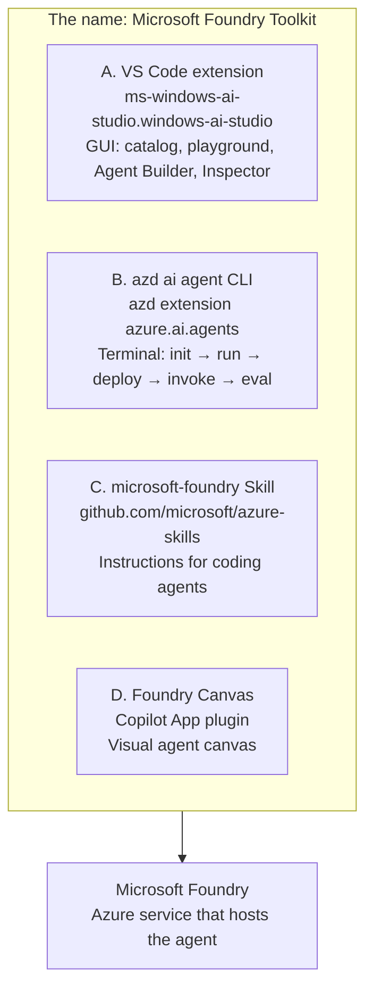
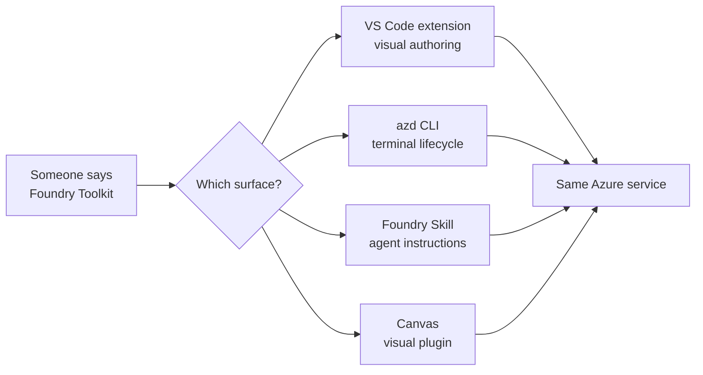
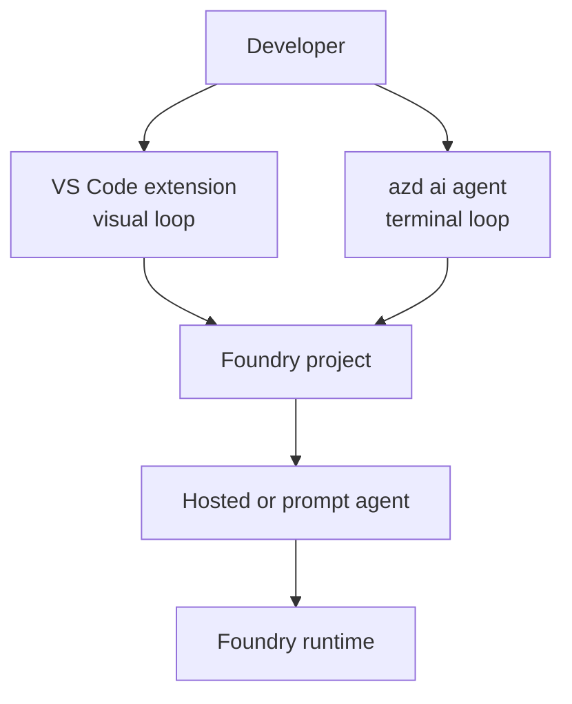

# 01 · What is the Toolkit?

> The phrase "Microsoft Foundry Toolkit" is overloaded. Treat it as an ecosystem label, not as one installable thing.

The single most confusing thing about the ecosystem is that four different products wear one name. No official page says that plainly enough, so this guide starts there.

| | What it is | Where it is documented | Maturity |
|---|---|---|---|
| **A. VS Code extension** | GUI for models, prompts, agents, eval | [code.visualstudio.com/docs/intelligentapps](https://code.visualstudio.com/docs/intelligentapps/overview) | GA-ish, docs partly stale |
| **B. `azd ai agent`** | Full agent lifecycle from the terminal | `--help`, Learn, and this repo | Preview, moves fastest |
| **C. Foundry Skill** | 187 files of guidance that make a coding agent good at Foundry | `microsoft/azure-skills` | Preview |
| **D. Foundry Canvas** | Copilot **App** plugin, not Copilot CLI | bundled in `microsoft/foundry-toolkit` | Early preview |

The repository <https://github.com/microsoft/foundry-toolkit> contains **no toolkit source code**. It is a docs, changelog, issue-tracker and sample-distribution repo. The extension itself is closed-source. Do not go there looking for the implementation.

## Why the name causes bad assumptions

A learner usually meets the Toolkit through one surface and assumes the other surfaces are the same product with different buttons. They are not.

The common destination is Microsoft Foundry, the Azure service. The product surfaces differ in how they create, inspect, run and deploy things.

That distinction matters because a claim can be true for one surface and false for another:

| Claim | Correct scope |
|---|---|
| The GUI has an Agent Builder and Inspector | VS Code extension |
| The lifecycle is exposed as terminal verbs | `azd ai agent` |
| A coding agent can follow a Foundry workflow without relearning the product | Foundry Skill |
| The canvas is a Copilot App plugin | Foundry Canvas |
| The hosted agent ultimately runs in Foundry | The Azure service underneath all of them |

## The two surfaces this repo treats as primary

This guide covers the VS Code extension and the `azd ai agent` CLI in equal depth, because those are the two surfaces developers actually build with.

The CLI is especially important for a getting-started repository because it is observable. Help text, manifests, environment values and deployment output can be captured and checked. That is why the reference layer leans heavily on verified CLI output.

The GUI matters for a different reason: it is where many people first understand the system visually. Agent Builder, Playground and Inspector give names and shapes to concepts that the CLI exposes as commands and files.

The mental model is therefore:

## What to trust for which question

The repo's reference layer has the detailed trust map, but the short version is:

| Question | Best starting point |
|---|---|
| What does my installed CLI support? | [`azd ai agent` reference](../reference/azd-cli.md) |
| Which docs are stale? | [ecosystem map](../reference/ecosystem.md) |
| What does a specific sample create? | [sample catalog](../reference/sample-catalog.md) and the sample README |
| How do permissions actually work? | [identity & RBAC](../reference/identity-and-rbac.md) |

A recurring rule in this repository follows from that: prefer observed behaviour over product names. "Toolkit" is not specific enough to prove anything.

## The useful simplification

After you separate the four products, the system becomes easier to learn:

1. The **VS Code extension** and **CLI** are authoring surfaces.
2. The **Foundry Skill** is guidance for coding agents.
3. **Canvas** is another visual surface.
4. **Microsoft Foundry** is where the hosted result lives.

Everything else in this layer builds on that split.

## → Next

[Understand the two agent types](02-agent-types.md)

---

[← 📘 Learn index](README.md) · [📘 Learn index](README.md) · [Agent types →](02-agent-types.md)
