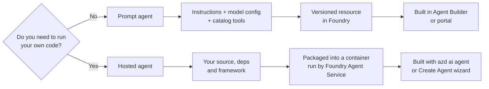
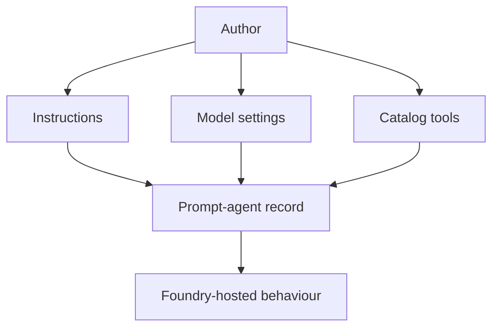
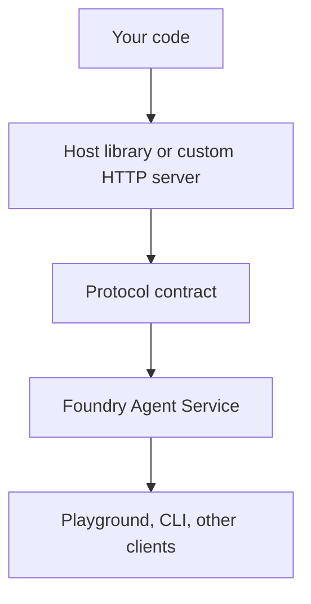
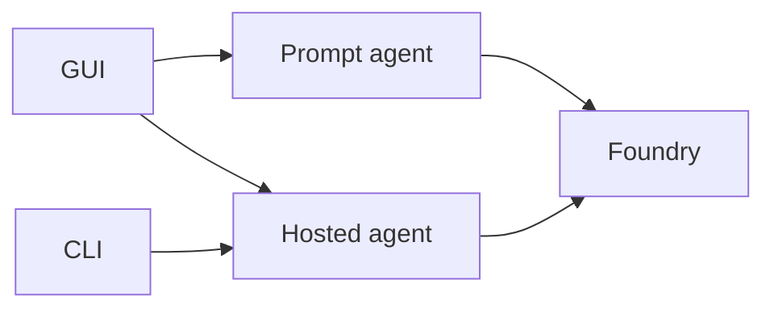

# 02 · Agent types

> Almost every "why can't I do X?" question starts with the same check: are you using a prompt agent or a hosted agent?

There are two primary agent kinds in this getting-started path.

| | Prompt agent | Hosted agent |
|---|---|---|
| You author | Instructions, model, temperature, tools | **Code**: Python or C# in this repo |
| Framework | none — declarative | Agent Framework, LangGraph, OpenAI Agents SDK, Pydantic AI, Claude Agent SDK, or none |
| Artifact | a configuration record | a container image or code package |
| Versioning | auto-increments on Save | auto-increments on deploy (`name:1`, `name:2`, …) |
| Local run | playground only | real HTTP server on your machine |
| Custom logic | ❌ | ✅ |
| Typical tool | Agent Builder | `azd ai agent` |

Two more kinds exist in preview and are out of scope for the basic getting-started path: **Workflows** and **Routines**. Workflows are graphs of agents. Routines are deterministic multi-step procedures.

This repository is about **hosted agents**, because that is where the developer story lives.

## Prompt agents: declarative behaviour

A prompt agent is the closest thing to "configure an assistant". You provide instructions, model configuration and tool choices. Foundry owns the runtime shape.

That makes prompt agents useful when the hard part is prompt design rather than application code. They are also a good way to learn Foundry's UI vocabulary: model, tool, evaluation, playground and version.

Their limit is also their strength: there is no arbitrary application process for you to control. If you need a custom framework, a custom dependency graph, bespoke request handling or local debugging as a server, you have crossed into hosted-agent territory.

## Hosted agents: code behind a protocol

A hosted agent is your application process behind a Foundry contract. Foundry does not care whether the handler is small or sophisticated. It cares that the deployed service speaks a supported protocol and can be managed as an agent.

That is why hosted agents are the focus of the samples. A hosted agent can:

- use Python or C# source in the sample ladder;
- run locally as a real HTTP server;
- be deployed as code or as a container;
- call external tools;
- receive a per-agent managed identity once deployed;
- participate in versioned deployment and rollback.

## The mistake to avoid

Do not evaluate an agent kind by the UI you used to create it. The distinction is not "GUI vs CLI". The distinction is whether the agent is a declarative Foundry record or a hosted application process.

The GUI can participate in hosted-agent authoring through its hosted-agent flow. The CLI can initialise and deploy hosted agents. Prompt agents are mostly a GUI and portal story in this repo.

## How this affects every later page

| Later topic | Why agent type matters |
|---|---|
| Lifecycle | Hosted agents have a local run loop; prompt agents do not have the same local server. |
| Protocols | Hosted agents declare a wire protocol; prompt agents are configured rather than hosted behind your server. |
| Execution | Hosted code runs locally first and then in Foundry; prompt behaviour lives in the service. |
| Identity | Deployed hosted agents get a per-instance managed identity. |
| Versioning | Hosted deploys produce `name:n` versions. |

A simple rule works for this guide: if a page discusses source code, local ports, container images, `azure.yaml` protocols or managed identities for running code, it is talking about hosted agents.

## → Next

[Learn the six lifecycle verbs](03-lifecycle.md)

---

[← What is the toolkit?](01-what-is-the-toolkit.md) · [📘 Learn index](README.md) · [The lifecycle →](03-lifecycle.md)
