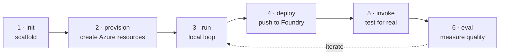
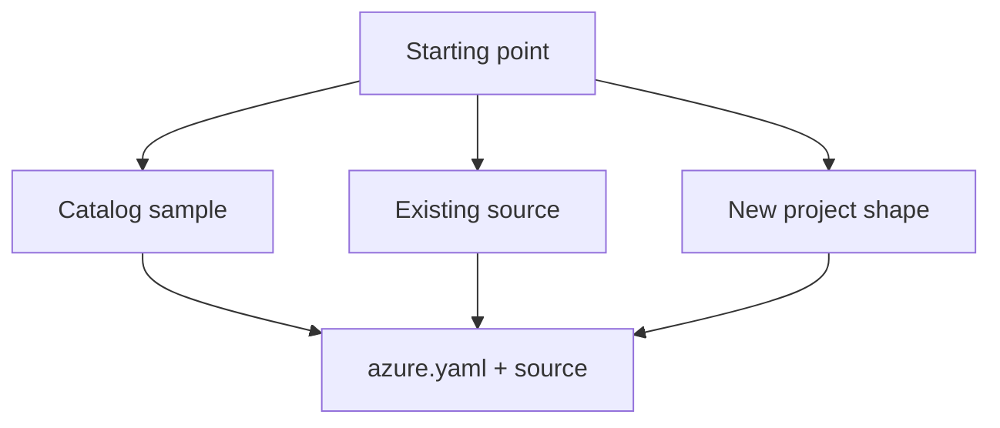
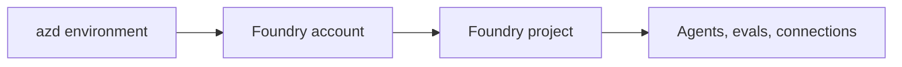
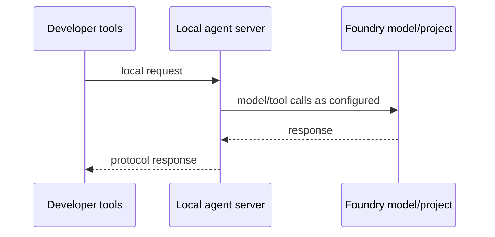
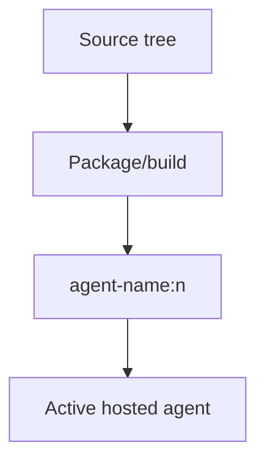
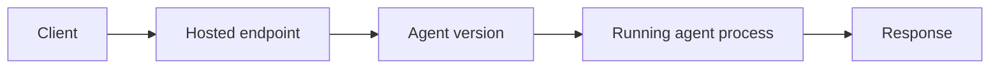
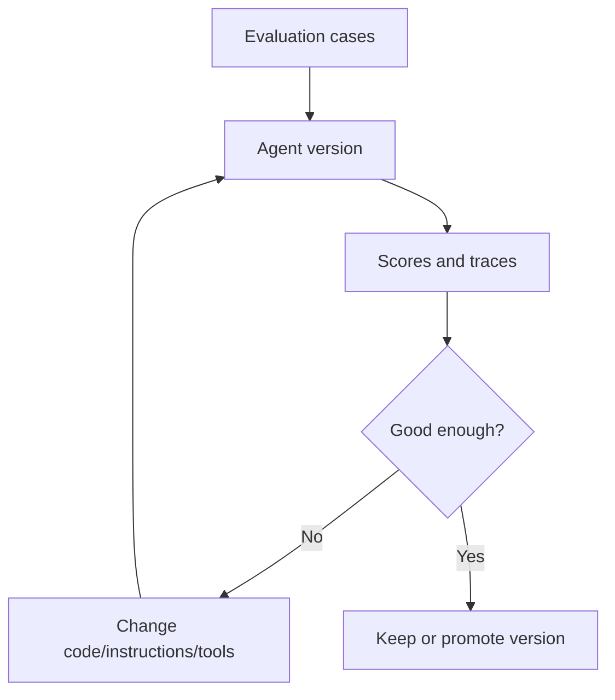

# 03 · Lifecycle

> The GUI and CLI look different, but the work is the same six verbs: init, provision, run, deploy, invoke, eval.

Once you know the verbs, both tracks become one product with two surfaces.

| Verb | CLI surface | VS Code surface |
|---|---|---|
| 1 · init | `azd ai agent init` | **Create Agent** wizard |
| 2 · provision | `azd provision` | Foundry Project Setup |
| 3 · run | `azd ai agent run` | `F5` → Agent Inspector |
| 4 · deploy | `azd deploy` | **Deploy Hosted Agent** wizard |
| 5 · invoke | `azd ai agent invoke` | Agent Playground |
| 6 · eval | `azd ai agent eval` | **Evaluation** view |

This table is not a prescription to type commands in the learn layer. It is a map: when a tutorial or a UI says one of these words, you can place it in the lifecycle.

## 1 · Init: choose the shape

Initialisation is where a hosted-agent project gets its skeleton: source folder, `azure.yaml`, agent metadata and the selected protocol.

This is where early choices become explicit:

| Choice | Later consequence |
|---|---|
| Language and runtime | Determines the source layout and local host behaviour. |
| Deploy mode | Determines whether ACR is needed. |
| Protocol | Determines which clients can talk to the agent. |
| Existing project vs new project | Determines whether provisioning creates a Foundry account/project or binds to an existing one. |

## 2 · Provision: create the shared stage

Provisioning creates Azure resources for the environment. In the verified basic sample, that meant a Cognitive Services account and a project beneath it; no ACR, no Key Vault, no storage account and no App Service.

Provisioning is not the same as deploying an agent version. It prepares the stage. Deployment later pushes the actor onto it.

The most important caveat is identity: the golden path can succeed because the signed-in developer already has inherited permissions. Provisioning did not grant new resource-group roles in the captured run. That matters for CI, and it gets its own page later.

## 3 · Run: local feedback

The local run loop exists because a hosted agent is an HTTP server. It gives fast feedback before Azure deployment enters the picture.

Local success proves that your process can start and speak the selected protocol. It does **not** prove that the hosted managed identity has the same permissions as your developer identity.

## 4 · Deploy: create an agent version

Deployment packages the agent and creates or updates the hosted agent in Foundry. Reusing a name creates a new version of that existing agent rather than a separate agent.

The output is versioned. That version boundary is one of the main safety features of the product: source and configuration can move forward without erasing what was previously deployed.

## 5 · Invoke: test the hosted reality

Invocation is where the local story meets the hosted story. It exercises the deployed endpoint, session handling, protocol implementation and hosted identity.

A successful invoke means the deployed agent is reachable and able to respond. It still does not mean the agent has every permission it will need in production; it only proves the path exercised by that invoke.

## 6 · Eval: measure quality, not just liveness

Evaluation closes the loop. A live response is not the same as a good response.

The lifecycle becomes a loop once eval is involved. You change the agent, deploy a new version, compare results and keep the version that behaves better.

## The compact mental model

| Verb | Question it answers |
|---|---|
| Init | What are we building? |
| Provision | Where will it live? |
| Run | Does the local server work? |
| Deploy | What version is now hosted? |
| Invoke | Does the hosted version answer? |
| Eval | Is the answer good enough? |

Everything else in the repo is a detail underneath one of those questions.

## → Next

[Choose the protocol contract](04-protocols.md)

---

[← Agent types](02-agent-types.md) · [📘 Learn index](README.md) · [Protocols →](04-protocols.md)
