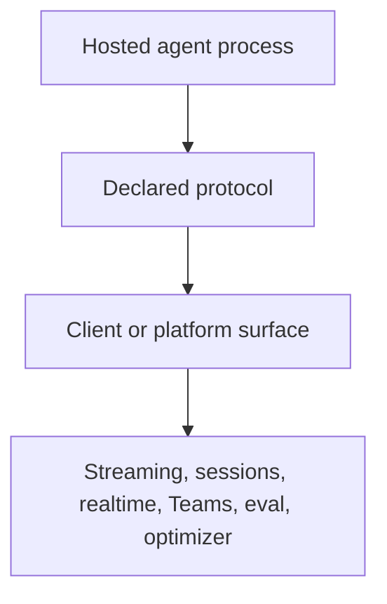
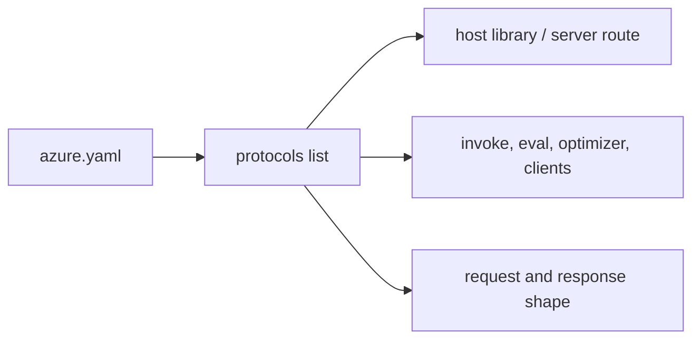
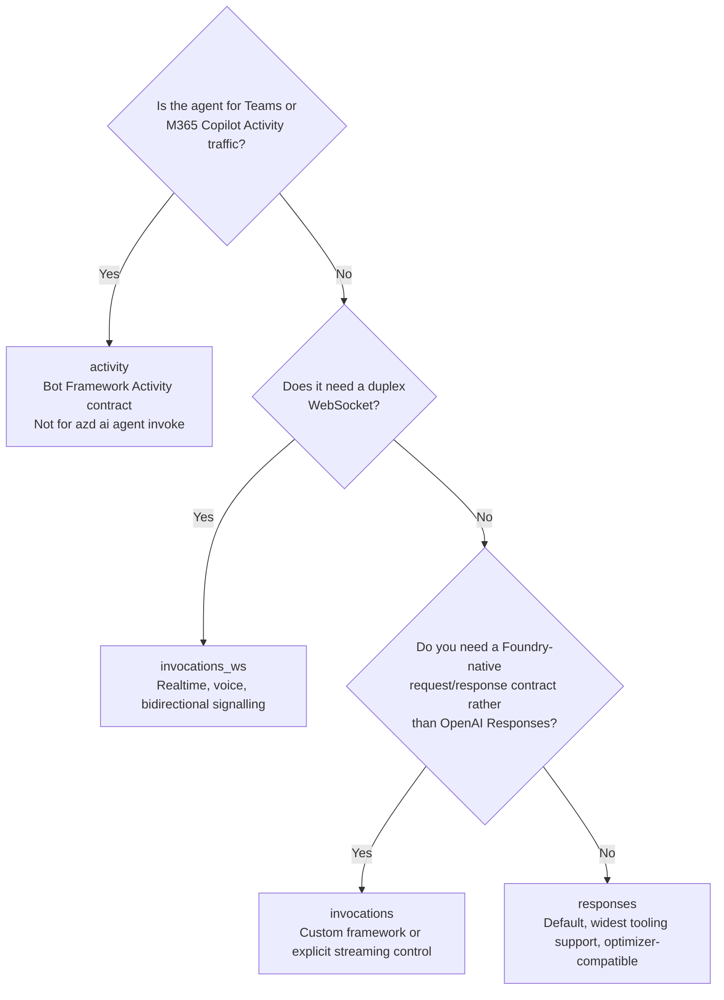
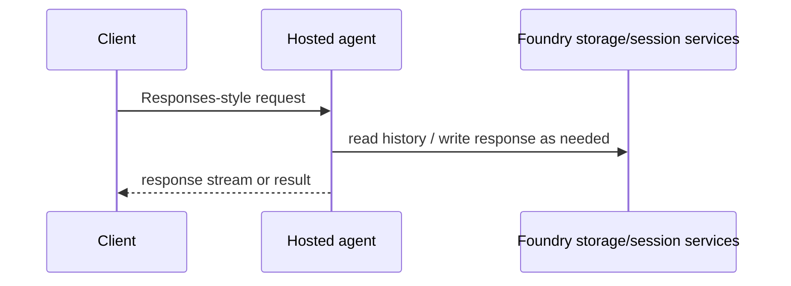
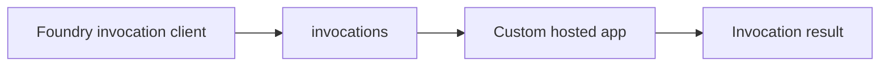
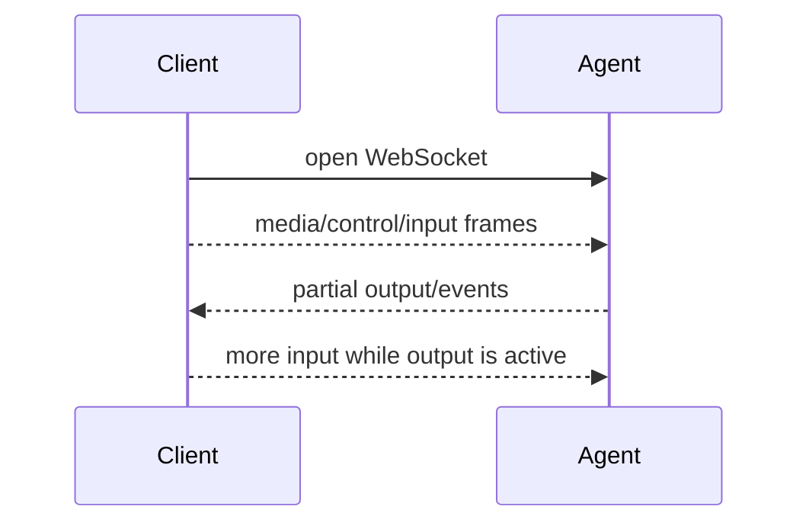
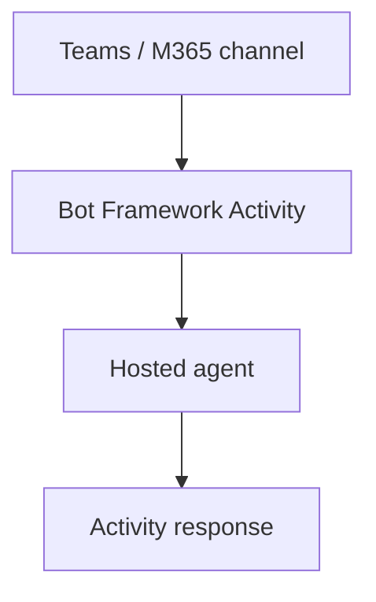

# 04 · Protocols

> A hosted agent is just an HTTP server from Foundry's point of view. The protocol is the contract that says how clients may talk to it.

You declare supported protocols in `azure.yaml`. That declaration determines which tooling can invoke the agent, which runtime libraries fit, and which product features can sit on top.



| Protocol | Shape | Use it for | Notes |
|---|---|---|---|
| **`responses`** | OpenAI Responses API, REST + SSE | **Default. Start here.** | Required by Agent Optimizer |
| `invocations` | Foundry-native request/response | Custom frameworks, streaming control | Useful when the hosted shape is not Responses-first |
| `invocations_ws` | Duplex WebSocket | Voice, realtime, bidirectional flows | For realtime and out-of-band media patterns |
| `activity` | Bot Framework Activity | Teams / M365 Copilot | Cannot use `azd ai agent invoke` |

The key idea is that protocol is not an implementation detail. It is a compatibility promise.

## The declaration is small, the consequence is large

The manifest shape is compact:

```yaml
protocols:
  - protocol: responses
    version: 2.0.0
```

That snippet is included as an illustration of the concept, not as an instruction for this layer. The reference layer owns the exact schema details: [`azure-yaml.md`](../reference/azure-yaml.md).



If the manifest says one thing and the server speaks another, the product surface does not have much room to help. Clients will send the shape they were promised.

## Decision tree

Use this as a mental model for the first protocol choice.



The shortest practical answer is still: if none of the branches force you away, use `responses`.

## `responses`: the default centre of gravity

`responses` is the default for the golden path because it aligns with the OpenAI Responses API shape and has the widest support in this repo's verified flow.



It is also the protocol accepted by Agent Optimizer. That one fact makes it the safest starting point for a learner who wants the full lifecycle: run, deploy, invoke, evaluate and optimise.

## `invocations`: Foundry-native request/response

`invocations` is for agents that want a Foundry-native invocation contract rather than the Responses shape. It is still request/response, and it can be a better fit for custom frameworks or explicit control over streaming semantics.



The important distinction is not "simple vs advanced". It is "which wire shape does your code actually implement?"

## `invocations_ws`: duplex and realtime

`invocations_ws` exists for bidirectional WebSocket flows. That is a different class of application from ordinary request/response.



Voice and realtime scenarios are the natural examples because the client and server both need to send events while the interaction is still alive.

## `activity`: Bot Framework shape

`activity` is for Bot Framework Activity traffic, including Teams and M365 Copilot style integrations.



The crucial gotcha from the existing docs is that `activity` agents cannot use `azd ai agent invoke`. That is not a bug in invoke; it is a protocol mismatch.

## Protocol mistakes are usually category mistakes

| Symptom | Likely category mistake |
|---|---|
| Tooling cannot invoke the agent | The tool speaks a different protocol from the manifest. |
| Realtime design feels awkward | Request/response protocol selected for a duplex problem. |
| Optimizer cannot be used | The agent is not on `responses`. |
| Teams path does not fit | The agent is not using the Activity contract. |

Protocol is therefore one of the first design decisions worth writing down, even for a small sample.

## → Next

[See where the code runs](05-where-code-runs.md)

---

<sub>[← The lifecycle](03-lifecycle.md) · [📘 Learn index](README.md) · [Where code runs →](05-where-code-runs.md)</sub>
