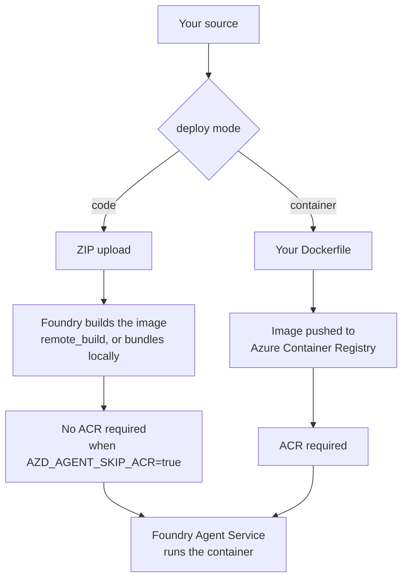
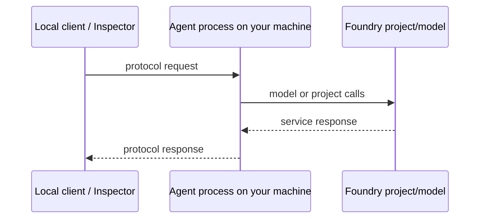
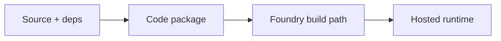
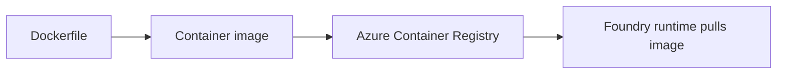
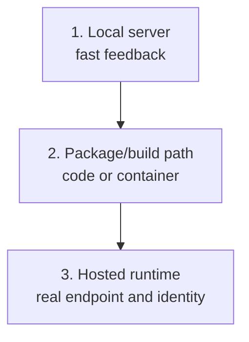

# 05 · Where code runs

> Hosted-agent code has three important locations: your machine, a code-deploy build path, and a container-deploy path.

Two deploy modes change what Azure resources are needed.

| | `--deploy-mode code` | `--deploy-mode container` |
|---|---|---|
| You provide | source + dependency file | source + `Dockerfile` |
| Build happens | in Azure (`remote_build`) or locally (`bundled`) | on your machine or CI |
| Registry | **not needed** (`AZD_AGENT_SKIP_ACR=true`) | ACR needed |
| Iteration speed | fast | slower, but total control |
| Good for | getting started, most agents | native deps, custom base images |

Start conceptually with `code`. This repo's golden path uses it, and it means the basic Azure footprint stays small.

## Local run is not a fake run

A hosted agent is an HTTP server. In the local loop, that server is on your machine, but it still speaks the selected protocol.

This is why local run is valuable. It validates the server startup path, routing, dependencies and protocol implementation before packaging and deployment.

The local identity is different, though. Code that uses Azure credentials locally is using the developer's sign-in context. The same code in Foundry uses the deployed agent's managed identity. That difference is the subject of the identity page.

## Code deploy: less infrastructure, less packaging work

In code deploy mode, the project sends source and dependency metadata. Foundry handles the build path for the hosted runtime.

The verified basic path created no Azure Container Registry. That is not a universal law; it is a property of the code-mode golden path as captured.

Code deploy is therefore the right mental default for learning:

- fewer Azure resources;
- fewer image-publishing concerns;
- faster path from source change to hosted version;
- fewer permissions to reason about at the start.

## Container deploy: more control, more responsibility

Container deploy mode moves image construction into your world. You supply the Dockerfile and the image must be available to the hosted service.

The benefit is control: native dependencies, custom base images, exact packaging and CI image policy. The cost is that ACR and pull permissions enter the design. The deployed agent's instance identity needs access to pull the image.

## Hosted execution is still your process

Foundry hosts the process, but your code is still the thing handling requests. That has practical consequences:

| Concern | Why it still matters when hosted |
|---|---|
| Startup time | The container has to become ready before it can serve. |
| Dependency failures | Missing runtime dependencies fail in the hosted process. |
| Protocol routes | The server must expose the contract declared in `azure.yaml`. |
| Environment variables | The hosted process receives configuration from the azd/Foundry environment. |
| Identity | Azure calls come from the agent instance identity, not the developer. |

## The three-location model

When debugging, first ask which location is failing. A dependency problem during local run is a different failure from an ACR pull failure in container deploy or a permission failure inside the hosted runtime.

## ✅ Check your understanding

Three questions. If you can answer all three, move on.

<b>1.</b> You switch to container mode to install a system package your agent needs. What recurring cost have you just signed up for, and why does it apply even on days you never deploy?

A **Premium-SKU** Azure Container Registry (ACR), which is billed daily regardless of deployment activity. Container mode requires ACR for image storage, and that resource incurs cost as long as it exists. See [What Azure creates](06-what-azure-creates.md).

<b>2.</b> Your agent works perfectly on your laptop but returns 500 errors once hosted. Using the three-location model, which location is failing and what is the most likely cause?

Location 3 (hosted runtime) is failing. The most likely causes are: the instance identity lacks permissions that your developer identity had locally, or a runtime dependency is missing in the hosted environment. The three-location model (local → package → hosted) tells you to check identity and environment differences at the hosted stage.

<b>3.</b> What would happen if your Dockerfile declared a route path different from the protocol contract in `azure.yaml`?

The hosted agent would fail to serve requests. The Foundry runtime sends traffic to the route declared in `azure.yaml`, so the container must expose exactly that contract. A mismatch means the server is listening but never receives the traffic.

## → Next

[Inspect the Azure resource footprint](06-what-azure-creates.md)

---

[← Protocols](04-protocols.md) · [📘 Learn index](README.md) · [What Azure creates →](06-what-azure-creates.md)
