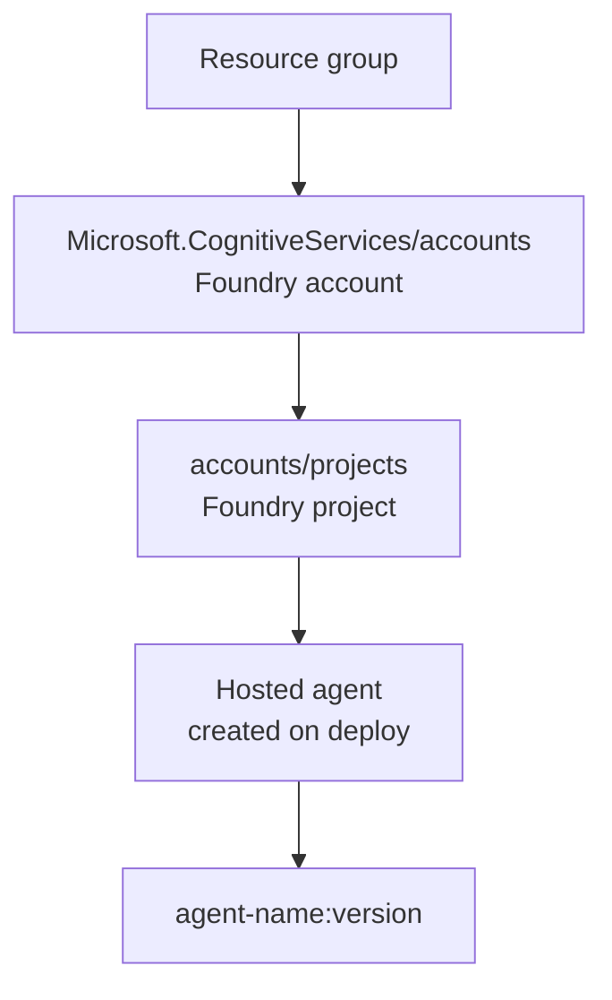
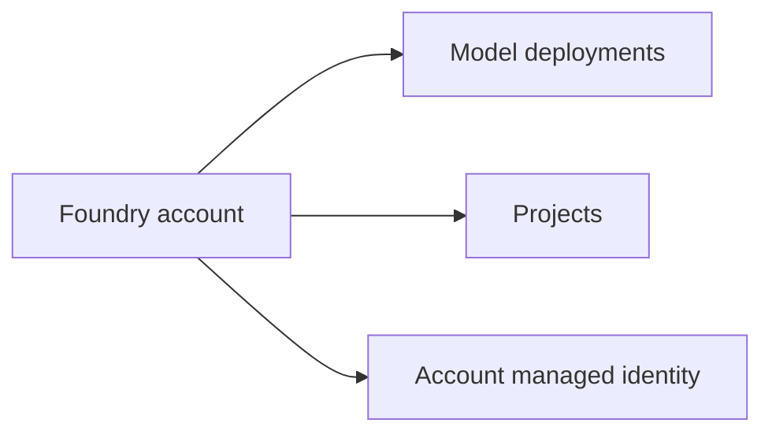
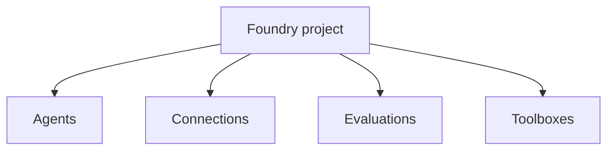
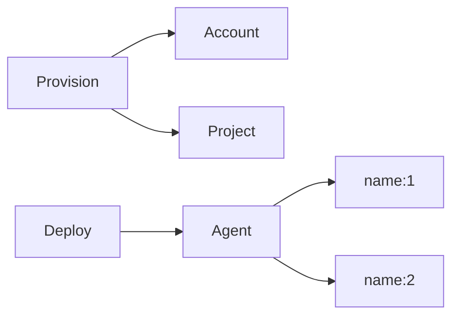
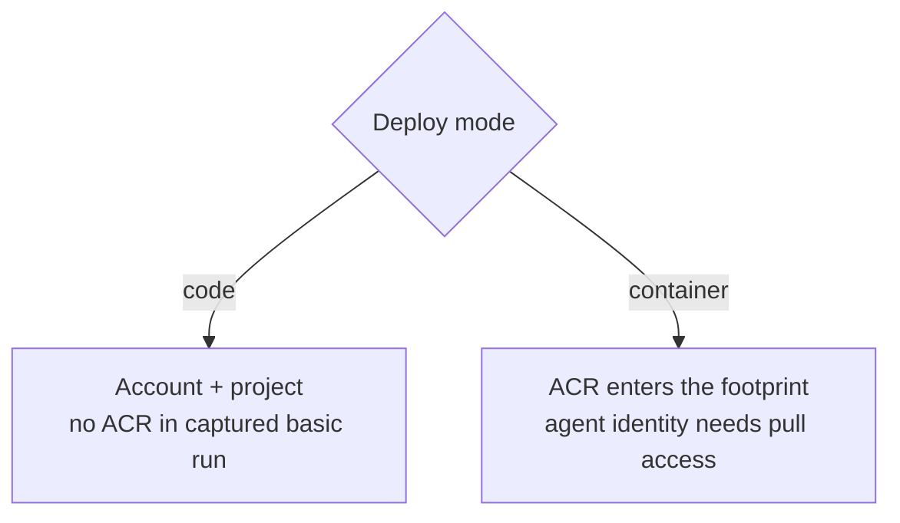

# 06 · What Azure creates

> The basic hosted-agent path creates less infrastructure than most people expect.

A verified `azd provision` on the basic sample produced exactly two resources:

```text
Name
----------------------
cog-56mzb54ouruu6            ← Microsoft.CognitiveServices/accounts
cog-56mzb54ouruu6/rdpy       ← …/accounts/projects
```

Those two resources are the core footprint.



- The **account** is the Foundry resource; model deployments live here.
- The **project** is the workspace your agent, connections and evals belong to.
- Your **agent** is then a child of the project, versioned by name.
- Each deployed agent gets **its own managed identity** (`instance_identity.principal_id`).

No ACR, no Key Vault, no storage account, no App Service — unless you opt into container mode or add connections that need them.

## Account: the service boundary

The Cognitive Services account is the Azure resource that represents the Foundry account in the captured basic deployment.



The account has its own managed identity. That account identity is documented in the reference layer because it matters when the Foundry account itself reaches dependencies. It is separate from the per-agent instance identity discussed later.

## Project: the workspace boundary

The project sits under the account and scopes the things a developer normally thinks of as the agent workspace.



That is why many endpoint shapes include both the account host and the project segment. The project is not just a display folder; it is part of the resource path clients address.

## Agent: created by deployment, not provision

Provisioning creates the stage. Deployment creates the hosted agent version.



This distinction prevents a common misunderstanding. A resource list immediately after provision can be small and still be correct. The agent itself appears as a project child after deployment, not as a top-level resource group item like an App Service.

## Why no ACR in the basic path?

The golden path uses code deploy. In that mode, the captured environment had `AZURE_CONTAINER_REGISTRY_ENDPOINT` empty and no ACR resource in the basic footprint.



This is the reason the first sample can stay focused on Foundry concepts rather than container registry operations.

## What can add more resources later

The two-resource footprint is the baseline, not a promise for every design.

| Design choice | Likely footprint change |
|---|---|
| Container deploy | Azure Container Registry and image-pull permissions. |
| External systems | Connections and role assignments for the target service. |
| Advanced storage/search designs | Additional Azure services outside the basic sample. |
| CI/CD | Service principal or managed identity setup for the pipeline. |

The important habit is to tie every added resource to a feature that needs it. If a sample or tutorial creates more than the account and project, ask what design choice introduced the extra resource.

## Cost and cleanup belong in reference/tutorial

The learn-layer concept is simple: the basic footprint is small because code deploy avoids registry infrastructure and because the agent is a child resource under the Foundry project.

For exact cost notes, use [`cost.md`](../reference/cost.md). For operational cleanup, use the tutorial layer.

## → Next

[Understand the identity model](07-identity-model.md)

---

<sub>[← Where code runs](05-where-code-runs.md) · [📘 Learn index](README.md) · [Identity model →](07-identity-model.md)</sub>
