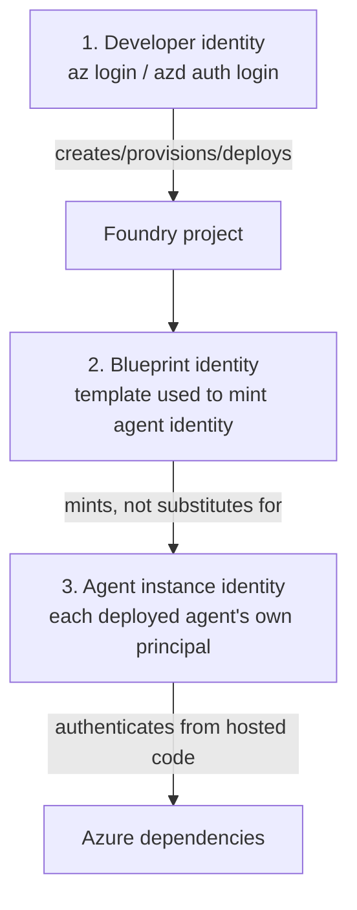
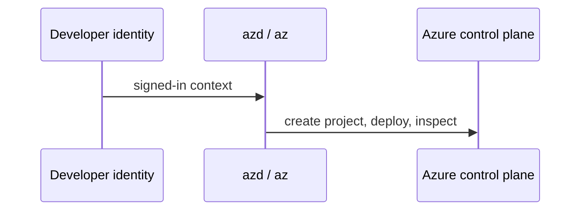
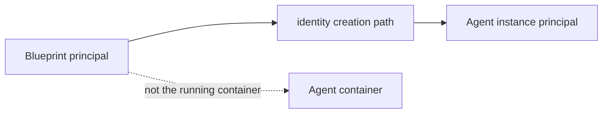
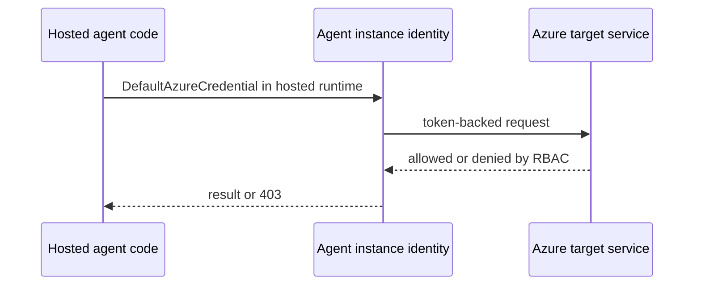
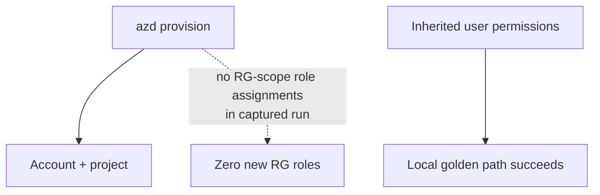
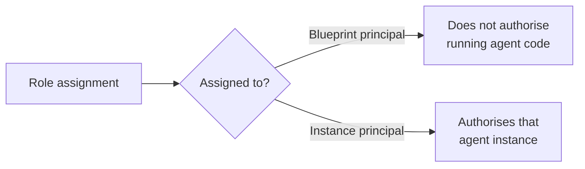
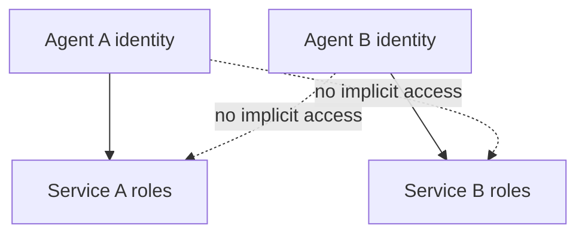

# 07 · Identity model

> A green local run proves your code can run as you. It does not prove the hosted agent can run as itself.

This page is the conceptual companion to [`identity-and-rbac.md`](../reference/identity-and-rbac.md). The reference page holds the captured IDs, role tables and diagnostic details. This page explains the model.

There are three identities to keep separate during hosted-agent work:

The account managed identity also exists and is documented in the reference page. For day-to-day hosted-agent debugging, the dangerous confusion is between the developer, blueprint and per-agent instance identity.

## Identity 1: the developer

Your developer identity is the user principal behind local sign-in. It is used when tools create resources, deploy from your machine and invoke from your laptop.

That identity is often over-privileged during getting started. In the captured run, inherited permissions included subscription-scope Owner and tenant-level Foundry User. The important lesson is not the exact tenant. The lesson is that the local happy path can be powered by broad inherited rights.

## Identity 2: the blueprint

The deployed agent output exposes a blueprint principal and client ID. The blueprint is a managed-agent identity blueprint: a template used in the identity machinery.

The verified reference output shows `Blueprint Principal ID` and `Instance Identity Principal ID` as different values. That difference matters. Granting a role to the blueprint principal does **not** grant it to the running agent.

Think of the blueprint as part of how Foundry creates the identity, not the identity your code uses.

## Identity 3: the agent instance

Each deployed agent gets its own principal. The `azd ai agent show` output in the reference page exposes it as `Instance Identity Principal ID`.

This is the principal that matters when your container reaches Azure resources. If the hosted call gets a 403, granting your user a role is usually irrelevant. Grant the role to the instance identity that actually made the call.

The reference evidence also shows the hosted token cache partitioned by the instance identity principal. That is the proof that the running code is using the per-agent managed identity branch, not a user account or a secret.

## The zero-role-assignment surprise

The previous live run found that `azd provision` created **zero role assignments at resource-group scope**. The golden path worked on inherited permissions.

That is the crucial operational insight:

> A successful local provision and deploy is not evidence that a least-privilege CI identity can do the same job.

The local user may have inherited permissions that the pipeline principal does not. The failure will only appear when the pipeline identity tries to create, deploy or invoke with its smaller permission set.

## Blueprint role does not flow to instance role

The second common trap is granting access to the wrong principal.

The blueprint and instance principal are different. The reference page states the verified rule plainly: `Blueprint Principal ID != Blueprint Client ID`, and granting a role to the blueprint principal does not grant it to your agent.

## Why this is good security and real operational work

Per-agent identities are not a nuisance by accident. They make least privilege possible.

If two agents do different jobs, they can receive different roles. A compromised or buggy agent does not automatically inherit its neighbour's reach.

The trade-off is that deploy automation must discover or record the correct instance principal and grant it the roles it needs. That is why identity belongs in the mental model, not only in troubleshooting.

## Reading symptoms through the model

| Symptom | Identity explanation |
|---|---|
| Works locally, fails hosted with 403 | Local code used the developer identity; hosted code used the instance identity. |
| Role granted, still denied | The role may have been granted to the blueprint or user, not the instance principal. |
| CI fails where laptop succeeds | The developer had inherited permissions the CI principal lacks. |
| Two agents behave differently | They have different per-instance identities and may have different role assignments. |

For command-level diagnosis and captured output, use [`identity-and-rbac.md`](../reference/identity-and-rbac.md).

## ✅ Check your understanding

Three questions. If you can answer all three, move on.

<b>1.</b> You grant a Cosmos DB role to the blueprint principal ID shown in the portal. Your deployed agent still gets 403 errors. Why?

The blueprint principal and the instance principal are **different identities**. Granting a role to the blueprint principal does not authorise the running agent code. You must grant the role to the **instance principal** of the deployed agent. See [identity-and-rbac.md](../reference/identity-and-rbac.md).

<b>2.</b> Two agents are deployed in the same project. Can Agent A automatically access a service that Agent B has permissions for?

No. Each deployed agent gets **its own managed identity**. There is no implicit access between agents — Agent A's identity has no relationship to Agent B's role assignments. This enforces least privilege.

<b>3.</b> What would happen if your CI pipeline succeeds but the hosted agent fails with 403 on the same Azure resource?

The CI pipeline likely ran under the developer's identity (or a service principal with inherited permissions), while the hosted agent uses its per-instance managed identity. That instance identity was never granted the required role. The fix is to discover the instance principal and grant it the specific role it needs.

## → Next

[Learn how versions behave](08-versioning.md)

---

[← What Azure creates](06-what-azure-creates.md) · [📘 Learn index](README.md) · [Versioning →](08-versioning.md)
