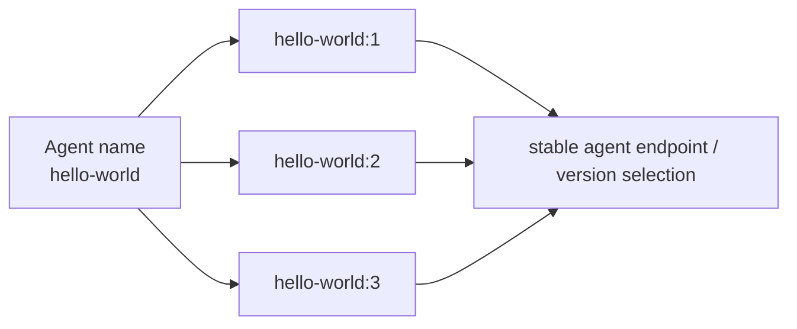
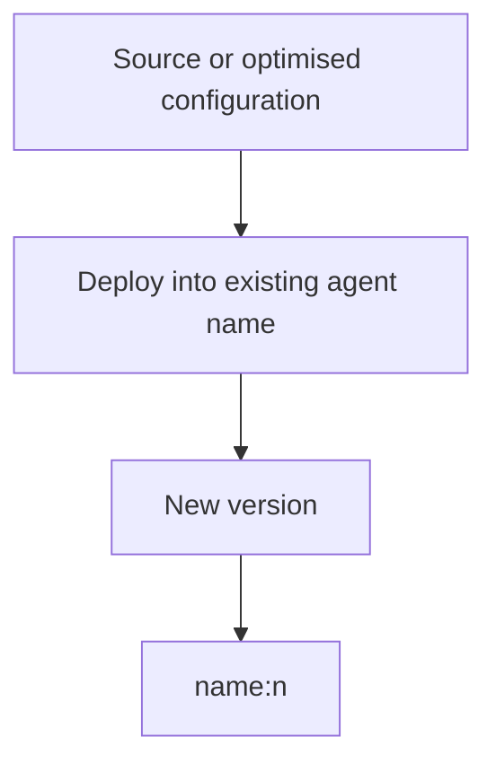
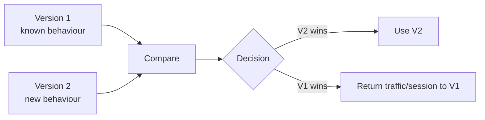
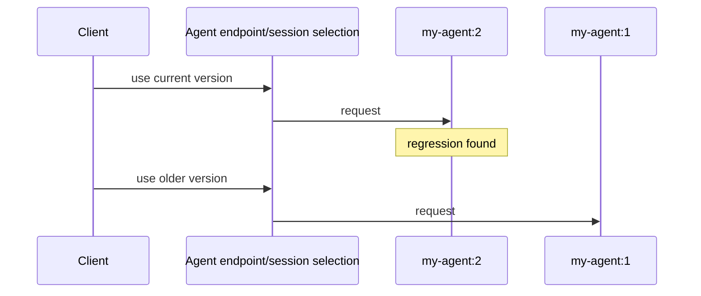
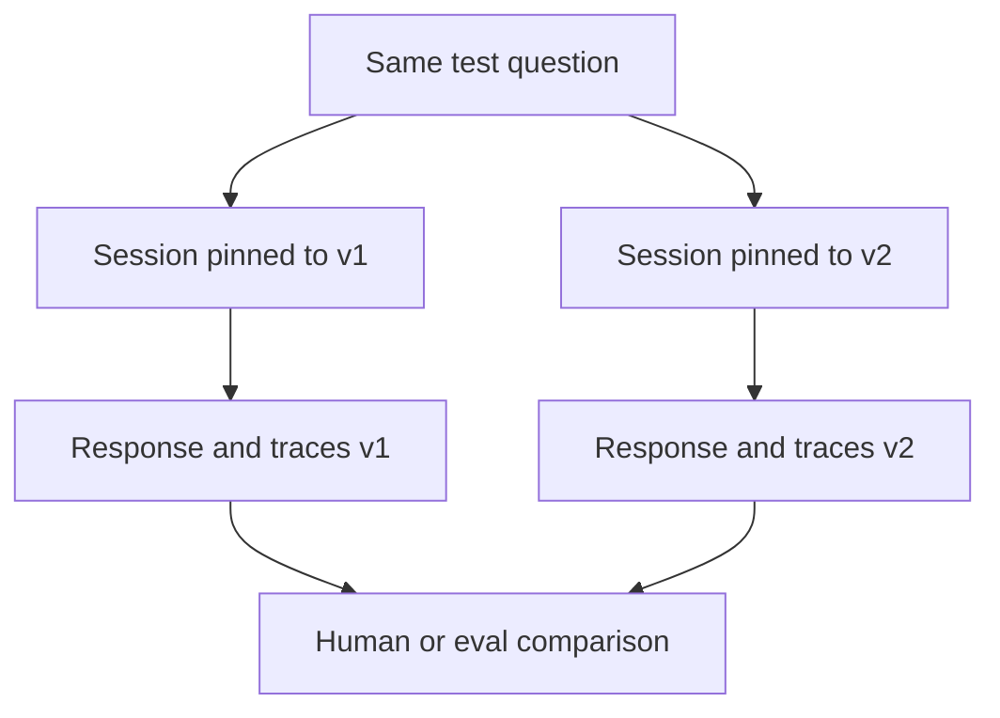
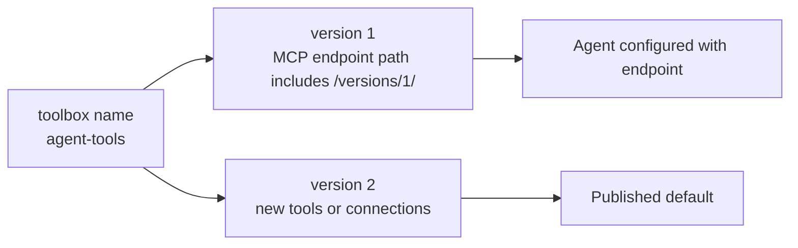
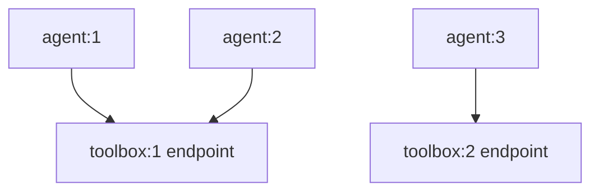

# 08 · Versioning

> In Foundry hosted agents, the name stays stable while deployed versions move forward: `my-agent:1`, `my-agent:2`, and so on.

The reference output from a live deploy showed an agent ID shaped like `hello-world:1`, with `Name` as `hello-world` and `Version` as `1`. That shape is the foundation for rollback, comparison and safe iteration.



## What creates a new agent version

Reusing an agent name creates a new version of that existing agent. The help capture for initialisation says that reusing a name creates a new version instead of a separate agent. The help capture for optimizer deploy says that deploying a winning optimization candidate creates a new agent version.



The useful mental model is append-only deployment. You do not edit `my-agent:1` into a different thing. You create `my-agent:2`.

## Immutability is the safety property

Versioning matters because a version should be treated as a fixed deployment artefact. That gives teams a stable object to test, compare, discuss and roll back to.



The reference layer documents commands that can inspect or download specific versions. This learn page only needs the concept: versions let you name the exact thing you are talking about.

## Rollback is choosing an older known version

Rollback is less mysterious when versions are immutable. You are not rebuilding the past. You are pointing clients or sessions back to a version that already exists and has known behaviour.



The CLI reference notes that sessions can be created against a specific agent version and that invoke has a version option. The point is not the syntax; the point is that version pinning exists as a first-class concept.

## Version pinning for experiments

Version pinning lets two versions be exercised side by side without pretending one is globally better yet.



This is especially useful for prompt or tool changes, where behaviour can shift without compile errors. A version number gives the evaluation result something concrete to attach to.

## Toolboxes are versioned too

The toolbox endpoint shape makes versioning visible:

```text
/toolboxes/<name>/versions/<n>/mcp
```

The verified toolbox creation output produced an endpoint containing `/toolboxes/agent-tools/versions/1/mcp`. The toolbox help states that a toolbox is a versioned named collection; each version is immutable; mutations create a new version; publishing promotes a version but does not mutate the version itself.



That endpoint is version-pinned. Publishing a new toolbox version cannot silently change an agent that is configured to call the old version-specific endpoint.

## Agent versions and toolbox versions combine

An agent version can itself depend on a toolbox endpoint that includes a toolbox version. That gives you two axes of change.



This matters because tool behaviour is agent behaviour. If a tool set changes, an answer can change even when the agent code did not. Version-pinned toolbox endpoints make that dependency visible.

## The practical rule

When discussing behaviour, include both versions when they matter:

| Behaviour source | Version name to preserve |
|---|---|
| Hosted agent code/config | Agent version, e.g. `my-agent:3` |
| Toolbox tools | Toolbox version in the MCP endpoint |
| Model deployment | Model deployment details in the environment/reference layer |
| Eval result | The agent version and tool version used during the run |

Versioning is not bookkeeping. It is how preview-era systems stay debuggable.

## → Next

[Learn how to live with preview](09-living-with-preview.md)

---

<sub>[← Identity model](07-identity-model.md) · [📘 Learn index](README.md) · [Living with preview →](09-living-with-preview.md)</sub>
