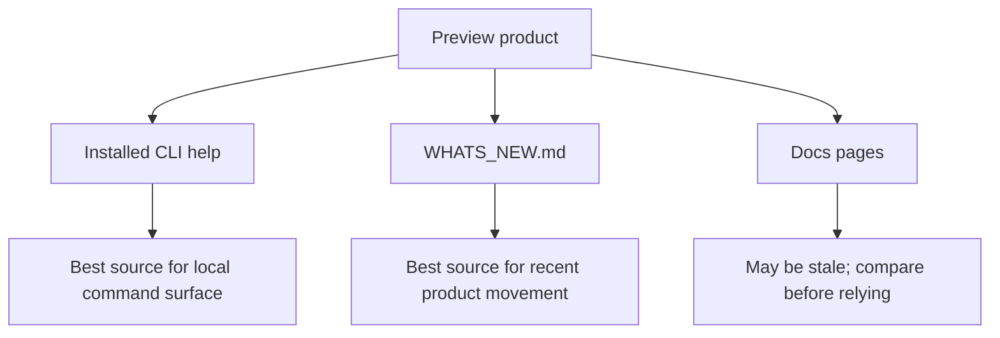
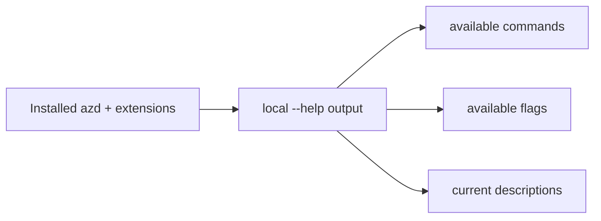
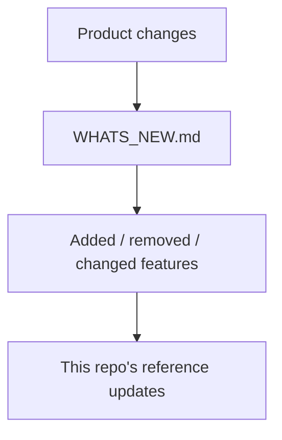
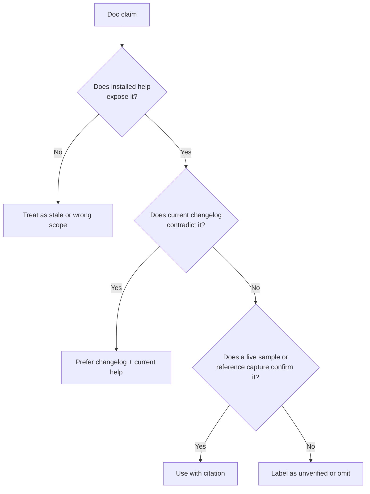
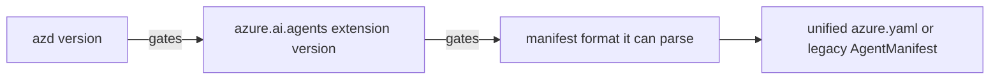
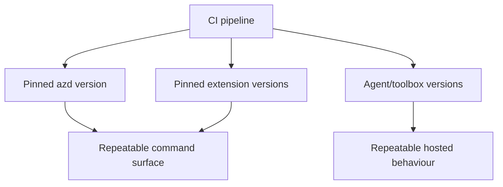
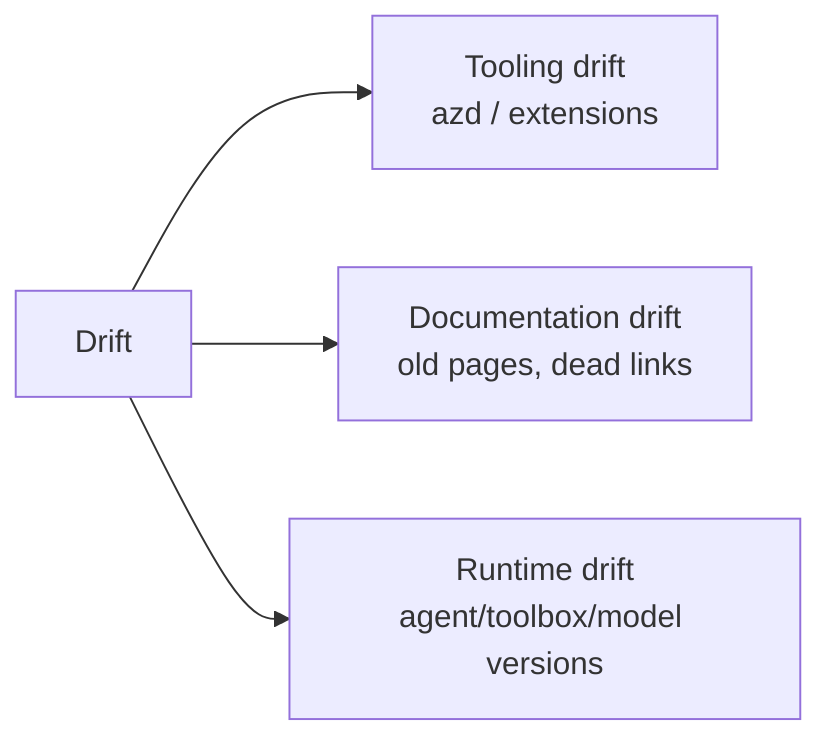

# 09 · Living with preview

> Preview products move faster than their docs. Survival starts by knowing which source matches the thing installed on your machine.

The ecosystem map says the CLI, hosted agents, workflows/routines, Foundry Skill and Canvas are preview or early preview. That is not a warning to avoid them. It is a warning to verify before trusting memory.

## The only source that always matches your installed CLI

For the CLI surface, the installed help is the source that matches your version. The reference page captures this as the highest-ranked documentation source: `azd ai agent --help` covers the CLI and always matches the installed version.

That does not mean help text is a tutorial. It means help text is the contract your machine is actually running.

This repo turns that principle into reference pages by capturing help output and building tables from it.

## The continuously maintained upstream source

The ecosystem map identifies `WHATS_NEW.md` in `microsoft/foundry-toolkit` as the only continuously maintained source, with 59 versions of release notes at the time the reference was written.

A changelog is not a getting-started guide, but it is the right place to check whether the product has moved underneath older docs.

## How to spot a stale doc

The reference layer already maps stale VS Code pages. The pattern is more useful than the individual page list.

Common stale-doc signals in this repo's evidence:

| Signal | Example from the ecosystem map |
|---|---|
| Dead repository or marketplace links | Old AI Toolkit links in VS Code docs. |
| Product retirement not reflected | GitHub Models still presented on pages after removal from the catalog/playground/evals. |
| Old wizard shape | A create-agents page describing an old two-template wizard. |
| GUI docs covering only GUI | VS Code docs contain no `azd` references across the checked pages. |

## Version skew: the baffling manifest error

One preview failure deserves its own mental model because the symptom points at the wrong file.

The troubleshooting reference records this chain:

When `azd` is too old, the extension upgrade can install an older compatible extension instead of the intended one, printing only a warning. That older extension cannot parse today's unified `azure.yaml` and reports the confusing error: `must contain 'template' field`.

The key lesson is conceptual: the YAML may be fine. The parser may be old.

## Why pinning matters more in preview

Version pinning is not only for rollback. It is also how you keep CI from silently becoming a different product.

The CI tutorial and troubleshooting reference both warn that relying on "latest" can mask a downgrade. In preview, "latest that my old host can install" is not the same as "latest product behaviour".

## Separate three kinds of drift

| Drift | How it shows up | Stabiliser |
|---|---|---|
| Tooling drift | Missing flags, old manifest parser, different command surface | Pin and print tool versions in automation. |
| Documentation drift | Instructions mention features that moved or retired | Prefer installed help, changelog and verified repo evidence. |
| Runtime drift | Behaviour changes after deploy or toolbox update | Use agent and toolbox version pinning. |

## The habit this repo wants you to learn

Do not ask "what should the product do?" first. Ask "what did this installed version and this deployed version actually do?"

That habit is why the reference layer is so large. It is also why this learn layer avoids making operational claims unless they are backed by repo content or captured evidence.

## ✅ Check your understanding

Three questions. If you can answer all three, move on.

<b>1.</b> You use `${MY_VAR}` in `azure.yaml` but forget to set it. What happens during provision?

Provision **silently succeeds**. An unset `${VAR}` in `azure.yaml` expands to an empty string — there is no error or warning. This can cause subtle downstream failures that are hard to trace back to the missing value.

<b>2.</b> Name the three kinds of drift this page identifies, and give one stabiliser for each.

1. **Tooling drift** (azd/extensions change) — stabiliser: pin and print tool versions in automation.
2. **Documentation drift** (old pages, dead links) — stabiliser: prefer installed help and verified repo evidence over external docs.
3. **Runtime drift** (agent/toolbox/model versions change) — stabiliser: use agent and toolbox version pinning.

<b>3.</b> What would happen if your CI pipeline used "latest" for the azd version and a breaking change shipped overnight?

The pipeline could silently pick up a new azd version with a different command surface, missing flags, or a different manifest parser. Your build might fail — or worse, succeed with different behaviour. The page warns that in preview, "latest that my old host can install" is not the same as "latest product behaviour". Pinning the version prevents this.

## → Next

[Understand multi-agent patterns](10-multi-agent.md)

---

[← Versioning](08-versioning.md) · [📘 Learn index](README.md) · [Multi-agent & A2A →](10-multi-agent.md)
