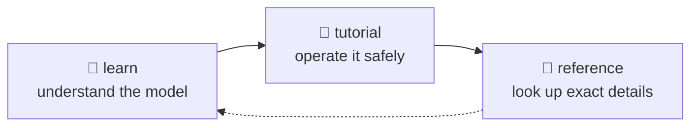

# 📘 Learn — the mental model

> **⏱️ 55 min to read all ten · 💰 $0 · ☁️ nothing is created**
> This is the 読む layer. Nothing here costs money and nothing here touches Azure.

This layer explains the shape of the Microsoft Foundry Toolkit so that the tutorial steps do
not feel like magic.

**There are no commands here that you are expected to type.** When a concept becomes
operational, the page hands you off to the tutorial or the reference layer instead. That
boundary is enforced by CI — a shell block in this directory fails the build.

---

## Pick a route

You do not have to read all ten. Match the route to what you are about to do.

| Route | Read | Time | You will be able to |
|---|---|---|---|
| ⚡ **Just enough** | 01 → 02 → 03 | ~16 min | Follow [labs 01–03](../tutorial/README.md) without copy-pasting blindly |
| 🌗 **Practitioner** | + 04 → 05 → 06 | ~30 min | Choose a protocol and a deploy mode, and predict the Azure bill |
| 🏭 **Production** | + 07 → 08 → 09 | ~48 min | Debug a 403, roll a version back, and survive a preview breaking change |
| 🕸️ **Multi-agent** | + 10 | ~56 min | Decide whether a second agent is worth its cost |

> [!TIP]
> If you only have ten minutes, read **01** and **03**. Those two remove most of the
> confusion people hit in the first hour.

---

## The ten pages

Each page ends with **✅ Check your understanding** — three questions you can answer without
an Azure subscription. If you can answer all three, you are ready for the next page.

| Page | ⏱️ | What you will understand after this |
|---|---|---|
| [01 · What is the Toolkit?](01-what-is-the-toolkit.md) | 5 min | Why one name refers to four different product surfaces. |
| [02 · Agent types](02-agent-types.md) | 5 min | Why prompt agents and hosted agents have different powers and limits. |
| [03 · Lifecycle](03-lifecycle.md) | 6 min | How GUI and CLI work map to the same six verbs. |
| [04 · Protocols](04-protocols.md) | 5 min | How to choose the wire contract your hosted agent speaks. |
| [05 · Where code runs](05-where-code-runs.md) | 5 min | What changes between local, code deploy and container deploy. |
| [06 · What Azure creates](06-what-azure-creates.md) | 4 min | Why the basic resource footprint is smaller than most people expect. |
| [07 · Identity model](07-identity-model.md) | 6 min | Which principal is acting at each stage, and why inherited access hides CI failures. |
| [08 · Versioning](08-versioning.md) | 5 min | How agent and toolbox versions make rollback and pinning possible. |
| [09 · Living with preview](09-living-with-preview.md) | 6 min | Which sources to trust when the product, docs and extensions disagree. |
| [10 · Multi-agent patterns](10-multi-agent.md) | 8 min | When splitting into several agents is worth the extra cost and failure modes. |

**Why this order.** 01–06 are the vocabulary: product surfaces, agent kinds, lifecycle,
protocols, execution location and Azure footprint. 07–09 are the things that make a
*successful* demo mislead you — identity, versioning and preview drift. 10 is for when one
agent is no longer enough.

---

## The five ideas that surprise people most

If you remember nothing else from this layer, remember these. Each is ✅ verified in this
repo, and each contradicts a reasonable assumption.

| Idea | Where |
|---|---|
| **"Toolkit" is four products, not one.** Installing one of them does not give you the others. | [01](01-what-is-the-toolkit.md) |
| **A successful `invoke` proves nothing.** It exits 0 even when the agent returned nothing at all. | [03](03-lifecycle.md) |
| **The default footprint is two Azure resources.** Container mode adds a third — a Premium-SKU registry billed daily. | [06](06-what-azure-creates.md) · [05](05-where-code-runs.md) |
| **Your laptop's permissions are not the agent's.** The deployed agent runs as its own managed identity, which starts with nothing. | [07](07-identity-model.md) |
| **In preview, the installed `--help` outranks the docs.** When they disagree, the binary is right. | [09](09-living-with-preview.md) |

---

## Where to go when you are done

| Next | If you want to |
|---|---|
| [🧪 Tutorial](../tutorial/README.md) | Do it — ten checkpointed labs, starting with a 30-minute win |
| [📖 Reference](../reference/README.md) | Look something up — verified detail, one fact per home |
| [🗂️ Cheatsheet](../reference/cheatsheet.md) | Keep one page open in a second tab |
| [❓ FAQ](../reference/faq.md) | Get a direct answer to a specific question |

## → Next

[Start with the product map →](01-what-is-the-toolkit.md)
