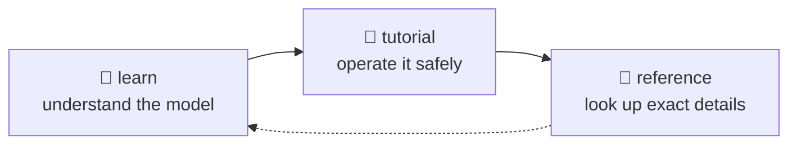

# 📘 Learn — the mental model

This layer is for reading before doing. It explains the shape of the Microsoft Foundry Toolkit so the tutorial steps do not feel like magic.

There are no commands here that you are expected to type. When a concept becomes operational, the page links to the tutorial or reference layer instead.

## Recommended reading order

Read pages 01–06 first. They are the vocabulary: product surfaces, agent kinds, lifecycle, protocols, execution location and Azure footprint.

Then read 07–09 before you depend on the system for real work. They explain identity, versioning and preview drift — the three places where a successful local demo can still mislead you.

Read 10 when one agent is no longer enough.

| Page | What you will understand after this |
|---|---|
| [01 · What is the Toolkit?](01-what-is-the-toolkit.md) | Why one name refers to four different product surfaces. |
| [02 · Agent types](02-agent-types.md) | Why prompt agents and hosted agents have different powers and limits. |
| [03 · Lifecycle](03-lifecycle.md) | How GUI and CLI work map to the same six verbs. |
| [04 · Protocols](04-protocols.md) | How to choose the wire contract your hosted agent speaks. |
| [05 · Where code runs](05-where-code-runs.md) | What changes between local, code deploy and container deploy. |
| [06 · What Azure creates](06-what-azure-creates.md) | Why the basic resource footprint is smaller than most people expect. |
| [07 · Identity model](07-identity-model.md) | Which principal is acting at each stage, and why inherited access can hide CI failures. |
| [08 · Versioning](08-versioning.md) | How agent and toolbox versions make rollback and pinning possible. |
| [09 · Living with preview](09-living-with-preview.md) | Which sources to trust when the product, docs and extensions disagree. |
| [10 · Multi-agent patterns](10-multi-agent.md) | When splitting into several agents is worth the extra cost and failure modes. |

## → Next

[Start with the product map](01-what-is-the-toolkit.md)
