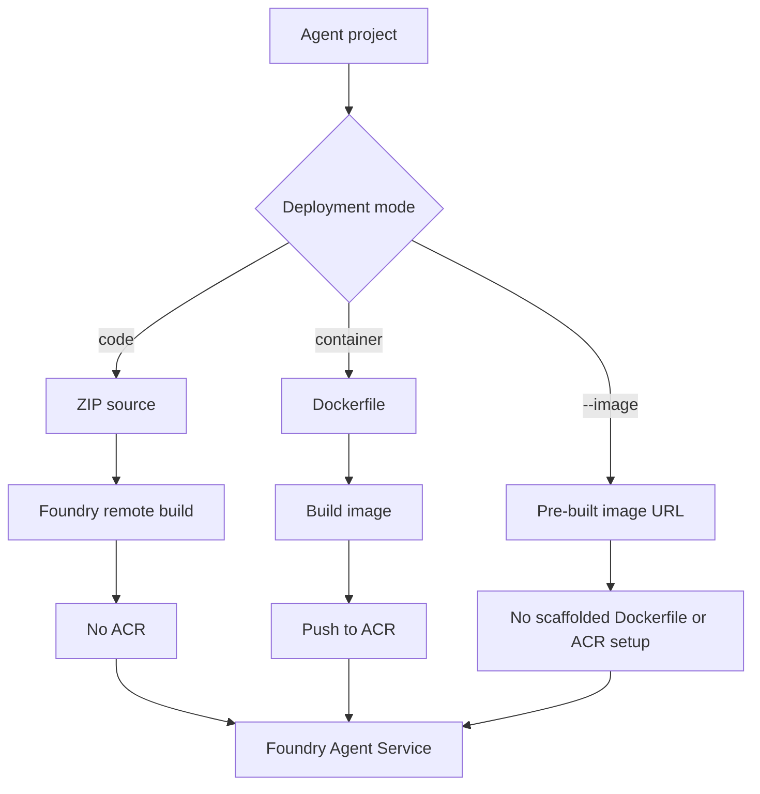

# 🚚 Deploy modes reference

Foundry Toolkit can deploy an agent from source code, from a Dockerfile-built image, or from a
container image you already built somewhere else.

---

## Evidence used for this page

| Evidence | What was read |
|---|---|
| Captured `azd ai agent init --help` | deploy-mode, code settings and `--image` help text |
| Captured Bicep eject | `acr.bicep`, `acr-pull-role-assignment.bicep`, `resources.bicep`, `main.parameters.json` |
| Captured generated sample | `azure.yaml`, `Dockerfile`, `.azdignore`, `.dockerignore`, `requirements.txt` |
| Existing docs | [`azure-yaml.md`](./azure-yaml.md), [`environment-variables.md`](./environment-variables.md), [`azd-cli.md`](./azd-cli.md), [`../guide-cli/README.md`](../guide-cli/README.md) |

> [!NOTE]
> The exact resource count for code mode comes from the repo's existing verified guide text and
> the user-provided evidence for this task. Container and BYO-image resource rows below are marked
> as inferred where no real provision was run for this page.

---

## Quick decision table

| Choose this mode | When | You provide | Toolkit creates ACR? | Main trade-off |
|---|---|---|---:|---|
| **Code mode** | Most Python/.NET agents; fastest path; no custom OS image needed | Source, dependencies, runtime and entry point | ❌ No | Less image-level control, but fewer resources and faster iteration. |
| **Container mode** | Native packages, custom base image, system tools, exact OS image, heavy build steps | Source plus `Dockerfile` | ✅ Inferred from ejected Bicep when ACR is included | More control, but registry cost and slower build/push loop. |
| **BYO-image** | CI already builds images; enterprise registry workflow; pinned digest/release promotion | Pre-built image URL | ❌ Help says ACR setup is skipped | Maximum control, but you own image build, patching and registry access. |

> [!TIP]
> Start with **code mode** unless you can name the thing that requires a container image.

---

## The three modes at a glance



---

## Code mode

Code mode is selected by `codeConfiguration:` in `azure.yaml` and by init flags such as
`--deploy-mode code`, `--runtime` and `--entry-point`.

<details open>
<summary>✅ Verified generated `azure.yaml` excerpt</summary>

```yaml
services:
  agent-framework-agent-basic-responses:
    host: azure.ai.agent
    project: src/agent-framework-agent-basic-responses
    language: python
    codeConfiguration:
      runtime: python_3_13
      entryPoint: main.py
    uses:
      - ai-project
```
</details>

The reference manifest page documents the supported shape:

| Field | Verified values documented in this repo | Meaning |
|---|---|---|
| `runtime` | `python_3_13`, `python_3_14`, `dotnet_10` | Host runtime token. |
| `entryPoint` | `main.py`, `MyAgent.dll` | File the host executes. |
| `dependencyResolution` | `remote_build`, `bundled` | Whether Azure resolves dependencies or you upload bundled dependencies. |

The captured manifest did not include `dependencyResolution`, but existing docs show
`remote_build` as the default/golden-path value.

### Code mode resources

✅ Verified for the basic sample: code mode set `AZD_AGENT_SKIP_ACR=true` and produced only two
Azure resources during provision:

```text
cog-czn5ugi4jtvzs                                   Microsoft.CognitiveServices/accounts
cog-czn5ugi4jtvzs/agent-framework-agent-basic-resp  …/accounts/projects
```

| Resource | Created? | Evidence |
|---|---:|---|
| Foundry / AIServices account | ✅ | Existing verified guide output. |
| Foundry project | ✅ | Existing verified guide output. |
| Azure Container Registry | ❌ | `AZD_AGENT_SKIP_ACR=true` and no ACR in verified resource list. |
| Key Vault / Storage / App Service | ❌ for the basic run | Existing guide states none were created unless opting into container mode or extra connections. |

> [!NOTE]
> The agent itself is deployed later by `azd deploy` as a project child/version, not as a
> separate top-level Azure resource in the provision list.

### Why code mode is usually first

| Area | Code mode behaviour |
|---|---|
| Build time | Usually fastest for simple agents because you upload source rather than building/pushing an image yourself. |
| Cold start | Platform builds the runtime image; you give up some image-level optimisations. |
| Control | Runtime and dependency strategy are declarative, not a full Dockerfile. |
| Cost | No registry cost for the basic path. |
| Operations | Fewer moving parts: account, project, agent deployment. |

---

## Container mode

Container mode uses a Dockerfile. The captured sample includes a Dockerfile even though its
manifest is code-mode shaped; the existing [`azure-yaml.md`](./azure-yaml.md) says the
Dockerfile is **container mode only — unused in code mode**. The task evidence states that every
generated sample ships a Dockerfile; I independently inspected the generated Dockerfile for the
basic Python sample below.

<details open>
<summary>✅ Verified generated Dockerfile</summary>

```dockerfile
FROM python:3.12-slim

WORKDIR /app

COPY . user_agent/
WORKDIR /app/user_agent

RUN if [ -f requirements.txt ]; then \
        pip install -r requirements.txt; \
    else \
        echo "No requirements.txt found"; \
    fi

EXPOSE 8088

# Precompile Python bytecode at build time so cold starts don't pay for it.
# These base images ship almost none of the standard library precompiled
# (~2% of stdlib .py files, on both Debian-slim and Azure Linux), so without
# this every new container recompiles hundreds of stdlib modules on first
# import. Dependencies are best-effort (`|| true`) so a stray unparsable file
# vendored by a third-party package can't fail the build; application code is
# compiled strictly so a syntax error surfaces at build time rather than at
# container start.
# PYTHONDONTWRITEBYTECODE is cleared for these commands only: it blocks
# bytecode *writes*, not *reads*, so images that set it still benefit.
RUN PYTHONDONTWRITEBYTECODE= python -m compileall -q $(python -c "import sysconfig as s; print(s.get_paths()['stdlib'], s.get_paths()['purelib'])") || true; \
    PYTHONDONTWRITEBYTECODE= python -m compileall -q .

CMD ["python", "main.py"]
```
</details>

### What the Dockerfile is doing

| Line / block | Purpose |
|---|---|
| `FROM python:3.12-slim` | Uses a slim Python base image for the container. |
| `COPY . user_agent/` | Copies the service source into the image. |
| `pip install -r requirements.txt` | Installs dependencies when the file exists. |
| `EXPOSE 8088` | Matches the local/runtime server port used by the agent host. |
| `compileall` for stdlib and site-packages | Best-effort precompile to reduce first-import work. |
| strict `compileall -q .` | Fails the build on syntax errors in application code. |
| `CMD ["python", "main.py"]` | Starts the generated agent. |

> [!TIP]
> The bytecode precompile is a useful cold-start optimisation. It moves work from container
> startup to image build time.

### Container mode resources

The captured Bicep shows what appears when ACR is used.

| Resource | Created? | Evidence |
|---|---:|---|
| Foundry / AIServices account | ✅ | `resources.bicep` creates `Microsoft.CognitiveServices/accounts@2025-06-01`. |
| Foundry project | ✅ | `resources.bicep` creates the nested `projects` resource. |
| Model deployments | ✅ when declared | `resources.bicep` loops over `deployments`. |
| Azure Container Registry | ✅ when `includeAcr` is true | `acr.bicep` creates `Microsoft.ContainerRegistry/registries@2023-07-01`. |
| ACR project connection | ✅ when `includeAcr` is true | `acr.bicep` creates a project `connections` child with `category: ContainerRegistry`. |
| AcrPull role assignment | ✅ when `includeAcr` is true | `acr.bicep` grants role id `7f951dda-4ed3-4680-a7ca-43fe172d538d`. |

<details>
<summary>✅ Verified ACR-related Bicep excerpts</summary>

```bicep
@description('Include an Azure Container Registry. Set true when any agent uses docker:.')
param includeAcr bool = false

module acr 'acr.bicep' = if (includeAcr) {
  name: 'acr'
  params: {
    name: '${abbrs.containerRegistryRegistries}${resourceToken}'
    foundryProjectPrincipalId: foundryAccount::project.identity.principalId
    enableNetworkIsolation: enableNetworkIsolation
  }
}
```

```bicep
resource registry 'Microsoft.ContainerRegistry/registries@2023-07-01' = {
  sku: {
    name: 'Premium'
  }
  properties: {
    adminUserEnabled: false
    publicNetworkAccess: enableNetworkIsolation ? 'Disabled' : 'Enabled'
  }
}
```
</details>

> [!WARNING]
> The actual container-mode resource count was not verified by running `azd provision` for this
> page. The resource list above is inferred from ejected Bicep that was read directly.

### Container mode trade-offs

| Area | Container mode behaviour |
|---|---|
| Build time | Slower loop: build image, push image, then deploy. |
| Cold start | Best control: choose base image, precompile, install native packages. |
| Control | Highest control over OS packages, Python/.NET patch level, build tooling and entry command. |
| Cost | ACR can add registry cost. Captured Bicep uses Premium SKU when it creates ACR. |
| Operations | More moving parts: image build, registry access, AcrPull, connection metadata. |

---

## BYO-image mode

BYO-image mode is selected with `azd ai agent init --image <image-url>`.

<details open>
<summary>✅ Verified `--image` help text</summary>

```text
--image string              Pre-built container image URL (e.g., 'myacr.azurecr.io/agent:v1'). When set without --manifest, skips template/language selection, code scaffolding, Dockerfile generation, and ACR setup, and requires --agent-name. Incompatible with --deploy-mode code.
```
</details>

The help text also includes this example:

```bash
azd ai agent init --no-prompt --agent-name my-agent \
  --image myacr.azurecr.io/agents/my-agent:v1
```

### BYO-image resources

| Resource | Created by toolkit? | Evidence / confidence |
|---|---:|---|
| Foundry / AIServices account | ✅ if provisioning a new project | Inferred from normal project service provisioning. |
| Foundry project | ✅ if provisioning a new project | Inferred from normal project service provisioning. |
| Dockerfile | ❌ | Help text says Dockerfile generation is skipped. |
| ACR setup | ❌ | Help text says ACR setup is skipped. |
| Your registry/image | ❌ | You bring the image URL; creation is outside this init path. |

> [!CAUTION]
> BYO-image does not mean "no registry exists". It means the toolkit does not scaffold or set up
> one for you in this path. Your image still has to be reachable by Foundry at deploy/run time.

### BYO-image trade-offs

| Area | BYO-image behaviour |
|---|---|
| Build time | Fast from azd's perspective because the image already exists. |
| Cold start | Fully controlled by your image and build pipeline. |
| Control | Maximum control, including pinned base images and digest-based promotion. |
| Cost | Registry cost belongs to the registry you bring; toolkit skips its own ACR setup. |
| Operations | You own image patching, vulnerability scanning, authentication and retention. |

---

## `.azdignore`, `.dockerignore`, and what gets packaged

The captured generated source included both ignore files:

| File | Verified content | Used by |
|---|---|---|
| `.azdignore` | `.env.example` | azd packaging for the service source. |
| `.dockerignore` | `.venv`, `__pycache__`, `*.pyc`, `*.pyo`, `*.pyd`, `.Python`, `.env` | Docker build context in container mode. |

The CLI help says init also generates a default `.agentignore` for code-deploy ZIP packaging.
The captured project root `.gitignore` contained `.azure`; a root `.agentignore` was not present
in the captured Bicep project I inspected.

---

## Resource comparison

| Resource / artifact | Code mode | Container mode | BYO-image |
|---|---:|---:|---:|
| `codeConfiguration` in `azure.yaml` | ✅ | ❌ normally | ❌ |
| Source ZIP upload | ✅ | ❌ | ❌ |
| Dockerfile used | ❌ | ✅ | ❌ generated by toolkit |
| Pre-built image URL | ❌ | ❌ | ✅ |
| Foundry account | ✅ | ✅ | ✅ if not using existing project |
| Foundry project | ✅ | ✅ | ✅ if not using existing project |
| ACR created by toolkit | ❌ verified for basic code run | ✅ inferred when `includeAcr` is true | ❌ per help text |
| ACR connection | ❌ | ✅ inferred from Bicep | ❌ setup skipped by init path |
| Registry cost | ❌ for basic code run | ✅ possible/likely | External to toolkit |
| Best for | First deployment and most agents | Custom runtime/image needs | Enterprise image pipelines |

---

## Common mistakes

| Mistake | Symptom | Fix |
|---|---|---|
| Expecting Dockerfile changes to affect code mode | Deploy ignores your Dockerfile | Use container mode or BYO-image. |
| Expecting ACR in code mode | No `AZURE_CONTAINER_REGISTRY_ENDPOINT` | That is expected; `AZD_AGENT_SKIP_ACR=true`. |
| Using `--image` with `--deploy-mode code` | CLI rejects the combination | Pick BYO-image or code mode, not both. |
| Assuming BYO-image creates a registry | No generated ACR setup | Create/manage the registry yourself or use container mode. |
| Forgetting runtime/entry point in non-interactive code init | Init cannot resolve required values | Pass `--runtime` and `--entry-point`. |

---

## Command examples

<details open>
<summary>Illustrative commands</summary>

```bash
# Code mode: source upload, no ACR for the basic path
azd ai agent init --no-prompt \
  --deploy-mode code \
  --runtime python_3_13 \
  --entry-point main.py

# Container mode: use the service Dockerfile and registry-backed deployment
azd ai agent init --no-prompt \
  --deploy-mode container

# BYO-image: point at a pre-built image and skip scaffolded Dockerfile/ACR setup
azd ai agent init --no-prompt \
  --agent-name my-agent \
  --image myacr.azurecr.io/agents/my-agent:v1
```
</details>

---

## How this relates to `azd provision` and `azd deploy`

| Phase | Code mode | Container mode | BYO-image |
|---|---|---|---|
| `azd provision` | Creates account/project/model infrastructure; no ACR in verified basic run. | Creates account/project/model plus ACR pieces when ACR is included. | Creates account/project/model if not using an existing project; registry is external. |
| `azd deploy` | Uploads source/package and creates a new agent version. | Builds/pushes image, then creates a new agent version. | Uses the provided image URL to create a new agent version. |
| `azd down` | Deletes provisioned Azure resources for the environment. | Also needs to remove registry resources if they were provisioned. | Does not own the external image registry. |

> [!NOTE]
> The exact remote deploy implementation is preview behaviour. Verify with
> [`azd ai agent show --output json`](./azd-cli.md#show) and the diagnostics in
> [`troubleshooting.md`](./troubleshooting.md) for your project.

---

## Next

- 👉 [`infrastructure.md`](./infrastructure.md) — ejected Bicep/Terraform files and ACR modules
- 👉 [`azure-yaml.md`](./azure-yaml.md) — `codeConfiguration`, `container.resources`, `infra.provider`
- 👉 [`azd-cli.md`](./azd-cli.md) — `init`, `--deploy-mode` and `--image` flags
- 👉 [`environment-variables.md`](./environment-variables.md) — `AZD_AGENT_SKIP_ACR` and ACR outputs
- 👉 [`../guide-cli/README.md`](../guide-cli/README.md) — verified CLI walkthrough
- 👉 [`troubleshooting.md`](./troubleshooting.md) — provision/deploy diagnostics
