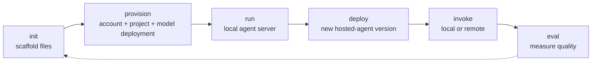

# 🔤 Glossary — Foundry Toolkit terms before they surprise you

> Newcomer rule: if a term is used anywhere in this repository, it should be defined here before
> you need it. Use this page as the lookup table while reading the guides.

---

## If you only learn five terms

| Term | Why it unlocks the rest of the repo |
|---|---|
| **Hosted agent** | The main subject of this repo: your code, packaged and run by Foundry Agent Service. |
| **Foundry project** | The workspace that contains agents, model deployments, connections, evals and tools. It is not the Azure resource group. |
| **`azure.yaml`** | The local contract that tells `azd` what to provision, how to run your agent and which protocol it speaks. |
| **Protocol** | The wire contract. Most samples use `responses`; `invocations` and `activity` solve different integration problems. |
| **Managed identity** | The deployed agent's own Microsoft Entra identity. Grant this principal access to Azure resources, not your personal user. |

> [!TIP]
> When in doubt, ask: **What kind of agent is this, which Foundry project owns it, which
> protocol does it expose, and which identity is calling the thing that failed?** That usually
> narrows the problem to one file or one role assignment.

---

## Commonly confused pairs

| Do not confuse | Difference |
|---|---|
| **Prompt agent** vs **hosted agent** | A prompt agent is instructions + model + catalog tools saved in Foundry. A hosted agent is your code running in a container sandbox. |
| **Foundry project** vs **Azure resource group** | The project is a child resource inside a Cognitive Services account. The resource group is the Azure management container that holds the account. |
| **MCP client** vs **hosted MCP server tool** | Client-side MCP is called by your container. Hosted/server-side MCP is declared as a tool and called by the model provider / service path. |
| **Evaluator** vs **eval run** | An evaluator is the scoring definition. An eval run is one execution of a dataset against an agent version using evaluators. |
| **Agent Inspector `:8087`** vs **agent server `:8088`** | `8087` is the UI. `8088` is the local hosted-agent HTTP server started by `azd ai agent run`. |
| **Model deployment** vs **agent deployment** | A model deployment makes a model available in a project. An agent deployment packages your code and creates a new agent version. |
| **Session** vs **conversation** | A session binds hosted-agent compute and files. A conversation tracks chat history for the Responses protocol. |

---

## Lifecycle map

| Lifecycle phase | Terms you will see there |
|---|---|
| **init** | `azd` extension, sample manifest, `azure.yaml`, `agent.yaml`, BYO, code mode, container mode, protocol |
| **provision** | Foundry project, Cognitive Services account, deployment, `GlobalStandard`, capacity, connection |
| **run** | AgentServer, Agent Inspector, endpoint, Responses protocol, session, trace |
| **deploy** | hosted agent, managed identity, `instance_identity`, version, `remote_build` |
| **invoke** | endpoint, agent card, A2A, invocations protocol, session, conversation |
| **eval** | evaluator, eval run, rubric, rubric dimensions, dataset, trace correlation |

---

## Alphabetical glossary

| Term | One-line definition | Longer explanation | Lifecycle | Go deeper |
|---|---|---|---|---|
| **A2A (agent-to-agent)** | A protocol and tool pattern for one agent to discover and call another agent. | In Foundry, A2A can mean exposing an agent endpoint under `/protocols/a2a` with an agent card, or adding an A2A tool so one agent calls a remote A2A-compatible endpoint. Incoming A2A currently requires a `responses`-capable agent. It is preview and should be treated as an integration boundary with explicit auth and role assignment. | invoke, multi-agent | [Multi-agent](../concepts/multi-agent.md#a2a-agent-to-agent-and-agent-cards), [CLI endpoint](azd-cli.md#other-subcommands) |
| **Activity protocol** | Bot Framework Activity shape for Teams and Microsoft 365 channels. | `activity` is not the default local developer path. The sample catalog has a Python echo agent using `activity`, and the catalog warns that activity agents cannot be called with `azd ai agent invoke`; use the M365 Agents Playground path instead. In `azure.yaml`: `services.<agent>.protocols[].protocol: activity`. | init, channels | [Concepts §4](../concepts/README.md#4-the-protocol-is-the-contract), [sample catalog](sample-catalog.md#protocol-coverage) |
| **Agent Builder** | The VS Code / portal UI for creating prompt agents. | Agent Builder is where you edit instructions, variables, tools, mock responses and versions for prompt agents. It is not the same as `azd ai agent init`, which scaffolds hosted-agent code. | GUI init, prompt iteration | [GUI guide §4](../guide-gui/README.md#4-agent-builder--prompt-agents) |
| **Agent card** | A discovery document that describes an agent's A2A capabilities. | When incoming A2A is enabled, Foundry publishes versioned agent card URLs below the A2A endpoint. Other agents read the card to understand name, description, skills and protocol version. This repo does not verify a live card; it documents the concept from Microsoft Learn and the `azd ai agent endpoint` command family. | invoke, discovery | [Multi-agent](../concepts/multi-agent.md#agent-card-discovery), [azd CLI](azd-cli.md#other-subcommands) |
| **Agent Framework** | Microsoft's SDK for building agents and workflows in Python and .NET. | The main samples use Agent Framework to define agents, local tools, MCP integrations and workflows. Python uses `Agent`, `FoundryChatClient` and `ResponsesHostServer`; C# uses `AIProjectClient(...).AsAIAgent(...)` and `AgentHost.CreateBuilder(args)`. | code, run | [samples](../../samples/README.md), [C# samples](../../samples/csharp/README.md) |
| **Agent Inspector** | The local chat and inspection UI for testing an agent. | The name is overloaded. In the CLI track, `azd ai agent run` starts the agent on `8088` and can open the Inspector UI on `8087`. In the VS Code track, `F5` opens the extension's Inspector. If the UI is blank, check which port you are using. | run, debug | [Troubleshooting §15](troubleshooting.md#15-wrong-port--8087-vs-8088), [GUI guide §7](../guide-gui/README.md#7-the-two-agent-inspectors--8087-vs-8088) |
| **Agent Optimizer** | CLI workflow that proposes improved instructions and scores candidates. | `azd ai agent optimize` runs an eval-driven loop using an eval model and an optimization model. It requires the `responses` protocol. It is CLI-only in this repo; the GUI guide explicitly calls out no GUI equivalent. | eval, improve | [CLI guide §11](../guide-cli/README.md#11-eval--measure-quality), [azd CLI optimize](azd-cli.md#optimize) |
| **Agent Playground / Playground** | Portal or extension UI for invoking a deployed agent or model. | The guide uses `azd ai agent invoke` for terminal verification, but deploy output also prints a portal Agent Playground URL. The VS Code guide covers Model Playground and Hosted Agent Playground as GUI surfaces. | invoke, GUI | [CLI guide §7](../guide-cli/README.md#7-deploy--push-to-foundry), [GUI guide §3](../guide-gui/README.md#3-model-catalog--playground) |
| **AgentServer / AgentServerHost** | The local/hosted server wrapper that exposes your code over a protocol. | In Python output, `azure.ai.agentserver: AgentServerHost starting on 0.0.0.0:8088` means the protocol server is coming up. Your code defines the agent; AgentServer provides HTTP hosting, platform headers, health behavior and protocol plumbing. | run | [CLI guide §5](../guide-cli/README.md#5-run--the-local-loop), [C# samples](../../samples/csharp/README.md#what-agenthostcreatebuilder-gives-you) |
| **`agent.yaml`** | Older or companion agent-definition file for hosted-agent shape. | Current samples in this repo use unified `azure.yaml`. Older docs and skills still mention `agent.yaml` or `agent.manifest.yaml`. A legacy agent manifest has a `template:` wrapper; a standalone `agent.yaml` may still work but new work should prefer unified `azure.yaml`. | init, migration | [`azure.yaml` reference](azure-yaml.md#legacy-agentyaml--agentmanifestyaml) |
| **Application Insights** | Azure observability backend used for hosted-agent traces and telemetry. | Hosted containers may receive `APPLICATIONINSIGHTS_CONNECTION_STRING` automatically. Do not declare it in `environmentVariables` unless you intentionally own the value, because shadowing injected values is a common source of missing traces. | run, deploy, observe | [C# Hello World warning](../../samples/csharp/01-hello-world/#expected-warning), [GUI tracing](../guide-gui/README.md#9-evaluation--tracing) |
| **Azure AI Foundry / Microsoft Foundry** | The Azure service family that hosts projects, models, agents, tools, evals and tracing. | This repo uses Microsoft Foundry language, while some APIs and docs still contain Azure AI Foundry names. Treat them as the same service area unless a command or UI label is being quoted exactly. | all phases | [Concepts §1](../concepts/README.md#1-foundry-toolkit-is-four-products-wearing-one-name), [ecosystem](ecosystem.md) |
| **Azure Container Registry (ACR)** | Registry used when you deploy container images instead of code ZIPs. | The golden path avoids ACR by using code mode and `remote_build`; `AZD_AGENT_SKIP_ACR=true` is written after provision in that path. Container mode or custom images need ACR-related env vars. | provision, deploy | [Concepts §5](../concepts/README.md#5-where-your-code-actually-runs), [environment variables](environment-variables.md#written-by-azd-provision) |
| **azd environment** | Named local environment whose values live under `.azure/<env>/.env`. | `azd env set` writes subscription, location, model deployment name and secrets to a gitignored environment file. This is separate from variables injected into the hosted container at runtime. | setup, provision, deploy | [environment variables](environment-variables.md), [CLI guide §3](../guide-cli/README.md#3-env--point-at-your-subscription) |
| **`azd ai agent doctor`** | CLI diagnostic command for local config, auth and remote state. | Run it first when anything is wrong. It checks the extension, `azure.yaml`, selected environment, manual env vars, project reachability, RBAC and hosted-agent activation. | setup, troubleshoot | [Setup §7](../setup/README.md#7-verify-everything), [CLI guide §10](../guide-cli/README.md#10-doctor--when-something-is-wrong) |
| **`azd ai agent invoke`** | CLI command that sends a message or payload to a local or remote agent. | With `--local` it targets `localhost:8088`; without it, it calls the deployed Foundry endpoint. It persists sessions/conversations by default and supports protocol selection. | invoke | [CLI guide §6](../guide-cli/README.md#6-invoke---local--talk-to-it), [azd CLI invoke](azd-cli.md#invoke) |
| **`azd ai agent monitor`** | CLI command for reading hosted-agent logs. | Use `-f` to follow live logs after deployment, or select console/system logs and tail counts. It is the terminal counterpart to the GUI Logs tab. | deploy, troubleshoot | [azd CLI monitor](azd-cli.md#monitor), [CLI guide §9](../guide-cli/README.md#9-invoke--call-the-deployed-agent) |
| **`azd ai agent show`** | CLI command that reports deployed agent status, definition, endpoints and identity. | Use `--output json` to see `definition.kind`, protocol versions, remote snake_case fields, `instance_identity`, endpoints and version. There is no `azd ai agent list`. | deploy, inspect | [CLI guide §8](../guide-cli/README.md#8-show--inspect-what-landed), [azd CLI show](azd-cli.md#show) |
| **`azd` extension** | The `azure.ai.agents` add-on that adds `azd ai agent` commands. | `azd` core does not contain the agent command tree by itself. You install/upgrade `azure.ai.agents`; it pulls dependencies such as `azure.ai.inspector` and `azure.ai.projects`. Version skew between `azd` and the extension is the #1 first-run failure. | setup | [Setup §3](../setup/README.md#3-install-the-agent-extension), [troubleshooting §1](troubleshooting.md#1-version-skew-the-one-that-bites-everyone) |
| **`azure.yaml`** | The project manifest and contract read by `azd`. | This is the most important local file. It declares the agent service (`host: azure.ai.agent`), project service (`host: azure.ai.project`), model deployments, protocol list, deploy mode, runtime, entry point, environment variables and resource tier. | all phases | [`azure.yaml` reference](azure-yaml.md) |
| **BYO / bring-your-own** | Samples where you bring your own framework or protocol handling. | BYO samples are under `hosted-agents/bring-your-own/...` and include LangGraph, OpenAI Agents SDK, Claude Agent SDK, Pydantic AI / AG-UI, GitHub Copilot SDK and no-framework examples. They still become hosted agents when packaged by Foundry. | init, code | [sample catalog](sample-catalog.md#framework-coverage), [samples](../../samples/README.md) |
| **Bicep / Terraform eject** | Taking ownership of infrastructure files instead of managed Foundry provisioning. | `infra.provider: microsoft.foundry` keeps infrastructure generated by `azd`. `azd ai agent init --infra` or `--infra=terraform` ejects IaC when you need custom networking, private endpoints or policy. | init, provision | [`azure.yaml` infra.provider](azure-yaml.md#infraprovider) |
| **Capacity** | Model deployment throughput setting, expressed in thousands of TPM for these samples. | The sample manifests request `sku.capacity: 10` with `sku.name: GlobalStandard`. If the region has no capacity or quota, provisioning can fail; set `AZURE_AI_DEPLOYMENTS_LOCATION` or lower the manifest capacity. Key path: `services.ai-project.deployments[].sku.capacity`. | provision | [`azure.yaml` reference](azure-yaml.md#complete-annotated-example), [troubleshooting §11](troubleshooting.md#11-provisioning-fails-on-capacity--quota) |
| **Code mode** | Deploy mode where `azd` uploads source and Foundry builds the image. | In code mode, `codeConfiguration` is present and `dependencyResolution: remote_build` is the default. It avoids ACR for the golden path (`AZD_AGENT_SKIP_ACR=true`). Key paths: `services.<agent>.codeConfiguration.runtime`, `.entryPoint`, `.dependencyResolution`. | init, deploy | [Concepts §5](../concepts/README.md#5-where-your-code-actually-runs), [`azure.yaml` codeConfiguration](azure-yaml.md#codeconfiguration) |
| **Cognitive Services account** | The Azure account resource that backs the Foundry resource. | A basic provision creates one `Microsoft.CognitiveServices/accounts` resource plus one project child. Models live at the account level; agents, connections and evals belong to the project. | provision | [Concepts §6](../concepts/README.md#6-what-actually-gets-created-in-azure), [environment variables](environment-variables.md#written-by-azd-provision) |
| **Connection** | A Foundry project record that stores how to reach an external resource or tool. | Connections can hold credentials or references for MCP servers, A2A endpoints, Azure resources and toolboxes. In docs, `AZURE_AI_PROJECT_CONNECTION_NAMES` is the env-var list written after provision when project connections exist. | provision, tools | [environment variables](environment-variables.md#written-by-azd-provision), [MCP sample](../../samples/csharp/03-mcp-toolbox/) |
| **Container mode** | Deploy mode where you provide or build a container image. | Container mode gives maximum control over base image and native dependencies, but needs ACR or a prebuilt image. The GUI guide calls Code + Remote the recommended default; use container mode when code mode is not enough. | init, deploy | [Concepts §5](../concepts/README.md#5-where-your-code-actually-runs), [GUI deploy matrix](../guide-gui/README.md#8-deploy--the-matrix-that-matters) |
| **Conversation** | Responses-protocol history across turns. | Conversations are not the same as sessions. A hosted agent may use a session for compute affinity and a conversation for chat history. `azd ai agent invoke` persists conversation by default; use `--new-conversation` to discard it. | invoke | [azd CLI invoke](azd-cli.md#invoke) |
| **DefaultAzureCredential** | Azure SDK credential chain used by the samples. | Locally it falls back to your `az login`; in Azure it uses the agent's managed identity. The harmless `169.254.169.254` trace is this credential probing the Instance Metadata Service on your laptop. | run, deploy, auth | [Hello World sample](../../samples/python/01-hello-world/#the-code), [troubleshooting §3](troubleshooting.md#3-the-alarming-169254169254-traceback-harmless) |
| **Dataset** | The set of cases or intents used by evaluation. | Generated eval artifacts include `datasets/<name>/*.jsonl`. In this repo's eval sample, rows are test intents, not fixed strings, and are generated from the agent description and instructions. | eval | [Evaluation sample](../../samples/python/04-eval/#the-dataset-is-intents-not-strings) |
| **Deployment (agent deployment)** | Packaging and registering a new hosted-agent version. | `azd deploy` uploads source or image, creates or updates the hosted agent, waits for active status and writes `AGENT_<SERVICE>_NAME` / `_VERSION`. Redeploying the same `name:` creates `:2`, not a second agent. | deploy | [CLI guide §7](../guide-cli/README.md#7-deploy--push-to-foundry), [troubleshooting §9](troubleshooting.md#9-deploying-created-a-new-version-not-a-new-agent) |
| **Deployment (model deployment)** | A model made available in a Foundry project under a deployment name. | The sample manifests deploy `gpt-5.4-mini` as a project model deployment. Your code reads the deployment name through `AZURE_AI_MODEL_DEPLOYMENT_NAME` or `FOUNDRY_MODEL_NAME`. Key path: `services.ai-project.deployments[]`. | provision, run | [`azure.yaml` reference](azure-yaml.md#complete-annotated-example), [environment variables](environment-variables.md#you-must-set-these) |
| **`dependencyResolution` / `remote_build`** | Code-mode setting for where dependencies are resolved. | `remote_build` means Azure installs dependencies from `requirements.txt` or project files during deploy. `bundled` means you ship already-resolved dependencies. Key path: `services.<agent>.codeConfiguration.dependencyResolution`. | init, deploy | [`azure.yaml` codeConfiguration](azure-yaml.md#codeconfiguration) |
| **Endpoint** | The URL callers use for a project, model, agent or protocol. | The project endpoint looks like `https://<account>.services.ai.azure.com/api/projects/<project>`. Agent endpoints append `/agents/<name>/endpoint/protocols/...`. Deploy output prints protocol endpoints and the portal Playground URL. | provision, invoke | [environment variables](environment-variables.md#written-by-azd-provision), [CLI guide §7](../guide-cli/README.md#7-deploy--push-to-foundry) |
| **Eval run** | One execution of an evaluation suite against an agent version. | `azd ai agent eval run` reads `eval.yaml`, runs cases, prints an eval id, run id, report URL and pass/fail counts. Do not confuse this with the evaluator definition itself. | eval | [CLI guide §11](../guide-cli/README.md#11-eval--measure-quality), [Evaluation sample](../../samples/python/04-eval/#run-it) |
| **`eval.yaml`** | Local evaluation intent file generated by `azd ai agent eval generate`. | It names the agent, dataset, evaluators, model options and sample limits. `agent.version` can pin which deployed agent version is measured. Treat it as local intent until a run or remote sync confirms it. | eval | [Evaluation sample](../../samples/python/04-eval/#evalyaml) |
| **Evaluator** | A scoring rule or grader used during evaluation. | Evaluators are stored under `evaluators/<name>/...` locally after generation. The generated rubric evaluator in this repo uses weighted dimensions such as accuracy, scope discipline and beginner clarity. | eval | [Evaluation sample](../../samples/python/04-eval/#the-rubric-is-weighted-dimensions) |
| **`.env.example` / `.env`** | Local development env-var template and private local value file. | Samples include `.env.example` to show required variables for direct `python main.py` or `dotnet run`. The real `.env` is gitignored and should never contain committed secrets. | run, local dev | [environment variables](environment-variables.md#local-only-development), [samples](../../samples/README.md#two-ways-to-use-these-samples) |
| **Foundry Canvas** | Copilot App plugin surface bundled with the broader Foundry Toolkit ecosystem. | This repo maps it as one of the four products wearing the Foundry Toolkit name, but does not teach it. Do not confuse it with the VS Code extension or `azd ai agent`. | ecosystem | [Concepts §1](../concepts/README.md#1-foundry-toolkit-is-four-products-wearing-one-name), [ecosystem](ecosystem.md#the-four-products) |
| **Foundry DevPack** | Preview artifact mentioned in the `microsoft/foundry-toolkit` repository. | The ecosystem page marks it as purpose-undocumented in the public repo. Treat it as ecosystem context, not something required for this getting-started path. | ecosystem | [ecosystem](ecosystem.md#inside-microsoftfoundry-toolkit) |
| **Foundry Project Setup** | VS Code wizard step for selecting or creating the project backing a hosted agent. | It is the GUI counterpart to setting subscription/location and running `azd provision` in the CLI path. | GUI provision | [GUI guide §5](../guide-gui/README.md#5-create-a-hosted-agent), [GUI/CLI equivalence](../guide-gui/README.md#13-gui--cli-equivalence) |
| **Foundry Local** | Microsoft's local inference runtime surfaced by the VS Code extension. | The GUI guide lists Foundry Local as today's no-Azure option after GitHub Models retirement. It is installed/validated through Foundry Toolkit commands, not through `azd ai agent provision`. | setup, GUI | [GUI guide §1](../guide-gui/README.md#1-install), [ecosystem](ecosystem.md#-github-models-is-retired) |
| **Foundry project** | The workspace containing agents, deployments, connections, tools and evals. | A Foundry project is a child of the Cognitive Services account, not the Azure resource group. `FOUNDRY_PROJECT_ENDPOINT` points at it, and most agent commands operate within the selected project. | provision, all | [Concepts §6](../concepts/README.md#6-what-actually-gets-created-in-azure), [environment variables](environment-variables.md#written-by-azd-provision) |
| **Foundry Skill** | A Copilot/agent skill containing Foundry workflow instructions. | The VS Code extension auto-installs the same `microsoft-foundry` skill used by coding agents. This repo recommends it for guided deployment, evaluation and troubleshooting workflows. | support | [Setup §6](../setup/README.md#6-optional-but-recommended-the-foundry-skill), [ecosystem](ecosystem.md#the-foundry-skill) |
| **Foundry Toolbox** | Foundry-managed bundle of external tools exposed to agents. | Toolbox is different from a local function tool. The Python `03-mcp-toolbox` sample uses `FoundryToolbox`, which resolves an endpoint from `TOOLBOX_ENDPOINT` or project/name values and authenticates with the agent credential. | tools | [Python MCP & Toolbox sample](../../samples/python/03-mcp-toolbox/), [sample catalog](sample-catalog.md#-python-21) |
| **`FOUNDRY_PROJECT_ENDPOINT`** | Runtime env var containing the project endpoint URL. | `azd provision` writes the endpoint into the azd environment, and Foundry injects it into hosted containers. The samples use it to construct `FoundryChatClient` / `AIProjectClient`. | provision, run | [environment variables](environment-variables.md#written-by-azd-provision), [Hello World sample](../../samples/python/01-hello-world/#the-code) |
| **GitHub Models** | Retired model provider that older official docs still mention. | The ecosystem and GUI pages warn that GitHub Models was removed from Foundry Toolkit model surfaces in v1.6.7. Do not use it as the no-Azure on-ramp in this repo. | model choice | [ecosystem](ecosystem.md#-github-models-is-retired), [GUI guide §3](../guide-gui/README.md#3-model-catalog--playground) |
| **`GlobalStandard`** | SKU name used by the default sample model deployments. | The sample manifests set `services.ai-project.deployments[].sku.name: GlobalStandard` with capacity `10`. Other SKU names exist, but this repo's verified path uses `GlobalStandard`. | provision | [`azure.yaml` reference](azure-yaml.md#complete-annotated-example), [setup quota](../setup/README.md#8-region-and-quota) |
| **`host: azure.ai.agent`** | `azure.yaml` marker for a hosted-agent service. | A service without this host is not an agent service, and `azd ai agent` commands will not treat it as the target agent. Key path: `services.<agent>.host`. | init | [`azure.yaml` service kinds](azure-yaml.md#the-two-service-kinds) |
| **`host: azure.ai.project`** | `azure.yaml` marker for the Foundry project service. | This service declares model deployments and provisions the account/project backing the agent. Agent services link to it with `uses`. Key path: `services.ai-project.host`. | provision | [`azure.yaml` service kinds](azure-yaml.md#the-two-service-kinds) |
| **Hosted agent** | Your code running as a managed, versioned agent in Foundry Agent Service. | Hosted agents are for custom logic, frameworks, protocols, stateful workloads and external integrations. They are the primary focus of this repo. In `azure.yaml`: `services.<agent>.host: azure.ai.agent`, `services.<agent>.kind: hosted`. | code, deploy | [Concepts §2](../concepts/README.md#2-two-kinds-of-agent-prompt-vs-hosted), [hosted samples](../../samples/README.md) |
| **Hosted MCP server tool** | Server-side MCP tool declared so the provider/service calls the MCP server directly. | The C# MCP sample shows `HostedMcpServerTool` for Microsoft Learn. This differs from an MCP client your container opens. Use an allowlist and approval policy because the model can reach server-exposed tools. | tools, invoke | [C# MCP sample](../../samples/csharp/03-mcp-toolbox/#two-layers-of-mcp) |
| **`infra.provider`** | `azure.yaml` setting for who owns infrastructure generation. | `infra.provider: microsoft.foundry` means managed Foundry provisioning with no Bicep on disk. You can eject to Bicep or Terraform when you need custom networking or policy. Key path: `infra.provider`. | provision | [`azure.yaml` infra.provider](azure-yaml.md#infraprovider) |
| **`instance_identity`** | The deployed agent's identity block returned by `azd ai agent show --output json`. | It contains a `principal_id` and `client_id`. Grant roles to `instance_identity.principal_id` when the deployed agent needs Azure resources, toolboxes or external services. | deploy, tools | [CLI guide §8](../guide-cli/README.md#8-show--inspect-what-landed), [Python MCP sample](../../samples/python/03-mcp-toolbox/#run--deploy) |
| **Invocations protocol** | Raw request/response protocol where your container defines the body shape. | Use `invocations` for webhooks, non-conversational processing, AG-UI or proprietary protocols. Unlike `responses`, the platform does not manage conversation history or transform payloads. In `azure.yaml`: `services.<agent>.protocols[].protocol: invocations`. | init, invoke | [Concepts §4](../concepts/README.md#4-the-protocol-is-the-contract), [sample catalog](sample-catalog.md#protocol-coverage) |
| **Invocations WebSocket / `invocations_ws`** | Duplex WebSocket protocol for real-time bidirectional agents. | This protocol is listed in the manifest reference for voice, realtime or out-of-band media scenarios. It is not exercised by the sample ladder. In `azure.yaml`: `services.<agent>.protocols[].protocol: invocations_ws`. | init, realtime | [`azure.yaml` protocols](azure-yaml.md#protocols), [Concepts §4](../concepts/README.md#4-the-protocol-is-the-contract) |
| **Managed identity** | Microsoft Entra identity assigned to the deployed hosted agent. | Local runs use your `az login`; hosted runs use the agent identity. This is why a tool can work locally but fail after deployment until you grant the agent principal the needed role. | deploy, tools, security | [CLI guide §8](../guide-cli/README.md#8-show--inspect-what-landed), [MCP sample warning](../../samples/csharp/03-mcp-toolbox/#deploy) |
| **MCP (Model Context Protocol)** | Open protocol for connecting LLM apps to external tools and data. | In this repo, MCP appears in the VS Code Agent Builder, the C# MCP sample, and the Python Toolbox sample. MCP servers can be local commands (`stdio`) or remote HTTP+SSE / HTTP endpoints depending on the surface. | tools | [Python MCP & Toolbox](../../samples/python/03-mcp-toolbox/), [C# MCP](../../samples/csharp/03-mcp-toolbox/) |
| **MCP client** | Code in your container that connects to an MCP server and invokes tools. | Client-side MCP gives you control: discover tools at startup, log calls, wrap auth and reach private network resources that your container can access. It adds a hop through your process. | tools, run | [C# MCP two layers](../../samples/csharp/03-mcp-toolbox/#two-layers-of-mcp) |
| **Model catalog** | Catalog of available models in the VS Code extension / Foundry. | The GUI guide covers Model Catalog filters and Playground. The ecosystem page warns that GitHub Models was retired from this surface and older docs are stale. | choose model | [GUI guide §3](../guide-gui/README.md#3-model-catalog--playground), [ecosystem](ecosystem.md#-github-models-is-retired) |
| **Model deployment name** | The name your agent uses to call a deployed model. | The first-run gotcha: `azd provision` writes `AI_PROJECT_DEPLOYMENTS` but not `AZURE_AI_MODEL_DEPLOYMENT_NAME`, even though sample code requires the plain variable. Set it manually. | provision, run | [environment variables](environment-variables.md#you-must-set-these), [troubleshooting §2](troubleshooting.md#2-model-deployment-name-is-not-configured) |
| **ONNX / Ollama** | Local model provider options surfaced by the VS Code extension. | Along with Foundry Local, these are listed as current no-Azure options after GitHub Models retirement. They are GUI/model-playground concepts, not `azd provision` resources. | GUI, local models | [GUI guide §3](../guide-gui/README.md#3-model-catalog--playground), [ecosystem](ecosystem.md#-github-models-is-retired) |
| **OpenTelemetry / tracing** | Telemetry emitted for agent runs, model calls and tool activity. | Remote invocations print a Trace ID, and the GUI has a Tracing view. Locally, you may see harmless credential-probe spans involving `169.254.169.254`. | run, invoke, observe | [CLI guide §9](../guide-cli/README.md#9-invoke--call-the-deployed-agent), [GUI guide §9](../guide-gui/README.md#9-evaluation--tracing) |
| **Prompt agent** | A Foundry agent defined by prompt, model settings and tools rather than custom hosted code. | Prompt agents are authored in Agent Builder or via SDK. They are easier for declarative assistants, but not the focus of this hosted-agent repo. Prompt agents support versioning on Save and can be exposed through A2A if they use the responses protocol. | GUI, prompt iteration | [Concepts §2](../concepts/README.md#2-two-kinds-of-agent-prompt-vs-hosted), [GUI guide §4](../guide-gui/README.md#4-agent-builder--prompt-agents) |
| **Protocol** | The wire contract your hosted agent exposes. | The protocol determines what can call the agent and what the platform manages. Start with `responses` unless you need raw payloads, channels or realtime WebSocket behavior. Key path: `services.<agent>.protocols[].protocol`. | init, run, invoke | [Concepts §4](../concepts/README.md#4-the-protocol-is-the-contract), [`azure.yaml` protocols](azure-yaml.md#protocols) |
| **`requiredVersions`** | Manifest block that declares minimum extension versions. | Samples use `requiredVersions.extensions.azure.ai.agents` to guard against old extensions. If an old extension reads a new manifest, you may see the misleading `template` error. | init, setup | [`azure.yaml` requiredVersions](azure-yaml.md#requiredversions--read-this-one), [troubleshooting §1](troubleshooting.md#1-version-skew-the-one-that-bites-everyone) |
| **Responses protocol** | OpenAI Responses-compatible HTTP/SSE protocol and the default path. | It is the broadest tooling path: `azd ai agent invoke` defaults to it, Agent Optimizer requires it, and incoming A2A for hosted agents requires the agent to implement it. In `azure.yaml`: `services.<agent>.protocols[].protocol: responses`. | init, run, invoke, eval | [Concepts §4](../concepts/README.md#4-the-protocol-is-the-contract), [Hello World sample](../../samples/python/01-hello-world/) |
| **Resource group** | Azure management container that holds the Cognitive Services account. | It is created or selected by `azd` during provision. Do not describe the resource group as the Foundry project; the project is a child resource inside the account. | provision | [Concepts §6](../concepts/README.md#6-what-actually-gets-created-in-azure) |
| **Rubric** | The scoring guide that defines what good means in an eval. | The eval sample's generated rubric has weighted dimensions. Editing the rubric is the highest-leverage way to make evals reflect your product's quality bar. | eval | [Evaluation sample](../../samples/python/04-eval/#the-rubric-is-weighted-dimensions) |
| **Rubric dimensions** | Individual weighted criteria inside a rubric. | Generated file path: `evaluators/<name>/rubric_dimensions.json`. Example dimensions include factual accuracy, procedural accuracy, scope discipline and uncertainty hygiene. | eval | [Evaluation sample](../../samples/python/04-eval/#the-rubric-is-weighted-dimensions) |
| **Sample manifest** | The upstream `azure.yaml` or legacy manifest URL used by `azd ai agent init -m`. | The sample catalog returns `manifestUrl` values pointing at `microsoft-foundry/foundry-samples`. Current samples use unified `azure.yaml`; older manifests can produce version-skew errors with old extensions. | init | [CLI guide §1](../guide-cli/README.md#1-pick-a-sample), [sample catalog](sample-catalog.md) |
| **Session** | Hosted-agent compute affinity and persistent `$HOME` state across invocations. | `azd ai agent invoke` supports `--session-id` and `--new-session`. Sessions are separate from conversations. Files in a hosted session can be managed with `azd ai agent files`. | invoke, files | [azd CLI invoke](azd-cli.md#invoke), [azd CLI other commands](azd-cli.md#other-subcommands) |
| **Tool** | Capability the model can call to do work beyond text generation. | Tools can be local functions, MCP servers, hosted MCP server tools, Foundry Toolbox entries, code interpreter, search and more. Tool descriptions are prompt engineering: the model reads them to decide whether to call. | code, tools | [Tools sample](../../samples/python/02-tools/), [MCP sample](../../samples/csharp/03-mcp-toolbox/) |
| **Tool Catalog** | GUI/catalog surface for discovering tool integrations. | The VS Code guide mentions featured MCP servers, existing MCP connections, reusable VS Code tools and custom function tools. Treat catalog tools as external capabilities with their own auth and approval model. | tools, GUI | [GUI guide §4](../guide-gui/README.md#4-agent-builder--prompt-agents), [ecosystem docs map](ecosystem.md#vs-code-docs-staleness-map) |
| **Toolbox connector** | The wiring that lets an agent use a Foundry Toolbox. | In the Python sample this appears as `FoundryToolbox(credential)`, plus `TOOLBOX_ENDPOINT` or `TOOLBOX_NAME` configuration. The agent passes `tools=toolbox`, not individual local functions. | tools | [Python MCP & Toolbox](../../samples/python/03-mcp-toolbox/#the-code) |
| **Trace / tracing** | Recorded execution details for invocations, spans, tools and latency analysis. | Remote `azd ai agent invoke` prints a Trace ID. VS Code has a Monitor → Tracing view. Application Insights connection strings may be injected in hosted containers; do not shadow them in manifests. | invoke, observe | [CLI guide §9](../guide-cli/README.md#9-invoke--call-the-deployed-agent), [GUI guide §9](../guide-gui/README.md#9-evaluation--tracing) |
| **`uses`** | `azure.yaml` link from an agent service to the project service it depends on. | Samples set `services.<agent>.uses: [ai-project]`, which tells `azd` the hosted agent uses the Foundry project service declared in the same manifest. | init, provision | [`azure.yaml` complete example](azure-yaml.md#complete-annotated-example) |
| **Version / `:1` suffix** | Foundry agent versions are name-based and immutable. | `azd ai agent show` returns ids such as `my-agent:1`. Redeploying the same `services.<agent>.name` creates a new version (`:2`). To create a separate agent, change the agent name before deploying. | deploy, eval | [CLI guide §8](../guide-cli/README.md#8-show--inspect-what-landed), [troubleshooting §9](troubleshooting.md#9-deploying-created-a-new-version-not-a-new-agent) |
| **VS Code Foundry Toolkit extension** | GUI product with catalog, Agent Builder, Inspector, deploy, eval and tracing views. | Marketplace ID: `ms-windows-ai-studio.windows-ai-studio`. It is a different product surface from `azd ai agent`, even though both target Microsoft Foundry. | setup, GUI | [Setup §5](../setup/README.md#5-install-the-vs-code-extension-gui-track), [GUI guide](../guide-gui/README.md) |
| **Workflow** | A graph or chain of agents/steps composed into one callable agent. | The sample catalog includes a Python Workflow agent and a C# Translation Workflow agent. In both, multiple Agent Framework agents are chained and then exposed as one `responses` hosted agent. | code, multi-agent | [Multi-agent](../concepts/multi-agent.md), [sample catalog](sample-catalog.md) |

---

## `azure.yaml` key paths called out in this glossary

| Concept | Exact key path |
|---|---|
| Agent service marker | `services.<agent>.host: azure.ai.agent` |
| Project service marker | `services.ai-project.host: azure.ai.project` |
| Agent source folder | `services.<agent>.project` |
| Agent language | `services.<agent>.language` |
| Hosted vs prompt | `services.<agent>.kind` |
| Foundry agent identity | `services.<agent>.name` |
| Display name | `services.<agent>.displayName` |
| Description | `services.<agent>.description` |
| Protocol list | `services.<agent>.protocols[]` |
| Protocol name | `services.<agent>.protocols[].protocol` |
| Protocol version | `services.<agent>.protocols[].version` |
| Code runtime | `services.<agent>.codeConfiguration.runtime` |
| Code entry point | `services.<agent>.codeConfiguration.entryPoint` |
| Dependency resolution | `services.<agent>.codeConfiguration.dependencyResolution` |
| CPU | `services.<agent>.container.resources.cpu` |
| Memory | `services.<agent>.container.resources.memory` |
| Runtime env vars | `services.<agent>.environmentVariables[]` |
| Model deployments | `services.ai-project.deployments[]` |
| Model SKU | `services.ai-project.deployments[].sku.name` |
| Model capacity | `services.ai-project.deployments[].sku.capacity` |
| Infrastructure provider | `infra.provider` |

> [!NOTE]
> Local `azure.yaml` uses camelCase (`codeConfiguration`, `entryPoint`,
> `dependencyResolution`). `azd ai agent show --output json` returns server-side snake_case
> (`code_configuration`, `entry_point`, `dependency_resolution`). Both are correct in their
> own place.

---

## Next

- 👉 [Concepts](../concepts/README.md) — the mental model these terms support
- 👉 [Multi-agent patterns](../concepts/multi-agent.md) — workflows, A2A and orchestration
- 👉 [`azure.yaml` reference](azure-yaml.md) — the manifest fields in context
- 👉 [Troubleshooting](troubleshooting.md) — real failures mapped back to these terms
