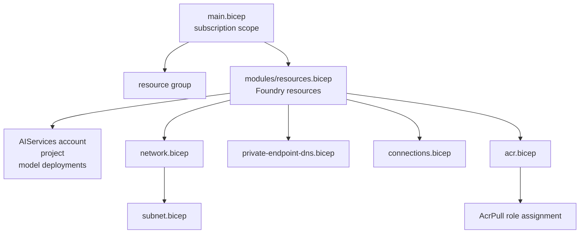

# 🏗️ Infrastructure ejection reference

`azd ai agent init --infra` turns the normally hidden Foundry provisioning plan into files you own.
Use it when the managed `microsoft.foundry` provider is no longer enough.

---

## Evidence used for this page

| Evidence | What was read |
|---|---|
| Captured Bicep eject | `rdcheck/infra/bicep/agent-framework-agent-basic-responses/` |
| Captured Terraform eject | `rdcheck/infra/tf/agent-framework-agent-basic-responses/` |
| Help text | `rdcheck/help/init.txt` |
| Existing references | [`azure-yaml.md`](./azure-yaml.md), [`azd-cli.md`](./azd-cli.md), [`environment-variables.md`](./environment-variables.md) |

> [!NOTE]
> Blocks marked **verified** below come from the captured files or command logs listed above.
> Anything that describes a future customisation pattern is marked **illustrative**.

---

## What `--infra` does

By default, a Foundry agent project keeps infrastructure managed behind this short manifest block:

```yaml
infra:
  provider: microsoft.foundry
```

That means `azd provision` synthesizes the Azure deployment from `azure.yaml`; no Bicep or
Terraform files are present in your project. Ejection writes the synthesized plan to `./infra/`
so future provisions read local files instead.

| Mode | Command | Result |
|---|---|---|
| Managed | no `--infra` | `infra.provider: microsoft.foundry`; no `./infra/` ownership |
| Bicep, implicit | `azd ai agent init --infra` | creates `infra/*.bicep`; leaves `infra.provider` as `microsoft.foundry` in the captured run |
| Bicep, explicit | `azd ai agent init --infra=bicep` | same intended Bicep eject behaviour; not separately run for this page |
| Terraform | `azd ai agent init --infra=terraform` | creates `infra/*.tf`; updates `azure.yaml` to `infra.provider: terraform` |

> [!WARNING]
> Ejection is a source-control boundary. After files exist under `./infra/`, **you own them**:
> review diffs carefully, keep customisations small, and test with preview before applying.

---

## Exact `--infra` help text

> [!WARNING]
> **This help text changed in the newer extension build.** `--infra` no longer ejects into
> `./infra/` wholesale — existing infrastructure is preserved and Foundry files are generated
> as a separate `infra/foundry` layer. The block below is still the exact text for the row
> everything on this page was verified on. See
> [newer than the verified toolchain](README.md#newer-than-the-verified-toolchain).

<details open>
<summary>✅ Verified `azd ai agent init --help` excerpt</summary>

```text
--infra string[="bicep"]    Eject infrastructure-as-code from azure.yaml into ./infra/. A bare --infra ejects Bicep; --infra=terraform ejects Terraform and sets infra.provider: terraform; --infra=bicep is explicit Bicep. When azure.yaml already declares a Foundry project service, runs as a standalone eject and skips the init prompts; otherwise init runs first and the eject follows it.
```
</details>

Key details:

| Detail | Practical meaning |
|---|---|
| `string[="bicep"]` | The flag accepts an optional value. No value means Bicep. |
| Bare `--infra` | Equivalent to requesting Bicep. |
| `--infra=terraform` | Requests Terraform and updates `infra.provider`. |
| `--infra=bicep` | Explicit Bicep. |
| Existing Foundry project service | If `azure.yaml` already has `host: azure.ai.project`, the command can run as a standalone eject. |
| No existing project service | `init` scaffolds first, then ejects. |

---

## When you need ejection

Start managed. Eject only when you need infrastructure that must be reviewed, changed or governed
as code.

| Need | Stay managed? | Eject? | Why |
|---|---:|---:|---|
| Basic hosted agent | ✅ | ❌ | Managed provider already creates the Foundry account and project. |
| Code deploy with no registry | ✅ | Usually no | Code mode can run without ACR; see [`deploy-modes.md`](./deploy-modes.md). |
| Custom tags, naming, policy review | Maybe | ✅ | Local files let platform teams review exact Azure resources. |
| Private endpoints / private DNS | ❌ | ✅ | Captured Bicep includes `network.bicep` and `private-endpoint-dns.bicep`. |
| BYO VNet and delegated agent subnet | ❌ | ✅ | Captured Bicep exposes subnet creation/reference parameters. |
| Container registry hardening | ❌ | ✅ | Captured Bicep includes ACR, AcrPull and project connection resources. |
| Terraform-only platform workflow | ❌ | ✅ | Use `--infra=terraform`. |

> [!NOTE]
> Inferred from the Bicep template, not observed in a live run: the table rows about private
> networking and registry hardening describe capabilities exposed by ejected files. The live run
> used code mode with `AZURE_FOUNDRY_NETWORK_MODE="none"` and no ACR.

---

## Verified ejection behaviour

> [!NOTE]
> In both logs below the absolute capture directory is shortened to `<work-dir>`; you will
> see your own path there. Every other character is verbatim.

<details>
<summary>✅ Verified Bicep init/eject log excerpt</summary>

```text
Initializing an app to run on Azure (azd init)

Copying template code from local path to: <work-dir>/bicep/agent-framework-agent-basic-responses
  (✓) Done: Initialized git repository
  (✓) Done: Copying template code from local path to: <work-dir>/bicep/agent-framework-agent-basic-responses


Installing required extensions...
Installing azure.ai.agents extension
  (-) Skipped: Installing azure.ai.agents extension (version 1.0.0-beta.9 already installed)
Missing Azure environment values: AZURE_SUBSCRIPTION_ID, AZURE_LOCATION. Continuing because --no-prompt was specified.
Set the missing values before running azd provision or azd deploy:
  azd env set AZURE_SUBSCRIPTION_ID <subscription-id>
  azd env set AZURE_LOCATION <region>
  # Optional: azd env set AZURE_AI_DEPLOYMENTS_LOCATION <region>

Adopted the sample's azure.yaml as the project manifest at azure.yaml.

Generating infrastructure files from azure.yaml...

  Created infra/abbreviations.json
  Created infra/main.bicep
  Created infra/main.parameters.json
  Created infra/modules/acr-pull-role-assignment.bicep
  Created infra/modules/acr.bicep
  Created infra/modules/connections.bicep
  Created infra/modules/network.bicep
  Created infra/modules/private-endpoint-dns.bicep
  Created infra/modules/resources.bicep
  Created infra/modules/subnet.bicep

Future provisions will read from ./infra/.

Next steps:
  azd provision    Apply changes
```
</details>

<details>
<summary>✅ Verified Terraform init/eject log excerpt</summary>

```text
Initializing an app to run on Azure (azd init)

Copying template code from local path to: <work-dir>/tf/agent-framework-agent-basic-responses
  (✓) Done: Initialized git repository
  (✓) Done: Copying template code from local path to: <work-dir>/tf/agent-framework-agent-basic-responses


Installing required extensions...
Installing azure.ai.agents extension
  (-) Skipped: Installing azure.ai.agents extension (version 1.0.0-beta.9 already installed)
Missing Azure environment values: AZURE_SUBSCRIPTION_ID, AZURE_LOCATION. Continuing because --no-prompt was specified.
Set the missing values before running azd provision or azd deploy:
  azd env set AZURE_SUBSCRIPTION_ID <subscription-id>
  azd env set AZURE_LOCATION <region>
  # Optional: azd env set AZURE_AI_DEPLOYMENTS_LOCATION <region>

Adopted the sample's azure.yaml as the project manifest at azure.yaml.

Generating infrastructure files from azure.yaml...

  Created infra/connections.tf
  Created infra/main.tf
  Created infra/main.tfvars.json
  Created infra/outputs.tf
  Created infra/provider.tf
  Created infra/variables.tf

  Updated azure.yaml (infra.provider: terraform)

Future provisions will read from ./infra/.

Next steps:
  azd provision    Apply changes
```
</details>

> [!NOTE]
> `azd ai agent init` also ran `git init` in both captured projects. That behaviour is visible
> in the logs, but it is not called out in the help text excerpt above.

---

## Bicep inventory

✅ Verified count: **10 infrastructure files, 1,091 lines**.

| File | Lines | Responsibility |
|---|---:|---|
| `infra/main.bicep` | 174 | Subscription-scoped entry point. Creates the resource group, passes parameters into `modules/resources.bicep`, and outputs azd environment values. |
| `infra/main.parameters.json` | 67 | Default parameter values derived from `azure.yaml`: deployments, connection list, network toggles, subnet names, `includeAcr`, and DNS settings. |
| `infra/abbreviations.json` | 4 | Prefix map: Cognitive Services accounts use `cog-`; container registries use `cr`. |
| `infra/modules/resources.bicep` | 331 | Resource-group-scoped Foundry account, project, model deployments, optional ACR module, optional private networking, optional connections, and developer role assignment. |
| `infra/modules/private-endpoint-dns.bicep` | 168 | Private endpoint for the AI account plus three private DNS zones: `privatelink.services.ai.azure.com`, `privatelink.openai.azure.com`, and `privatelink.cognitiveservices.azure.com`. |
| `infra/modules/acr.bicep` | 115 | Premium Azure Container Registry, managed identity, project-scoped ContainerRegistry connection, and AcrPull grant for the Foundry project identity. |
| `infra/modules/network.bicep` | 95 | BYO VNet wiring; creates or references agent and private-endpoint subnets, including `Microsoft.App/environments` delegation for the agent subnet. |
| `infra/modules/connections.bicep` | 85 | Creates `Microsoft.CognitiveServices/accounts/projects/connections` resources for `host: azure.ai.connection` services. |
| `infra/modules/subnet.bicep` | 28 | Small reusable module for creating one subnet on an existing VNet. |
| `infra/modules/acr-pull-role-assignment.bicep` | 24 | Standalone AcrPull role assignment helper for an existing registry. |

### Bicep file map



---

## Terraform inventory

✅ Verified count: **6 infrastructure files, 340 lines**.

| File | Lines | Responsibility |
|---|---:|---|
| `infra/main.tf` | 140 | Resource group, AIServices account, model deployments, Foundry project, and developer Cognitive Services User role assignment. |
| `infra/variables.tf` | 84 | Inputs for subscription, location, resource group, environment, tags, resource salt, Foundry project name, deployments, connections, principal id and principal type. |
| `infra/outputs.tf` | 35 | azd-consumed outputs such as resource group, project id, account name, OpenAI endpoint, Foundry endpoint and connection names. |
| `infra/connections.tf` | 34 | `azapi_resource` loop for project connections declared from `azure.yaml`. |
| `infra/provider.tf` | 23 | Terraform and provider constraints: Terraform `>= 1.3.0, < 2.0.0`, `azurerm ~> 4.0`, `azapi ~> 2.0`. |
| `infra/main.tfvars.json` | 24 | azd variable bridge: `${AZURE_ENV_NAME}`, `${AZURE_LOCATION}`, `${AZURE_SUBSCRIPTION_ID}`, `${AZURE_RESOURCE_GROUP}`, deployments and connections. |

> [!CAUTION]
> The captured Terraform eject does **not** include the Bicep network or ACR modules. The files
> read for this page show the account, project, deployments, role assignment and connections.
> Do not assume Terraform currently exposes every Bicep capability unless you inspect your own
> generated files.

---

## The `infra.provider` asymmetry

The captured Bicep and Terraform projects differ after ejection:

| Eject | Captured `azure.yaml` after ejection |
|---|---|
| Bicep | `infra.provider: microsoft.foundry` |
| Terraform | `infra.provider: terraform` |

<details>
<summary>✅ Verified Bicep manifest tail</summary>

```yaml
infra:
  provider: microsoft.foundry
```
</details>

<details>
<summary>✅ Verified Terraform manifest tail</summary>

```yaml
infra:
    provider: terraform
```
</details>

> [!WARNING]
> Treat the Bicep value as an observed preview asymmetry, not as a general rule. The Bicep log
> still says `Future provisions will read from ./infra/.`, so the presence of local files is
> operationally important even though the provider value was not changed in the captured run.

---

## Why `main.bicep` targets the subscription

<details open>
<summary>✅ Verified header comment from `infra/main.bicep`</summary>

```text
Subscription-scoped so the resource group is part of the deployment. This
keeps `azd provision --preview` side-effect free: the resource group shows
up as a previewed Create instead of being created up front to satisfy a
resource-group-scoped what-if.
```
</details>

The entry point uses:

```bicep
targetScope = 'subscription'
```

That is deliberate. The resource group is created inside the deployment, and the actual
Foundry resources are delegated to the resource-group-scoped `modules/resources.bicep` module.

---

## Hidden capabilities revealed by Bicep ejection

The managed provider hides useful knobs. The captured Bicep makes them visible.

| Capability | Evidence | What it enables |
|---|---|---|
| Private data plane | `publicNetworkAccess: 'Disabled'` when `enableNetworkIsolation` is true | Keeps the Foundry account off the public data plane. |
| BYO VNet injection | `networkInjections`, `agentSubnetArmId`, `useMicrosoftManagedNetwork: false` | Places the agent runtime into a customer subnet. |
| Microsoft-managed egress | `useManagedEgress` and `managednetworks@2025-10-01-preview` | Uses the platform-managed network with optional isolation mode. |
| Private endpoint | `private-endpoint-dns.bicep` | Creates an account private endpoint in the PE subnet. |
| Private DNS | three zones: `privatelink.services.ai.azure.com`, `privatelink.openai.azure.com`, `privatelink.cognitiveservices.azure.com` | Resolves Foundry/OpenAI/Cognitive Services endpoints privately. |
| ACR | `Microsoft.ContainerRegistry/registries@2023-07-01` | Creates a Premium registry when `includeAcr` is true. |
| AcrPull | role id `7f951dda-4ed3-4680-a7ca-43fe172d538d` | Lets the Foundry project managed identity pull images from that registry. |
| Project connections | `connections.bicep` | Provisions project connection resources declared from `host: azure.ai.connection` services. |

> [!NOTE]
> Inferred from the Bicep template, not observed in a live run. The captured live code-mode run
> had `AZURE_FOUNDRY_NETWORK_MODE="none"`, `ENABLE_CAPABILITY_HOST="false"`,
> `AZURE_CONTAINER_REGISTRY_ENDPOINT=""`, and only two Azure resources.

---

## How ejection interacts with `azd provision`

The captured logs end with:

```text
Future provisions will read from ./infra/.
```

That means the next `azd provision` uses the ejected files instead of only synthesizing from the
managed provider. The files still receive values from the azd environment; for example,
`main.tfvars.json` contains `${AZURE_LOCATION}`, `${AZURE_SUBSCRIPTION_ID}` and
`${AZURE_RESOURCE_GROUP}`, while Bicep parameters include deployments and network switches.

> [!CAUTION]
> This page did **not** run `azd provision`, `azd deploy`, or any command that creates Azure
> resources. Use [`troubleshooting.md`](./troubleshooting.md) before applying changes in a real
> subscription.

---

## Safe customisation workflow

1. Commit the generated project before editing infrastructure.
2. Change one concern at a time: networking, tags, role assignments or registry settings.
3. Keep azd output names stable. Existing pages document environment outputs in
   [`environment-variables.md`](./environment-variables.md).
4. Run a syntax-only local check when possible.
5. Use `azd provision --preview` before applying.
6. Do not edit generated infrastructure and `azure.yaml` in conflicting ways.

<details>
<summary>Illustrative local checks</summary>

```bash
# Bicep syntax check, if Azure CLI/Bicep is installed
az bicep build --file infra/main.bicep

# Terraform formatting and validation, if Terraform is installed
terraform -chdir=infra fmt -check
terraform -chdir=infra init -backend=false
terraform -chdir=infra validate
```
</details>

> [!TIP]
> If you only need to set model or runtime environment values, do not eject. Use `azd env set`
> and the manifest patterns in [`environment-variables.md`](./environment-variables.md).

---

## One-way ownership model

There is no verified command in the captured help text for "re-importing" edited Bicep or
Terraform back into `infra.provider: microsoft.foundry`.

> [!NOTE]
> Inferred from the available help text, not observed in a live run: treat ejection as one-way.
> You can delete and re-scaffold in a new branch, but no captured command merges custom IaC back
> into the managed provider for you.

---

## Standalone eject vs init-then-eject

| Starting point | Help text behaviour | What to expect |
|---|---|---|
| Existing `azure.yaml` with `host: azure.ai.project` | standalone eject; skips init prompts | Generates `./infra/` from the existing manifest. |
| Agent manifest, sample pointer or local code without a full project service | init first, eject follows | Scaffolds project files, initializes git, then writes `./infra/`. |

The captured runs used a sample unified `azure.yaml`; the logs show adoption of that manifest,
`azd init`, git initialization, and then infrastructure generation.

---

## Next

- 👉 [`deploy-modes.md`](./deploy-modes.md) — how code, container and BYO-image deployments change resources
- 👉 [`azure-yaml.md`](./azure-yaml.md) — manifest fields that drive ejection
- 👉 [`azd-cli.md`](./azd-cli.md) — CLI flags and examples
- 👉 [`environment-variables.md`](./environment-variables.md) — outputs written by provisioning
- 👉 [`../tutorial/02-first-agent.md`](../tutorial/02-first-agent.md) — end-to-end CLI flow
- 👉 [`troubleshooting.md`](./troubleshooting.md) — known failures and fixes
