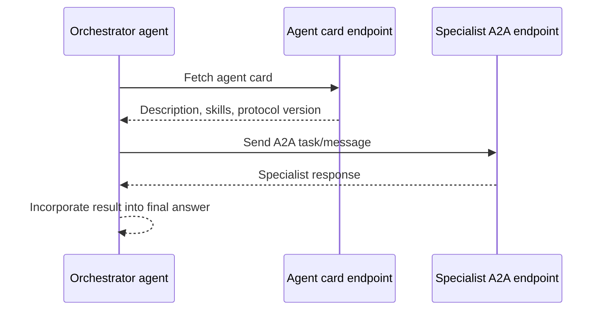
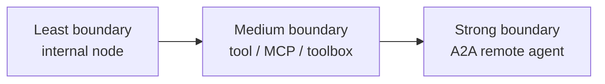
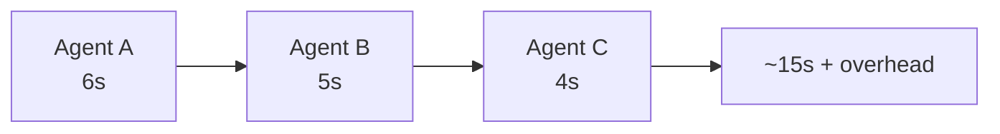
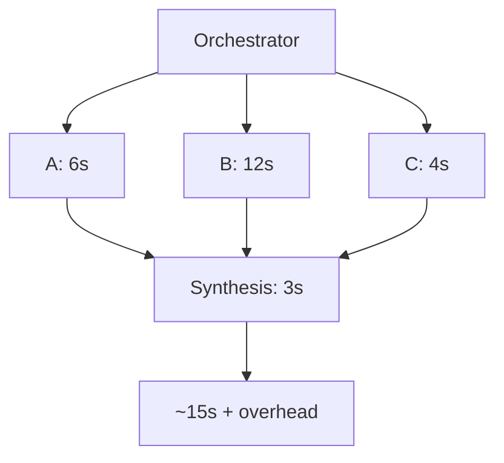

# 🧩 Multi-agent reference — patterns, protocols and verified details

> Dense lookup page for multi-agent implementation in Foundry. For concepts and
> decision guidance, see [Learn: Multi-agent patterns](../learn/10-multi-agent.md).
> For a hands-on A2A lab, see [Tutorial 09](../tutorial/09-multi-agent-a2a.md).

---

## What was verified for this page

⬆️ **Upgraded 2026-08-09.** A2A was originally documented from source inspection only. It has
since been **deployed and exercised on live Azure** — two agents, two projects, a real agent
card fetched over the wire. See [Lab 09](../tutorial/09-multi-agent-a2a.md) for the full run.

> [!IMPORTANT]
> **The live run did not reach a working delegation.** Everything up to `tools/list` is
> verified; the final agent-to-agent call fails on a defect in `azd provision`. That is
> recorded honestly in Lab 09 rather than smoothed over here.

<details open>
<summary><b>✅ Verified sample catalog commands</b></summary>

```bash
AZURE_DEV_USER_AGENT=microsoft_foundry_skill azd ai agent sample list --language python --output json
AZURE_DEV_USER_AGENT=microsoft_foundry_skill azd ai agent sample list --language dotnetCsharp --output json
```

Those commands returned **21 Python** templates and **13 C#** templates. Filtering titles and
paths for workflow / multi-agent / A2A found:

| Language | Verified sample | Path |
|---|---|---|
| Python | **Workflow agent (Responses, Agent Framework, Python)** | `python/hosted-agents/agent-framework/responses/05-workflows` |
| C# | **Translation Workflow agent (Responses, Agent Framework, C#)** | `csharp/hosted-agents/agent-framework/workflows` |

No sample title or path in the captured catalog contained `A2A` or `agent-to-agent`.

> [!WARNING]
> **The catalog is not the whole repository.** ✅ Verified 2026-08-09: `foundry-samples`
> contains A2A delegation samples in **both** languages —
> `python/hosted-agents/agent-framework/a2a/01-delegation` and
> `csharp/hosted-agents/agent-framework/a2a/01-delegation`, plus a LangGraph variant at
> `python/hosted-agents/langgraph/a2a`. We deployed the **Python** one. Treat
> `azd ai agent sample list` as a curated subset, not an index — browse the upstream tree
> when something you expect is missing.
</details>

<details>
<summary><b>✅ Verified upstream source files inspected</b></summary>

| Sample | Files inspected via `raw.githubusercontent.com` |
|---|---|
| Python Workflow agent | `README.md`, `azure.yaml`, `src/agent-framework-workflows-responses/main.py`, `src/agent-framework-workflows-responses/requirements.txt` |
| C# Translation Workflow agent | `README.md`, `azure.yaml`, `src/workflows/Program.cs`, `src/workflows/workflows.csproj` |
| C# A2A delegation sample | `README.md`, `caller/azure.yaml`, `caller/src/.../Program.cs`, `executor/azure.yaml`, `executor/src/.../Program.cs`, `executor/src/.../scripts/setup-a2a.sh` |

The source inspection below is based on those files, not on a live deployment.
</details>

<details>
<summary><b>✅ Verified command-help surface for A2A/card configuration</b></summary>

Captured help shows `azd ai agent endpoint` has exactly two subcommands:

| Command | Verified purpose |
|---|---|
| `azd ai agent endpoint show [name]` | Displays protocols, version selector, authorization schemes and agent card configured on the live agent. |
| `azd ai agent endpoint update [name] [--force]` | Reads `agentEndpoint` / `agentCard` from `azure.yaml` (or legacy `agent_endpoint` / `agent_card`) and patches the existing agent without creating a new version. |

`endpoint update` has one command-specific flag: `--force`, described as "Skip confirmation
prompts for breaking changes."
</details>

> [!IMPORTANT]
> Blocks in this page are labelled carefully. Catalog discovery, upstream source inspection,
> the **live agent card**, the **live `RemoteA2A` connection** and the **live failure modes**
> are verified. A **successful** agent-to-agent call is **not** — see
> [Lab 09](../tutorial/09-multi-agent-a2a.md). Workflow samples were not deployed. Architecture
> diagrams are **illustrative** unless explicitly tied to inspected sample code.

---

## Verified Python sample: slogan writer → legal reviewer → formatter

The Python sample at `python/hosted-agents/agent-framework/responses/05-workflows` creates
three `Agent` instances that share one `FoundryChatClient`:

| Agent name | Instruction role |
|---|---|
| `writer` | Create new slogans from the user's topic. |
| `legal_reviewer` | Correct the slogan so it is legally compliant. |
| `formatter` | Format the slogan in a cool retro terminal style. |

The source wraps each agent in an `AgentExecutor` with `context_mode="last_agent"`, then wires
edges with `WorkflowBuilder`:

```text
writer_executor → legal_executor → format_executor
```

It sets `output_executors=[format_executor]`, so only the final formatted result is returned to
the caller. The workflow is converted to one callable agent with `.build().as_agent()` and is
served by `ResponsesHostServer(workflow_agent)`.

| Verified manifest field | Value |
|---|---|
| `services.agent-framework-workflows-responses.kind` | `hosted` |
| `services.agent-framework-workflows-responses.protocols[0].protocol` | `responses` |
| `services.agent-framework-workflows-responses.codeConfiguration.runtime` | `python_3_13` |
| `services.agent-framework-workflows-responses.codeConfiguration.entryPoint` | `main.py` |
| `services.agent-framework-workflows-responses.container.resources` | `0.5` CPU / `1Gi` memory |

> [!NOTE]
> The upstream README says this sample needs a more advanced model because it continues from
> an assistant message, and says it was tested with `gpt-5.4`. The inspected `azure.yaml`
> still declares `gpt-5.4-mini`. I did not deploy the sample, so I cannot say which model is
> sufficient in practice.

---

## Verified C# sample: English → French → Spanish → English

The C# sample at `csharp/hosted-agents/agent-framework/workflows` creates three `AIAgent`
instances from one `AIProjectClient`:

| Agent name | Instruction role |
|---|---|
| `english-to-french` | Translate user input into French only. |
| `french-to-spanish` | Translate the French output into Spanish only. |
| `spanish-to-english` | Translate the Spanish output back into English only. |

The source builds the chain with:

```text
AgentWorkflowBuilder.BuildSequential("translation-chain", englishToFrench, frenchToSpanish, spanishToEnglish)
```

Then it exposes the result with `AddFoundryResponses(agent)` and
`RegisterProtocol("responses", endpoints => endpoints.MapFoundryResponses())`.

| Verified manifest field | Value |
|---|---|
| `services.workflows.displayName` | `Translation Workflow Agent` |
| `services.workflows.description` | sequential translation through English → French → Spanish → English |
| `services.workflows.kind` | `hosted` |
| `services.workflows.protocols[0].protocol` | `responses` |
| `services.workflows.codeConfiguration.runtime` | `dotnet_10` |
| `services.workflows.codeConfiguration.entryPoint` | `workflows.dll` |

> [!WARNING]
> The source defaults `AZURE_AI_MODEL_DEPLOYMENT_NAME` to `gpt-4o` if the env var is missing,
> while the manifest declares `gpt-5.4-mini`. In this repo's golden path, set
> `AZURE_AI_MODEL_DEPLOYMENT_NAME` explicitly after provision so the runtime and manifest agree.

---

## A2A (agent-to-agent) protocol details

A2A is for agent-to-agent delegation across an endpoint boundary. One agent can discover a
remote agent's advertised capabilities and call it through the A2A protocol.



| A2A concept | Meaning in Foundry | Status |
|---|---|---|
| **A2A base path** | `.../agents/<agent>/endpoint/protocols/a2a` | ✅ verified live |
| **Agent card URL** | `<a2a-base>/agentCard/v0.3`. Do not assume this path for future A2A versions. | ✅ verified live |
| **Calling identity** | A `RemoteA2A` connection with `authType: UserEntraToken` — the toolbox forwards the **calling user's** Entra token, not a managed identity. | ✅ connection verified live |
| **Target role** | The sample README requires **Foundry User** (or higher) on the project. A narrower role was not tested. | ⚠️ from README |
| **Protocol dependency** | Both agents start as `responses` agents; a PATCH adds `a2a` to the executor's protocols. | ✅ verified live |
| **Cross-project** | The connection points at a **different Foundry project** in a different resource group. | ✅ verified live |

### What a real agent card contains

Fetched from a live endpoint on 2026-08-09 — this is the entire contract the caller gets:

```json
{
  "name": "agent-framework-a2a-executor-responses",
  "description": "A math expert that performs arithmetic operations and explains the steps.",
  "url": "https://…/endpoint/protocols/a2a",
  "version": "1.0",
  "protocolVersion": "0.3",
  "capabilities": { "streaming": false, "pushNotifications": false,
                    "stateTransitionHistory": false, "extensions": [] },
  "defaultInputModes": ["text"],
  "defaultOutputModes": ["text"],
  "skills": [{ "id": "arithmetic", "name": "Arithmetic and math expert",
               "description": "Performs arithmetic operations …", "tags": [], "examples": [] }],
  "supportsAuthenticatedExtendedCard": false,
  "additionalInterfaces": [{ "transport": "HTTP+JSON", "url": "https://…/endpoint/protocols/a2a" }],
  "preferredTransport": "JSONRPC"
}
```

Three things to read off it:

- **`streaming: false`.** A delegated call does not stream. If your orchestrator streams to a
  user, the delegated portion arrives as one block.
- **`preferredTransport: JSONRPC`, but `additionalInterfaces` offers `HTTP+JSON`.** Callers
  negotiate; do not hardcode one.
- **`skills[]` is the whole advertised capability surface.** Descriptions here are what the
  orchestrator's model reasons over when deciding to delegate — vague skill text produces
  vague routing.

> [!WARNING]
> **Live run status: delegation did not succeed.** We verified deploy, A2A enablement, the
> agent card, and the cross-project `RemoteA2A` connection — then hit a defect where
> `azd provision` **drops the manifest's `audience`**, so the token exchange has no audience
> and `tools/list` fails. Full reproduction, three defects and four attempted workarounds:
> [Lab 09](../tutorial/09-multi-agent-a2a.md). **Budget real time for A2A** — it is the least
> settled area of the preview.

> [!IMPORTANT]
> A2A is a trust boundary, not just a function call. Treat the remote agent like an external
> service: authenticate it, authorise the caller, version it, monitor it and decide what user
> context may cross the boundary.

### Source-verified C# sample: caller → RemoteA2A toolbox → executor

The upstream tree contains a C# A2A delegation sample at
`samples/csharp/hosted-agents/agent-framework/a2a/01-delegation`. It was **not** present in
the captured `azd ai agent sample list` output, so treat it as upstream source evidence rather
than catalog evidence.

| Piece | What the source says |
|---|---|
| Executor | A hosted Responses agent named `agent-framework-a2a-executor-responses-dotnet` that answers arithmetic/math questions. |
| Incoming A2A enablement | `executor/scripts/setup-a2a.sh` PATCHes `"$FOUNDRY_PROJECT_ENDPOINT/agents/$AGENT_NAME?api-version=v1"` with `agent_card` and `agent_endpoint.protocols: ["responses", "a2a"]`. |
| Executor A2A endpoint | The script prints `$FOUNDRY_PROJECT_ENDPOINT/agents/$AGENT_NAME/endpoint/protocols/a2a`. |
| Agent-card path in the sample | The script prints `.../protocols/a2a/agentCard/v0.3`; the caller manifest also sets `AgentCardPath: /agentCard/v0.3` and `agent_card_path: agentCard/v0.3`. |
| Caller | A hosted Responses agent named `agent-framework-a2a-caller-responses-dotnet` that loads a Foundry Toolbox. |
| Connection/tool wiring | The caller manifest declares a `RemoteA2A` connection and an `a2a_preview` toolbox tool. `azd provision` creates them for the caller project. |
| Auth | The parent README says the `RemoteA2A` connection uses `authType: UserEntraToken`, forwarding the calling user's Microsoft Entra token. |

> [!NOTE]
> Described from upstream source only. I did not deploy the caller/executor pair, run the
> `setup-a2a` script, invoke the caller, or fetch the advertised card from a live endpoint.

### CLI surface: endpoint show/update

The current CLI help exposes `azd ai agent endpoint show` and `azd ai agent endpoint update`.
That matters because the endpoint/card configuration is mutable without creating a new agent
version.

| Command | Verified from help |
|---|---|
| `endpoint show` | Shows protocols, version selector / traffic split, authorization schemes and agent card configured on the live agent. |
| `endpoint update` | Reads `agentEndpoint` / `agentCard` from `azure.yaml` (or legacy snake_case fields) and patches the existing agent. |
| `endpoint update --force` | Skips confirmation prompts for breaking changes. |

> [!CAUTION]
> I did not run `endpoint update`, so this page does **not** quote its success output. The only
> verified output here is `--help` text and upstream sample source. Do not copy invented
> command output into this guide.

### What could not be verified

| Claim | Status |
|---|---|
| A live Foundry-hosted A2A call from one deployed agent to another | **Not verified** — would require deployed agents / Azure resources. |
| A live agent card response | **Not verified** — I inspected source and scripts only; no deployed endpoint was called. |
| `azd ai agent endpoint update` exact success output for A2A/card patching | **Not verified** — no write commands were run. |

---

## How agents call other agents — boundary levels

| Level | What happens | Best for | Identity/version story |
|---|---|---|---|
| **Internal workflow node** | One process creates several Agent Framework agents and chains them. | Tight pipeline, same owner, same permissions. | One hosted agent identity and one deployed version. |
| **Tool-like specialist** | Orchestrator calls a tool, MCP server, toolbox or hosted MCP server tool. | Deterministic capabilities or external APIs. | Tool has its own auth/config; agent version may not change. |
| **Remote agent / A2A** | Orchestrator calls another deployed agent endpoint. | Independent teams, independent permissions, reusable specialists. | Each agent has its own identity and version; callers need access. |



---

## Managed identity and trust between agents

Every deployed hosted agent gets its own managed identity. In `azd ai agent show --output json`,
that identity appears as `instance_identity.principal_id` and `instance_identity.client_id`.

In the live C# deployment captured for this repo, `azd ai agent show` printed:

```text
Agent GUID                       4e7e0e00-af5c-462b-a40b-09657fc5e964
Instance Identity Principal ID   af65ac56-3c8b-4fc9-ba35-9cb1a37e52da
Instance Identity Client ID      af65ac56-3c8b-4fc9-ba35-9cb1a37e52da
Blueprint Principal ID           68c06f0f-7eee-48d0-8d6b-ddeb81f5c1bb
Blueprint Client ID              6371fa08-38ff-483f-aadf-98edb2ecb0af
Blueprint Reference Type         ManagedAgentIdentityBlueprint
Blueprint Reference ID           hello-world-4e7e0
```

That capture proves two multi-agent-relevant details: the running agent identity is separate
from the blueprint identity, and the blueprint principal/client IDs are not interchangeable
with the instance principal you grant roles to.

| Design | What it means |
|---|---|
| One workflow agent with internal nodes | All nodes run as the same hosted-agent identity. Simple, but no per-node RBAC. |
| Separate deployed specialists | Each specialist has its own identity. You can grant different roles per specialist. |
| Orchestrator calls target A2A endpoint | The target project must trust the calling identity. Grant only the least role needed. |
| Tool works locally but not hosted | You probably granted your user access, not the deployed agent's `principal_id`. |

> [!CAUTION]
> Do not use multi-agent boundaries to bypass access control. If Agent A is not allowed to read
> a resource, routing the request through Agent B must be an intentional, audited delegation with
> explicit roles.

> [!WARNING]
> The verified default provision created **zero role assignments at resource-group scope**.
> Do not assume agent-to-agent authorization is set up for you. Grant the exact caller
> identity/token path required by your chosen pattern and verify it independently.

---

## Versioning agents independently

Foundry agent ids include a version suffix, for example:

```text
my-agent:1
my-agent:2
```

Redeploying the same `services.<agent>.name` creates a new version. Changing the name creates a
separate agent.

| Pattern | Versioning effect |
|---|---|
| Internal workflow | Any code or prompt change redeploys the whole workflow as a new version. |
| Remote specialist | Specialist can move from `translator:3` to `translator:4` without redeploying the router, if the router targets the active endpoint by name. |
| Eval baseline | Pin `agent.version` in `eval.yaml` when you need to compare `:1` against `:2`. |
| A2A card | Keep the card description and skills aligned with the deployed version callers will reach. |

> [!TIP]
> For production, record the specialist version selected by a router or orchestrator in traces.
> Otherwise a later regression may look like "the orchestrator got worse" when only one
> downstream specialist changed.

---

## Cost and latency implications of chaining

| Cost driver | Why it grows in multi-agent systems | Mitigation |
|---|---|---|
| Model calls | Sequential chains call a model once per step. | Combine steps only when separation adds no value; cache deterministic work. |
| Tokens | Each agent has its own instructions and context. | Keep specialist prompts short; pass only the fields the next agent needs. |
| Tool calls | Each specialist may call tools independently. | Centralize expensive retrieval or share summarized evidence. |
| Cold starts | Separate hosted agents can each need a session/sandbox. | Reuse sessions for related work; avoid over-splitting tiny tasks. |
| Network hops | A2A and remote tools add endpoint latency. | Prefer internal workflows for tightly coupled low-latency pipelines. |
| Evaluation | More branches require more test cases to cover routes and failures. | Evaluate each specialist plus the orchestrator path. |

Sequential latency is roughly additive:



Parallel latency is closer to the slowest branch plus synthesis, but cost still grows with every
branch:



The numbers above are illustrative. Measure your actual agents with traces and eval runs.

---

## Evaluation strategy for multi-agent systems

| Evaluate | Question to answer | Example metric |
|---|---|---|
| Each specialist alone | Does the specialist do its narrow job well? | Translation quality, legal compliance, retrieval precision. |
| Router / orchestrator | Did it choose the right specialist and pass the right context? | Route accuracy, hand-off completeness. |
| Whole workflow | Does the user get a correct final answer? | End-to-end rubric pass rate. |
| Failure paths | Does the system degrade safely? | Refusal correctness, fallback quality, timeout handling. |
| Cost/latency | Is the split worth the overhead? | p50/p95 latency, model-call count, tokens per request. |

---

## Local development checklist

| Check | Why |
|---|---|
| Start with `responses` unless you need another protocol. | It has the widest tooling support and is required by optimizer and incoming A2A. |
| Run with `azd ai agent run --no-client`. | Starts the local server on `8088`; add the Inspector when you need UI. |
| Use the Agent Inspector for workflow graphs when available. | The GUI guide notes Agent Framework workflows render as a graph. |
| Keep intermediate outputs inspectable. | Debugging a chain is impossible if you only see the final answer. |
| Set `AZURE_AI_MODEL_DEPLOYMENT_NAME`. | The first-run failure applies to workflow samples too. |
| Do not background the local server in a throwaway shell. | It can receive SIGHUP and disappear. |

---

## Honesty summary

| Statement | Evidence |
|---|---|
| The `azd` catalog contains a Python Workflow agent and a C# Translation Workflow agent. | Verified by running `azd ai agent sample list --language ... --output json`. |
| Both workflow samples expose the `responses` protocol. | Verified in upstream `azure.yaml` files. |
| The Python workflow is writer → legal reviewer → formatter. | Verified in upstream `main.py`. |
| The C# workflow is English → French → Spanish → English. | Verified in upstream `Program.cs`. |
| A2A exists in Foundry docs and CLI surface, and the upstream tree contains a C# caller/executor A2A delegation sample. | Verified by command help and upstream source inspection; no live A2A call run. |
| The captured sample catalog did **not** advertise an A2A sample. | Verified catalog filter; source tree and catalog are not identical. |
| Per-agent managed identity matters for multi-agent trust. | Verified in this repo's deployed `show` example and documented hosted-agent behavior. |
