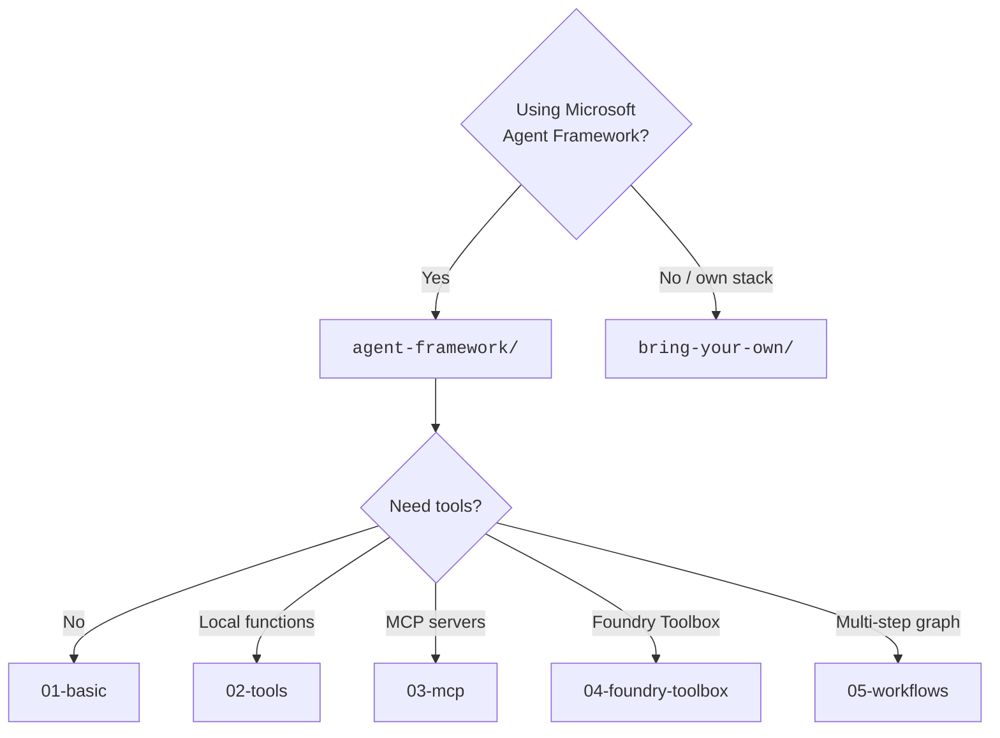

# 📚 Sample catalog

Captured live from `azd ai agent sample list` (`azure.ai.agents 1.0.0-beta.9`).
**24 Python + 13 C# = 37 samples**, as of 2026-08-14.

```bash
azd ai agent sample list --language python
azd ai agent sample list --language dotnetCsharp --output json
```

> `--language` takes short forms (`python`, `dotnetCsharp`). `--runtime` takes full tokens
> (`python_3_13`). They are not interchangeable.

Initialise any of them with:

```bash
azd ai agent init -m "<manifestUrl>"
```

All URLs below are relative to:

```text
https://github.com/microsoft-foundry/foundry-samples/blob/main/samples/
```


---

## 🐍 Python (24)

### ⭐ Featured

| Sample | Framework | Protocol | Path |
|---|---|---|---|
| **Basic agent** | Agent Framework | `invocations` | `python/hosted-agents/agent-framework/invocations/01-basic` |
| **Basic agent** | Agent Framework | `responses` | `python/hosted-agents/agent-framework/responses/01-basic` |
| **Agent with Local Tools** | Agent Framework | `responses` | `python/hosted-agents/agent-framework/responses/02-tools` |
| **Agent with MCP Tools** ⚠️ | Agent Framework | `responses` | `python/hosted-agents/agent-framework/responses/03-mcp` — **broken upstream, see note below** |
| **Agent with Foundry Toolbox** | Agent Framework | `responses` | `python/hosted-agents/agent-framework/responses/04-foundry-toolbox` |
| **Note-taking agent** | none / BYO | `responses` | `python/hosted-agents/bring-your-own/responses/notetaking-agent` |

> [!WARNING]
> **`03-mcp` is advertised but does not exist upstream.** `azd ai agent sample list` returns it,
> but `azd ai agent init --sample <its id>` fails and the upstream directory
> `python/hosted-agents/agent-framework/responses/03-mcp` **404s** on GitHub. It is a stale
> catalog entry. Use **`04-foundry-toolbox`** instead — that is the sample this repo's
> [`samples/python/03-mcp-toolbox`](../../samples/python/03-mcp-toolbox/) is built from.
>
> This is a useful lesson in itself: **the catalog is a published index, not a guarantee.**
> Always be ready for `init` to fail on an entry that `list` happily printed.

### Additional

| Sample | Framework | Protocol | Path |
|---|---|---|---|
| **Workflow agent** | Agent Framework | `responses` | `python/hosted-agents/agent-framework/responses/05-workflows` |
| **Echo agent** | none / BYO | `activity` | `python/hosted-agents/bring-your-own/activity/echo` |
| **Agent with AG-UI** | none / BYO | `invocations` | `python/hosted-agents/bring-your-own/invocations/ag-ui` |
| **Agent with Claude Agent SDK** | none / BYO | `invocations` | `python/hosted-agents/bring-your-own/invocations/claude-agent-sdk` |
| **Agent with Copilot SDK** | none / BYO | `invocations` | `python/hosted-agents/bring-your-own/invocations/github-copilot` |
| **Hello World agent** | none / BYO | `invocations` | `python/hosted-agents/bring-your-own/invocations/hello-world` |
| **Human-in-the-Loop agent** | none / BYO | `invocations` | `python/hosted-agents/bring-your-own/invocations/human-in-the-loop` |
| **LangGraph Chat agent** | none / BYO | `invocations` | `python/hosted-agents/bring-your-own/invocations/langgraph-chat` |
| **Note-taking agent** | none / BYO | `invocations` | `python/hosted-agents/bring-your-own/invocations/notetaking-agent` |
| **Resilient Approval Gate agent** 🆕 | none / BYO | `invocations` | `python/hosted-agents/bring-your-own/invocations/resilient-approval-gate` |
| **Resilient Research agent** 🆕 | none / BYO | `invocations` | `python/hosted-agents/bring-your-own/invocations/resilient-research` |
| **Agent with Foundry Toolbox** | none / BYO | `invocations` | `python/hosted-agents/bring-your-own/invocations/toolbox` |
| **Background agent** | none / BYO | `responses` | `python/hosted-agents/bring-your-own/responses/background-agent` |
| **Agent with Foundry Toolbox** | none / BYO | `responses` | `python/hosted-agents/bring-your-own/responses/bring-your-own-toolbox` |
| **Hello World agent** | none / BYO | `responses` | `python/hosted-agents/bring-your-own/responses/hello-world` |
| **LangGraph Chat agent** | none / BYO | `responses` | `python/hosted-agents/bring-your-own/responses/langgraph-chat` |
| **Agent with OpenAI Agents SDK** | none / BYO | `responses` | `python/hosted-agents/bring-your-own/responses/openai-agents-sdk` |
| **Resilient Steering agent** 🆕 | none / BYO | `responses` | `python/hosted-agents/bring-your-own/responses/resilient-steering` |

> [!NOTE]
> **The three 🆕 rows appeared between 2026-08-12 and 2026-08-14 with no extension release.**
> `azure.ai.agents` was `1.0.0-beta.9` on both days. The catalog is fetched from GitHub at
> call time, so it can grow — or lose an entry, as `03-mcp` shows — without anything on your
> machine changing. Re-run the two commands at the top of this page rather than trusting this
> snapshot.


---

## 🔷 C# (13)

### ⭐ Featured

| Sample | Framework | Protocol | Path |
|---|---|---|---|
| **Hello World agent** | Agent Framework | `responses` | `csharp/hosted-agents/agent-framework/hello-world` |
| **Agent with Local Tools** | Agent Framework | `responses` | `csharp/hosted-agents/agent-framework/local-tools` |
| **Agent with MCP Tools** | Agent Framework | `responses` | `csharp/hosted-agents/agent-framework/mcp-tools` |
| **Hello World agent** | none / BYO | `invocations` | `csharp/hosted-agents/bring-your-own/invocations/HelloWorld` |
| **Note-taking agent** | none / BYO | `responses` | `csharp/hosted-agents/bring-your-own/responses/notetaking-agent` |

### Additional

| Sample | Framework | Protocol | Path |
|---|---|---|---|
| **Echo agent** | Agent Framework | `invocations` | `csharp/hosted-agents/agent-framework/invocations-echo-agent` |
| **Simple agent** | Agent Framework | `responses` | `csharp/hosted-agents/agent-framework/simple-agent` |
| **Text Search RAG agent** | Agent Framework | `responses` | `csharp/hosted-agents/agent-framework/text-search-rag` |
| **Translation Workflow agent** | Agent Framework | `responses` | `csharp/hosted-agents/agent-framework/workflows` |
| **Human-in-the-Loop agent** | none / BYO | `invocations` | `csharp/hosted-agents/bring-your-own/invocations/human-in-the-loop` |
| **Note-taking agent** | none / BYO | `invocations` | `csharp/hosted-agents/bring-your-own/invocations/notetaking-agent` |
| **Hello World agent** | none / BYO | `responses` | `csharp/hosted-agents/bring-your-own/responses/HelloWorld` |
| **Background agent** | none / BYO | `responses` | `csharp/hosted-agents/bring-your-own/responses/background-agent` |

---

## How to choose



The Python `agent-framework/responses/` line (`01-basic` → `05-workflows`) is the intended
learning ladder, and is what [`samples/`](../../samples/README.md) in this repo mirrors.

## Framework coverage

| Framework | Python | C# |
|---|:---:|:---:|
| Microsoft Agent Framework | ✅ | ✅ |
| No framework (BYO) | ✅ | ✅ |
| LangGraph | ✅ | — |
| OpenAI Agents SDK | ✅ | — |
| Pydantic AI (AG-UI) | ✅ | — |
| Claude Agent SDK | ✅ | — |
| GitHub Copilot SDK | ✅ | — |

Python has markedly broader third-party framework coverage. C# concentrates on Agent Framework
plus a text-search RAG and a translation workflow sample.

## Protocol coverage

| Protocol | Python | C# |
|---|:---:|:---:|
| `responses` | ✅ many | ✅ many |
| `invocations` | ✅ many | ✅ several |
| `activity` (Teams/M365) | ✅ echo | — |

> `activity` agents cannot be called with `azd ai agent invoke`; use the M365 Agents Playground
> (`azd ai agent run --channel …`).
