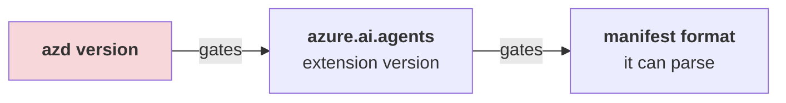

# 🔧 Troubleshooting

> Every entry below is a **real failure encountered while verifying this guide**, with the
> real error text and the fix that worked.

**Before anything else:**

```bash
azd ai agent doctor
```

It checks local config, authentication *and* remote state, and usually names the exact
variable or role that is missing.

---

## 1. Version skew — the one that bites everyone

### Symptom

```text
ERROR: downloading agent.yaml: YAML content does not conform to AgentManifest format:
must contain 'template' field
```

### Why it happens

Nothing is wrong with your YAML. There is a three-link chain, and the *first* link is the
real constraint:



Today's samples ship the **unified `azure.yaml`** format. Extension `0.1.x` only understood the
**legacy AgentManifest**, so it tries to read the new file as the old format and complains
about the missing `template:` field.

The trap: `azd extension upgrade azure.ai.agents` appears to succeed, but prints

```text
WARNING: 1.0.0-beta.9 is incompatible with azd 1.25.6 (requires ">=1.27.1"),
installing 0.1.41-preview instead
```

It **silently downgrades** rather than failing. You now have a "latest" extension that still
cannot parse the file.

### Fix

Upgrade **`azd` first**, then the extension:

```bash
brew update && brew upgrade azd      # ← brew update is required; a stale tap capped at 1.26.0
azd version                          # must be >= 1.27.1
azd extension upgrade --all
azd extension list --installed --output json
```

You want:

| Extension | Version |
|---|---|
| `azure.ai.agents` | `1.0.0-beta.9`+ |
| `azure.ai.inspector` | `1.0.0-beta.3`+ |
| `azure.ai.projects` | `1.0.0-beta.5`+ |

> Samples declare their floor in `requiredVersions.extensions` inside `azure.yaml`. If you see
> a parse error, check that block before suspecting your file.

---

## 2. `Model deployment name is not configured`

### Symptom

`azd ai agent run` dies immediately after "Starting agent":

```text
RuntimeError: Model deployment name is not configured.
Set AZURE_AI_MODEL_DEPLOYMENT_NAME or FOUNDRY_MODEL_NAME.
```

### Why

`azure.yaml` declares `value: ${AZURE_AI_MODEL_DEPLOYMENT_NAME}` and `main.py` reads it, but
`azd provision` only writes the JSON blob `AI_PROJECT_DEPLOYMENTS`:

```text
AI_PROJECT_DEPLOYMENTS="[{\"name\":\"gpt-5.4-mini\",\"model\":{…}}]"
```

The plain variable is never populated. This is a genuine gap in the current preview, not a
mistake on your side.

Current `doctor` detects the omission under `manual env vars set` and names
`AZURE_AI_MODEL_DEPLOYMENT_NAME`. Older extension rows left that check green, so the runtime
error remains worth recognizing.

### Fix

```bash
azd env set AZURE_AI_MODEL_DEPLOYMENT_NAME gpt-5.4-mini
```

Use the `deployments[].name` value from your `azure.yaml`.

---

## 3. The alarming `169.254.169.254` traceback (harmless)

### Symptom

Right after the agent starts locally, a large OpenTelemetry span dumps to the console:

```text
"status_code": "ERROR",
"description": "ConnectTimeout: HTTPConnectionPool(host='169.254.169.254', port=80):
Max retries exceeded with url: /metadata/instance/compute…"
```

### Why

`169.254.169.254` is the **Azure Instance Metadata Service**. `DefaultAzureCredential` probes
it to see whether a managed identity is available. On your laptop there isn't one, so it times
out (200 ms) and falls back to your `az login` credential.

### Fix

**None needed.** The agent works. Confirm with:

```bash
azd ai agent invoke --local "hi"
```

It only matters if you *also* see auth failures — then run `az login`.

---

## 4. `curl http://localhost:8088/` returns 404

Expected. There is no root route. The agent exposes protocol-specific paths (Responses API).
Use `azd ai agent invoke --local`, or the Agent Inspector.

---

## 5. The agent dies when backgrounded

### Symptom

`azd ai agent run &` seems fine, then the process vanishes and `invoke --local` gets connection
refused.

### Why

The process is SIGHUP'd when the parent shell exits. `&` and `nohup` in a throwaway shell are
not enough.

### Fix

Run it in a **dedicated foreground terminal**, a `tmux`/`screen` session, or VS Code's
integrated terminal. Wait for the readiness line:

```text
Running on http://0.0.0.0:8088 (CTRL + C to quit)
```

`Starting agent on http://localhost:8088` is **not** ready yet — invoking then will fail.

---

## 6. `azd ai agent list` → unknown command

```text
ERROR: unknown command "list" for "agent"
```

There is no `list`. Use:

```bash
azd ai agent show                  # current project's agent
azd ai agent show --output json    # full definition
```

…or the portal for a cross-project view.

---

## 7. `eval generate` refuses to run

```text
ERROR: one of --gen-instruction, --gen-instruction-file, --config, or both --dataset
and --evaluators is required when generating eval assets for a hosted agent
```

Generation needs to know *what to test*. Simplest form:

```bash
azd ai agent eval generate --no-prompt \
  --gen-instruction "Generate 5 short factual questions a new developer would ask."
```

> ⏱️ It may be running after the local command stops waiting. One measured run completed in
> **8m51s**. On 2026-08-16, evaluator generation finished in 32 seconds but dataset generation
> hit the CLI's **11m16s** polling limit; the command said the server job was still running and
> exited successfully. Running `azd ai agent eval run` resumed that job for another **1m20s**
> and then started the evaluation. Preserve `eval.yaml` and the generated state. Use
> `--no-wait` when you intentionally do not want to poll.

---

## 7b. `failed to read eval config ".../src/<agent>/eval.yaml"`

```text
ERROR: failed to read eval config "/…/src/hello-world/eval.yaml":
  open /…/src/hello-world/eval.yaml: no such file or directory
```

✅ **Verified 2026-08-09.** `azd ai agent eval` resolves every path against the service's
`project:` directory in `azure.yaml` — **not** your cwd and **not** the repo root. `eval.yaml`,
`datasets/`, `evaluators/` and `.agent_configs/` all belong under `src/<agent>/`.

> [!CAUTION]
> **`--config` does not fix this.** A *relative* `--config` is resolved against the same
> project directory, so `--config eval.yaml` fails identically. An absolute path gets past
> config-reading, but `local_uri` still resolves against the project directory — it only moves
> the failure one step later.

The CLI prints its own resolution before failing. Read these lines rather than guessing:

```text
(✓) Project:        /…/src/hello-world (azure.yaml service "hello-world" project path)
    Eval config:    /…/src/hello-world/eval.yaml
```

---

## 7c. `The evaluator <name> was not found` (404)

```text
RESPONSE 404: UserError
"message": "The evaluator smoke-core was not found"
"messageFormat": "The evaluator {id} was not found"
```

✅ **Verified 2026-08-09.** You are using an `eval.yaml` that was generated for a *different*
project. **`eval.yaml` is not portable.**

`local_uri` is a **download cache, not an upload source** — `eval run` never registers local
files. The dataset and evaluator must exist as registered assets *in the project you are
evaluating against*, and `eval generate` is what creates them.

**Fix:** run `azd ai agent eval generate` in the target project. Copying the YAML is not
enough.

---

## 7d. `AzureDeveloperCLICredential: signal: killed`

```text
ERROR: failed to get auth token: AzureDeveloperCLICredential: signal: killed.
```

✅ **Observed repeatedly 2026-08-09** across `invoke`, `eval generate`, `eval run` and
`eval show`. It is a **transient token-acquisition failure**, not a configuration problem — the
subprocess that fetches the token is killed before it returns.

✅ **Also seen inside `azd ai agent doctor` on 2026-08-12**, where it is more dangerous because
it does not surface as an error:

```text
   (-) Hosted agents are active -- skipped (1 agent probe(s) did not complete: probe failed:
       HTTP request failed: AzureDeveloperCLICredential: signal: killed. …)

10 passed, 0 failed, 3 skipped
```

The probe failure is counted as a **skip**, not a failure, so `doctor` still exits `0` and the
summary line looks merely incomplete rather than wrong. It hit two of three consecutive runs
against an agent that `azd ai agent show` reported as `Status active`. If you see
`10 passed, 0 failed, 3 skipped` where you expected `11 passed, 0 failed, 2 skipped`, re-run
before investigating.

**Fix:** re-run the command. It cleared on retry every time. If it repeats, prime the cache
first:

```bash
azd auth token -o json > /dev/null && azd ai agent eval run --no-prompt
```

Do not start editing `azure.yaml` or re-provisioning over this error — nothing is wrong with
your project.

---

## 8. `--agent-name` seems to be ignored

When `-m` points at a sample's **unified `azure.yaml`**, that file is adopted *verbatim*, so the
service and folder keep the sample's name. `--agent-name` only takes effect when initialising
from an **agent manifest** or from `--src`.

### Fix

Edit `name:` in `azure.yaml` (both the service key and the service's `name:` field) before your
first `azd deploy`. That value is the Foundry agent identity.

---

## 9. Deploying created a new **version**, not a new agent

By design. Foundry agents are unique **by name within a project**:

```json
{ "id": "my-agent:1", "version": "1" }
```

Redeploying the same `name:` produces `:2`. To get a separate agent, change `name:` in
`azure.yaml`.

---

## 10. Wrong Python locally

You do **not** need Python 3.13/3.14. `azd ai agent run` fetches its own interpreter via `uv`:

```text
Using CPython 3.14.3
Creating virtual environment at: .venv
```

A local 3.12 is fine.

### Related: the hosted runtime is a different Python from the local one

The interpreter `uv` fetches for `azd ai agent run` is **not** the one your deployed agent runs
on. Verified 2026-08-12: the local venv reported `Using CPython 3.14.3` while the same code,
once deployed, reported a 3.13 runtime:

```bash
azd ai agent show --output json | jq -r '.definition.code_configuration.runtime'
```

```text
python_3_13
```

So "works locally" does not prove "works hosted" — 3.14-only syntax, or a dependency with no
3.13 wheel, fails only after `azd deploy`. This is a reason to deploy early
([Lab 03](../tutorial/03-deploy.md)) rather than polishing locally first.

### Related: two virtual environments

azd creates `.venv` **inside `src/<project>/`**, next to `requirements.txt`. If you create one
at the repo root, azd ignores it and builds a second — you then edit deps in one and run the
other. Keep the venv where azd puts it.

---

## 11. Provisioning fails on capacity / quota

The samples request `gpt-5.4-mini`, `GlobalStandard`, capacity `10`. If your region is full:

```bash
azd env set AZURE_AI_DEPLOYMENTS_LOCATION swedencentral   # models elsewhere…
# …while AZURE_LOCATION keeps the project near you
```

Or lower `deployments[].sku.capacity` in `azure.yaml`.

Check what you actually have:

```bash
az cognitiveservices usage list -l eastus2 -o table
```

---

## 12. `azd down` then re-provision fails on a name conflict

Cognitive Services accounts are **soft-deleted** (48 h) and hold their name. Always:

```bash
azd down --force --purge
```

To clean up a stuck one:

```bash
az cognitiveservices account list-deleted -o table
az cognitiveservices account purge -n <name> -g <rg> -l <location>
```

---

## 13. VS Code extension not found

The Marketplace ID is:

```text
ms-windows-ai-studio.windows-ai-studio
```

The official *Use Copilot tools* docs page links `itemName=ms-ai.vscode-ai-toolkit`, which
**404s**. That ID does not exist.

Also: the extension requires the **.NET Runtime** and installs it on first activation — a cold
start can take a couple of minutes before any view appears.

---

## 14. "GitHub Models" is missing from the docs' free tier

Several official pages still present **GitHub Models** as the no-Azure on-ramp. It was
**retired** (Foundry Toolkit v1.6.7) and removed from the Model Catalog, playground, model
comparison, Prompt Builder and evaluations.

### Today's no-Azure options

| Option | Notes |
|---|---|
| **Foundry Local** | Microsoft's local inference runtime |
| **Ollama** | via the extension's local provider |
| **ONNX** | local, CPU/GPU |
| Custom endpoint | `windowsaistudio.remoteInfereneEndpoints` — note the product's own typo, *Inferene* |

---

## 15. Wrong port — 8087 vs 8088

This is the single most confusing thing in the local loop, because **one command opens both
ports**. `azd ai agent run` starts *two* listeners:

| Port | What listens there | Flag | You do this with it |
|---|---|---|---|
| **8088** | The **agent server** — your actual HTTP endpoint | `--port` | `curl`, `azd ai agent invoke` |
| **8087** | The **Agent Inspector UI** — a browser chat/trace surface | `--inspector-port` | open in a browser |

So `8087` vs `8088` is **not** "VS Code vs azd". Both are azd. The mistake is invoking the
Inspector UI port with `curl` (it serves the UI, not your agent) or opening the agent port in
a browser (it has no UI, so you get a 404 — see [§4](#4-curl-httplocalhost8088-returns-404)).

The **VS Code AI Toolkit** track is a separate implementation with its own ports —
`debugpy` on **5679** for the `"type": "aitk"` launch task. Do not mix the two in one project.

```bash
azd ai agent run --port 9000 --inspector-port 9001   # both are movable
```

If the Inspector shows nothing, you are almost certainly pointed at the other port.

---

## 16. 🔴 Empty response, and `invoke` exits **0**

```text
Session:      24b123a0…  (assigned by server)
Trace ID:     30f2707e12f8bc3d4555543be7c540f3
Server responded in 9.010s (first byte: 8.294s)
```

Notice what is **missing**: there is no `[agent-name] …` line. ✅ Verified 2026-08-09.

> [!CAUTION]
> **This is the most dangerous failure mode in the toolkit.** A hosted agent that throws during
> tool initialisation still returns **HTTP 200 with an empty body**, so
> `azd ai agent invoke` prints timings and **exits 0**. A CI job checking `$?` records a pass.

**An empty agent line is a failure.** Always confirm with:

```bash
azd ai agent monitor <agent-name>
```

In our run the underlying error was only visible there:

```text
agent_framework.exceptions.ToolExecutionException: ('Failed to enter context manager.', McpError(
  'tools/list failed for 1 tool source(s), succeeded for 0 tool source(s)'))
```

> [!TIP]
> In CI, assert on **output content**, not the exit code:
> ```bash
> OUT=$(azd ai agent invoke my-agent "ping")
> echo "$OUT" | grep -q "^\[my-agent\]" || { echo "agent produced no output"; exit 1; }
> ```

---

## 17. 🔴 `${VAR}` in `azure.yaml` silently becomes an empty string

```text
POST …/toolboxes//mcp?api-version=v1   →   HTTP 405 Method Not Allowed
                   ↑↑ empty name
```

✅ Verified 2026-08-09. `azure.yaml` declared:

```yaml
environmentVariables:
  - name: TOOLBOX_NAME
    value: ${TOOLBOX_NAME}
```

`TOOLBOX_NAME` was never set in the azd environment. **azd substituted an empty string and
warned about nothing.** `provision` and `deploy` both succeeded.

### Fix

```bash
azd env get-values          # confirm every ${VAR} in azure.yaml has a value
azd env set TOOLBOX_NAME a2a-delegation-tools
azd deploy
```

> [!TIP]
> Check the sample's `.env.example` — for third-party samples it is often the only place the
> expected value is written down.

Audit your own manifest before deploying:

```bash
grep -o '\${[A-Za-z_][A-Za-z0-9_]*}' azure.yaml | tr -d '${}' | sort -u | \
  while read v; do azd env get-value "$v" >/dev/null 2>&1 || echo "UNSET: $v"; done
```

---

## 18. `unknown command "logs"`

```text
ERROR: unknown command "logs" for "agent"
```

The command is **`monitor`**:

```bash
azd ai agent monitor <agent-name>
```

---

## 19. `setup-a2a.sh` — `FOUNDRY_PROJECT_ENDPOINT is not set`

```text
Error: FOUNDRY_PROJECT_ENDPOINT is not set (expected in .../scripts/../.env).
```

✅ Verified 2026-08-09. The upstream script reads `../.env`, but `azd` writes environment values
to `.azure/<env-name>/.env`. The file the script wants does not exist.

### Fix

```bash
FOUNDRY_PROJECT_ENDPOINT=$(azd env get-value FOUNDRY_PROJECT_ENDPOINT) ./setup-a2a.sh
```

> [!WARNING]
> Do **not** use `azd env get-value AZURE_AI_PROJECT_ENDPOINT` — that key does not exist. The
> correct name is `FOUNDRY_PROJECT_ENDPOINT`, and `get-value` on a missing key prints an error
> *to stdout*, which then gets embedded into your URL and produces
> `curl: (3) URL rejected: Malformed input to a URL function`.

---

## 20. `CONNECTION_FAILED … is missing 'Audience'/'TokenAudience'`

```text
{"code":"CONNECTION_FAILED","message":"Connection response for UserIdentity connection
 '…/connections/math-expert-a2a' is missing 'Audience'/'TokenAudience'.
  Token exchange cannot proceed without an audience."}
```

✅ Verified 2026-08-09. `azd provision` **drops the `audience` field** when creating a
`RemoteA2A` connection, even though `azure.yaml` declares it. The created connection's metadata
contains only `AgentCardPath`.

> [!WARNING]
> **No working fix known.** Setting `Audience`/`TokenAudience` in `metadata` at account scope,
> at project scope, and as a top-level `audience` property all persisted successfully and none
> changed the runtime error, including after a redeploy. Full detail:
> [Lab 09](../tutorial/09-multi-agent-a2a.md#-where-this-stops--and-why-we-are-telling-you).

---

## 21. Agent365 and A365 messages in hosted logs

Two current hosted runtimes mention Agent365 even though these samples are ordinary Foundry
hosted agents. The messages alone do not establish that either the application or the tenant
is configured for Agent365:

| Log text | What the measured run established | Action |
|---|---|---|
| **Python:** `Failed to set up A365 OpenAI Agents instrumentation` followed by `ModuleNotFoundError: No module named 'agents'` | The optional OpenAI Agents instrumentation could not load because this Agent Framework sample does not install that package. The next line was `Tracing configured successfully`; managed identity succeeded and the request returned HTTP 200. | Ignore it unless the agent request or the tracing setup itself fails. It does not mean you must enable Agent365 for this sample. |
| **C#:** `Agent365Exporter: Unhandled export exception` / duplicate `gen_ai.conversation.id` | The exception occurs after a correct HTTP 200 while the exporter builds a span, before sending anything. It reproduced on every measured **tool-backed** request. A fresh no-tool request and a 40-second late log check produced no exception. | Do not retry or change tenant permissions for a response that already succeeded. Treat it as lost telemetry for that span and judge the request separately. |

Neither message is evidence of a missing Agent365 license or tenant configuration. The first
is an optional Python instrumentor import; the second is a C# exporter defect whose currently
measured scope is tool-backed responses.

---

## 22. Interactive init loses its environment under `AZD_CONFIG_DIR`

### Symptom

Interactive `azd ai agent init` accepts all five answers and prints its `Next:` block, but
`azd env get-values` using the same custom `AZD_CONFIG_DIR` cannot find the environment
afterward.

### Scope

✅ Reproduced 2026-08-16 with `azd` 1.31.1. The same standalone-terminal flow using the normal
config persisted all 11 expected values. A no-prompt scaffold under the isolated config also
persisted its initial environment, so the measured regression is the combination of
**interactive init + custom `AZD_CONFIG_DIR`**, not interactive init generally.

### Fix

Do not trust the final `Next:` block as proof of persistence. Before provisioning, run:

```bash
azd env get-values
```

If the environment is missing, the safest recovery is to rerun `init` in a new empty
directory without the custom config. If isolation is required, recreate the no-prompt
scaffold and set the values collected by the interactive flow manually before spending
anything.

---

## 23. Public GitHub sample fetch fails with SAML SSO

```text
ERROR: parsing GitHub URL: rpc error: code = Unknown desc = The GitHub organization that
owns this repository requires SAML SSO authorization for your token before it can be used.
```

✅ Reproduced 2026-08-16 before scaffolding. `azd` reused the active `gh` token while resolving
a manifest in a **public** repository; that token was not SAML-authorized for the owning
organization. Anonymous Git access to the same repository succeeded.

Authorize the token if that is appropriate for your account. The verified fallback is to
clone the public repository anonymously, then pass the checked-out local `azure.yaml` path to
`azd ai agent init -m`. The CLI's own suggestion — *verify the URL points to a file* — is
misleading in this case; the URL was valid.

---

## 24. Collecting diagnostics

```bash
azd version
azd extension list --installed --output json
azd ai agent doctor
azd ai agent monitor            # live logs from the deployed agent
azd ai agent show --output json
azd provision --debug           # verbose ARM output
```

Report bugs at <https://github.com/microsoft/foundry-toolkit/issues>. Search first; many known
issues are already tracked there.
