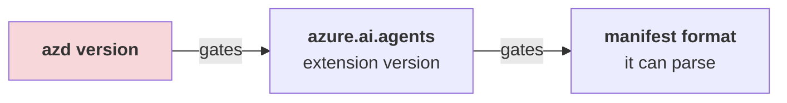

# 🔧 Troubleshooting

> Every entry below is a **real failure encountered while verifying this guide**, with the
> real error text and the fix that worked.

**Before anything else:**

```bash
azd ai agent doctor
```

It checks local config, authentication *and* remote state, and usually names the exact
variable or role that is missing.

---

## 1. Version skew — the one that bites everyone

### Symptom

```text
ERROR: downloading agent.yaml: YAML content does not conform to AgentManifest format:
must contain 'template' field
```

### Why it happens

Nothing is wrong with your YAML. There is a three-link chain, and the *first* link is the
real constraint:



Today's samples ship the **unified `azure.yaml`** format. Extension `0.1.x` only understood the
**legacy AgentManifest**, so it tries to read the new file as the old format and complains
about the missing `template:` field.

The trap: `azd extension upgrade azure.ai.agents` appears to succeed, but prints

```text
WARNING: 1.0.0-beta.9 is incompatible with azd 1.25.6 (requires ">=1.27.1"),
installing 0.1.41-preview instead
```

It **silently downgrades** rather than failing. You now have a "latest" extension that still
cannot parse the file.

### Fix

Upgrade **`azd` first**, then the extension:

```bash
brew update && brew upgrade azd      # ← brew update is required; a stale tap capped at 1.26.0
azd version                          # must be >= 1.27.1
azd extension upgrade --all
azd extension list --installed --output json
```

You want:

| Extension | Version |
|---|---|
| `azure.ai.agents` | `1.0.0-beta.9`+ |
| `azure.ai.inspector` | `1.0.0-beta.3`+ |
| `azure.ai.projects` | `1.0.0-beta.5`+ |

> Samples declare their floor in `requiredVersions.extensions` inside `azure.yaml`. If you see
> a parse error, check that block before suspecting your file.

---

## 2. `Model deployment name is not configured`

### Symptom

`azd ai agent run` dies immediately after "Starting agent":

```text
RuntimeError: Model deployment name is not configured.
Set AZURE_AI_MODEL_DEPLOYMENT_NAME or FOUNDRY_MODEL_NAME.
```

### Why

`azure.yaml` declares `value: ${AZURE_AI_MODEL_DEPLOYMENT_NAME}` and `main.py` reads it, but
`azd provision` only writes the JSON blob `AI_PROJECT_DEPLOYMENTS`:

```text
AI_PROJECT_DEPLOYMENTS="[{\"name\":\"gpt-5.4-mini\",\"model\":{…}}]"
```

The plain variable is never populated. This is a genuine gap in the current preview, not a
mistake on your side.

### Fix

```bash
azd env set AZURE_AI_MODEL_DEPLOYMENT_NAME gpt-5.4-mini
```

Use the `deployments[].name` value from your `azure.yaml`.

---

## 3. The alarming `169.254.169.254` traceback (harmless)

### Symptom

Right after the agent starts locally, a large OpenTelemetry span dumps to the console:

```text
"status_code": "ERROR",
"description": "ConnectTimeout: HTTPConnectionPool(host='169.254.169.254', port=80):
Max retries exceeded with url: /metadata/instance/compute…"
```

### Why

`169.254.169.254` is the **Azure Instance Metadata Service**. `DefaultAzureCredential` probes
it to see whether a managed identity is available. On your laptop there isn't one, so it times
out (200 ms) and falls back to your `az login` credential.

### Fix

**None needed.** The agent works. Confirm with:

```bash
azd ai agent invoke --local "hi"
```

It only matters if you *also* see auth failures — then run `az login`.

---

## 4. `curl http://localhost:8088/` returns 404

Expected. There is no root route. The agent exposes protocol-specific paths (Responses API).
Use `azd ai agent invoke --local`, or the Agent Inspector.

---

## 5. The agent dies when backgrounded

### Symptom

`azd ai agent run &` seems fine, then the process vanishes and `invoke --local` gets connection
refused.

### Why

The process is SIGHUP'd when the parent shell exits. `&` and `nohup` in a throwaway shell are
not enough.

### Fix

Run it in a **dedicated foreground terminal**, a `tmux`/`screen` session, or VS Code's
integrated terminal. Wait for the readiness line:

```text
Running on http://0.0.0.0:8088 (CTRL + C to quit)
```

`Starting agent on http://localhost:8088` is **not** ready yet — invoking then will fail.

---

## 6. `azd ai agent list` → unknown command

```text
ERROR: unknown command "list" for "agent"
```

There is no `list`. Use:

```bash
azd ai agent show                  # current project's agent
azd ai agent show --output json    # full definition
```

…or the portal for a cross-project view.

---

## 7. `eval generate` refuses to run

```text
ERROR: one of --gen-instruction, --gen-instruction-file, --config, or both --dataset
and --evaluators is required when generating eval assets for a hosted agent
```

Generation needs to know *what to test*. Simplest form:

```bash
azd ai agent eval generate --no-prompt \
  --gen-instruction "Generate 5 short factual questions a new developer would ask."
```

---

## 8. `--agent-name` seems to be ignored

When `-m` points at a sample's **unified `azure.yaml`**, that file is adopted *verbatim*, so the
service and folder keep the sample's name. `--agent-name` only takes effect when initialising
from an **agent manifest** or from `--src`.

### Fix

Edit `name:` in `azure.yaml` (both the service key and the service's `name:` field) before your
first `azd deploy`. That value is the Foundry agent identity.

---

## 9. Deploying created a new **version**, not a new agent

By design. Foundry agents are unique **by name within a project**:

```json
{ "id": "my-agent:1", "version": "1" }
```

Redeploying the same `name:` produces `:2`. To get a separate agent, change `name:` in
`azure.yaml`.

---

## 10. Wrong Python locally

You do **not** need Python 3.13/3.14. `azd ai agent run` fetches its own interpreter via `uv`:

```text
Using CPython 3.14.3
Creating virtual environment at: .venv
```

A local 3.12 is fine.

### Related: two virtual environments

azd creates `.venv` **inside `src/<project>/`**, next to `requirements.txt`. If you create one
at the repo root, azd ignores it and builds a second — you then edit deps in one and run the
other. Keep the venv where azd puts it.

---

## 11. Provisioning fails on capacity / quota

The samples request `gpt-5.4-mini`, `GlobalStandard`, capacity `10`. If your region is full:

```bash
azd env set AZURE_AI_DEPLOYMENTS_LOCATION swedencentral   # models elsewhere…
# …while AZURE_LOCATION keeps the project near you
```

Or lower `deployments[].sku.capacity` in `azure.yaml`.

Check what you actually have:

```bash
az cognitiveservices usage list -l eastus2 -o table
```

---

## 12. `azd down` then re-provision fails on a name conflict

Cognitive Services accounts are **soft-deleted** (48 h) and hold their name. Always:

```bash
azd down --force --purge
```

To clean up a stuck one:

```bash
az cognitiveservices account list-deleted -o table
az cognitiveservices account purge -n <name> -g <rg> -l <location>
```

---

## 13. VS Code extension not found

The Marketplace ID is:

```text
ms-windows-ai-studio.windows-ai-studio
```

The official *Use Copilot tools* docs page links `itemName=ms-ai.vscode-ai-toolkit`, which
**404s**. That ID does not exist.

Also: the extension requires the **.NET Runtime** and installs it on first activation — a cold
start can take a couple of minutes before any view appears.

---

## 14. "GitHub Models" is missing from the docs' free tier

Several official pages still present **GitHub Models** as the no-Azure on-ramp. It was
**retired** (Foundry Toolkit v1.6.7) and removed from the Model Catalog, playground, model
comparison, Prompt Builder and evaluations.

### Today's no-Azure options

| Option | Notes |
|---|---|
| **Foundry Local** | Microsoft's local inference runtime |
| **Ollama** | via the extension's local provider |
| **ONNX** | local, CPU/GPU |
| Custom endpoint | `windowsaistudio.remoteInfereneEndpoints` — note the product's own typo, *Inferene* |

---

## 15. Wrong port — 8087 vs 8088

This is the single most confusing thing in the local loop, because **one command opens both
ports**. `azd ai agent run` starts *two* listeners:

| Port | What listens there | Flag | You do this with it |
|---|---|---|---|
| **8088** | The **agent server** — your actual HTTP endpoint | `--port` | `curl`, `azd ai agent invoke` |
| **8087** | The **Agent Inspector UI** — a browser chat/trace surface | `--inspector-port` | open in a browser |

So `8087` vs `8088` is **not** "VS Code vs azd". Both are azd. The mistake is invoking the
Inspector UI port with `curl` (it serves the UI, not your agent) or opening the agent port in
a browser (it has no UI, so you get a 404 — see [§4](#4-curl-httplocalhost8088-returns-404)).

The **VS Code AI Toolkit** track is a separate implementation with its own ports —
`debugpy` on **5679** for the `"type": "aitk"` launch task. Do not mix the two in one project.

```bash
azd ai agent run --port 9000 --inspector-port 9001   # both are movable
```

If the Inspector shows nothing, you are almost certainly pointed at the other port.

---

## 16. Collecting diagnostics

```bash
azd version
azd extension list --installed --output json
azd ai agent doctor
azd ai agent monitor            # live logs from the deployed agent
azd ai agent show --output json
azd provision --debug           # verbose ARM output
```

Report bugs at <https://github.com/microsoft/foundry-toolkit/issues> (~93 open at the time of
writing — search first; many known issues are already tracked there).
