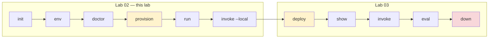

# 🧪 Lab 02 — Run your first agent locally

> ⏱️ **30 min** · 📋 **Requires:** [Lab 01](01-setup.md) · 💰 **~$0.02** · ☁️ **Creates 2 Azure resources**

Scaffold a hosted-agent sample, provision a Foundry project, and talk to the agent on your laptop.

## What you'll learn

- Pick a verified sample from the CLI catalog.
- Initialize a project from a unified `azure.yaml`.
- Set the environment values `azd provision` does not set for you.
- Check the project with `doctor` *before* creating anything billable.
- Run the local agent server and invoke it through `azd`.



<sub>🟡 costs money · 🔴 destroys everything</sub>

> Every verified command and output block in this lab came from a real Azure run on
> 2026-08-08 with `azd 1.30.0` / `azure.ai.agents 1.0.0-beta.9`.

## Steps

### 1. Pick a sample

The CLI ships a curated catalog — **21 Python** and **13 C#** samples today.

```bash
azd ai agent sample list --language python
azd ai agent sample list --language dotnetCsharp
```

Each sample prints as three lines. The entry this lab uses — note it is **not** the first one
listed:

<details open>
<summary>✅ Verified output — captured 2026-08-12, 1 of 21 entries</summary>

```text
Sample: Basic agent (Responses, Agent Framework, Python)
Description: A basic Agent Framework agent hosted by Foundry using the Responses protocol.
Manifest: https://github.com/microsoft-foundry/foundry-samples/blob/main/samples/python/hosted-agents/agent-framework/responses/01-basic/azure.yaml
```
</details>

> [!WARNING]
> **Two different samples are called `01-basic`.** They differ only by protocol:
>
> | Title | Path | |
> |---|---|---|
> | Basic agent (**Responses**, Agent Framework, Python) | `agent-framework/responses/01-basic` | ✅ this lab |
> | Basic agent (**Invocations**, Agent Framework, Python) | `agent-framework/invocations/01-basic` | ❌ different wire protocol |
>
> Match on the whole `Manifest:` URL, never on `01-basic` alone. Pick the invocations variant
> and every output below will differ.

> [!TIP]
> `--language` takes the *short* form (`python`, `dotnetCsharp`).
> `--runtime` elsewhere takes the *full* token (`python_3_13`). They are not interchangeable —
> a bare `python` will fail as a runtime.

Machine-readable form, which is how you get the `manifestUrl` to feed into `init`:

```bash
azd ai agent sample list --language python --output json
```

`-o, --output` accepts **only `json` and `text`**, and defaults to `text` — the form above.
One entry of the 21, verbatim:

```json
{
  "title": "Basic agent (Responses, Agent Framework, Python)",
  "description": "A basic Agent Framework agent hosted by Foundry using the Responses protocol.",
  "languages": [
    "python"
  ],
  "type": "azure.yaml",
  "manifestUrl": "https://github.com/microsoft-foundry/foundry-samples/blob/main/samples/python/hosted-agents/agent-framework/responses/01-basic/azure.yaml",
  "tags": [
    "example",
    "Responses Protocol",
    "featured",
    "recommended"
  ],
  "featured": true,
  "recommended": true,
  "initCommand": "azd ai agent init -m \"https://github.com/microsoft-foundry/foundry-samples/blob/main/samples/python/hosted-agents/agent-framework/responses/01-basic/azure.yaml\""
}
```

The JSON carries two fields the text form does not: **`recommended`**, which is how you tell
the starting sample from the rest, and **`initCommand`**, a ready-to-paste command.

Full catalog: [sample-catalog.md](../reference/sample-catalog.md).

### 2. `init` — scaffold

```bash
mkdir my-agent && cd my-agent

azd ai agent init --no-prompt \
  -m "https://github.com/microsoft-foundry/foundry-samples/blob/main/samples/python/hosted-agents/agent-framework/responses/01-basic/azure.yaml" \
  --deploy-mode code \
  --runtime python_3_13 \
  --entry-point main.py
```

<details open>
<summary>✅ Verified output</summary>

```text
Downloading sample from GitHub...
  AGENTS.md
  CLAUDE.md
  README.md
  azure.yaml
  src/agent-framework-agent-basic-responses/.azdignore
  src/agent-framework-agent-basic-responses/.dockerignore
  src/agent-framework-agent-basic-responses/.env.example
  src/agent-framework-agent-basic-responses/Dockerfile
  src/agent-framework-agent-basic-responses/main.py
  src/agent-framework-agent-basic-responses/requirements.txt
Adopting the sample's azure.yaml as your project manifest...

Initializing an app to run on Azure (azd init)
  (✓) Done: Initialized git repository
  (✓) Done: Copying template code from local path to: …/agent-framework-agent-basic-responses

Installing required extensions...
  (-) Skipped: Installing azure.ai.agents extension (version 1.0.0-beta.9 already installed)
Missing Azure environment values: AZURE_SUBSCRIPTION_ID, AZURE_LOCATION. Continuing because --no-prompt was specified.

Adopted the sample's azure.yaml as the project manifest at azure.yaml.
```
</details>

**What you get:**

```text
my-agent/
└── agent-framework-agent-basic-responses/   ← init makes its own folder here
    ├── azure.yaml                ← the contract; read this first
    ├── AGENTS.md  CLAUDE.md  README.md
    ├── .gitignore
    ├── .git/                     ← init runs `git init` here, not in my-agent/
    ├── .azure/                   ← azd environment state (gitignored)
    └── src/agent-framework-agent-basic-responses/
        ├── main.py
        ├── requirements.txt
        ├── Dockerfile            ← only used in container mode
        ├── .env.example
        ├── .azdignore  .dockerignore
        └── .venv/                ← created later by `run`
```

> [!IMPORTANT]
> **`init` nests a second folder named after the sample — `cd` into it before anything else.**
> Creating `my-agent/` and running `init` inside it does *not* put `azure.yaml` in `my-agent/`;
> it puts it in `my-agent/agent-framework-agent-basic-responses/`. Every later command
> (`azd env set`, `azd provision`, `azd deploy`) must run from that inner folder, or azd reports
> that no project exists. The `…/agent-framework-agent-basic-responses` path in the `init`
> output above is the copy destination — that is the folder it means.

So the next command is not optional:

```bash
cd agent-framework-agent-basic-responses
```

Confirm you are in the right place before continuing — this must list `azure.yaml`:

```bash
ls azure.yaml
```

> [!NOTE]
> **`--agent-name` does not rename the scaffold.** When `-m` points at a sample's unified
> `azure.yaml`, that file is *adopted verbatim*, so the folder and service keep the sample's
> name. To rename, edit `name:` in `azure.yaml` before deploying — the Foundry agent identity
> comes from there.

#### Two manifest flavours

`init` accepts either. Knowing which you have explains most `init` errors.

| Flavour | Detected by | Behaviour |
|---|---|---|
| **Unified `azure.yaml`** (current) | declares a service with `host: azure.ai.agent` | adopted as your project manifest |
| **Agent manifest** (`agent.manifest.yaml`) | AgentManifest shape, has `template:` | an `azure.yaml` is *generated* from it |

A `must contain 'template' field` error means an **old extension** is trying to read a new
unified manifest as an agent manifest. Fix the version, not the file.

### 3. `env` — point at your subscription

```bash
azd env set AZURE_SUBSCRIPTION_ID <your-subscription-id>
azd env set AZURE_LOCATION eastus2
```

Values land in `.azure/<env-name>/.env`. That file is **gitignored** and is where secrets
belong — never in `azure.yaml`.

### 4. `doctor` — check before you spend money

Everything so far was free. The next command creates billable Azure resources, so confirm the
project is sound first. `--local-only` keeps it offline and fast.

```bash
azd ai agent doctor --local-only
```

<details open>
<summary>✅ Verified output — captured 2026-08-09, before provisioning</summary>

```text
azd ai agent doctor

Local
   (✓) azd extension reachable
   (✓) azure.yaml present and parseable
   (✓) azd environment selected
   (✓) agent service in azure.yaml
   (x) FOUNDRY_PROJECT_ENDPOINT set
       FOUNDRY_PROJECT_ENDPOINT is not set in the current azd environment
       fix: Run `azd provision` to create the Foundry project, or `azd env set
       FOUNDRY_PROJECT_ENDPOINT <https://...>` to point at an existing one.
   (✓) agent definition valid (per service)
   (✓) manual env vars set
   (-) Manifest toolboxes have endpoint env vars set -- skipped (no toolbox resources
       declared in any service's agent.manifest.yaml.)

Authentication
   (-) authentication -- skipped (remote check excluded by --local-only)

Remote
   (-) Foundry project endpoint reachable -- skipped (remote check excluded by --local-only)
   (-) Developer has required role on Foundry project -- skipped (remote check excluded by --local-only)
   (-) Hosted agents are active -- skipped (remote check excluded by --local-only)
   (-) Manifest connections exist on Foundry project -- skipped (remote check excluded by --local-only)

6 passed, 1 failed, 6 skipped

To fix:

  Review the fix: notes above for each failed check.

Then re-run `azd ai agent doctor` to verify.
```
</details>

**This is the expected state here, not a problem.** `FOUNDRY_PROJECT_ENDPOINT` is the *only*
red check, and it cannot be anything else — `azd provision` in the next step is what writes it.
If any check *above* it is red, stop and fix that one first; see
[Lab 01 § 7](01-setup.md#7-verify-everything) for how the cascade works.

<details>
<summary>If instead you see <code>4 passed, 1 failed, 8 skipped</code> — no environment selected</summary>

`init` creates and selects an azd environment for you, so this should not happen. It does if
you deleted `.azure/`, copied the project without it, or are in the wrong folder.

```text
   (x) azd environment selected
       Failed to get current environment: rpc error: code = Unknown desc = default environment not found
       fix: Create one with `azd env new <name>` or select an existing one with `azd env select <name>`.
   (-) FOUNDRY_PROJECT_ENDPOINT set -- skipped (environment check failed or skipped)
   (-) manual env vars set -- skipped (no azd environment selected (cannot resolve agent.yaml variables))

4 passed, 1 failed, 8 skipped

To fix, run these commands in order:

  1. azd env new  -- create or select an azd environment
```

✅ Verified — excerpt. Follow the `fix:` line, then re-run § 3 to set your values again.
</details>

> [!TIP]
> Drop `--local-only` and `doctor` also probes Azure — endpoint reachability, your role
> assignment, and whether hosted agents are running. There is nothing to reach yet, so save it
> for [Lab 03](03-deploy.md#4-doctor--check-local-and-remote-state).

### 5. `provision` — create Azure resources

```bash
azd provision --no-prompt
```

<details open>
<summary>✅ Verified output — 1 min 20 s</summary>

```text
Reading subscription and location from environment...
Subscription: MCAPS-Hybrid-REQ-…
Location: East US 2

Preparing Foundry provisioning template...
Starting ARM deployment "azd-foundry-…"...
Foundry deployment in progress
…
Foundry deployment complete

SUCCESS: Your application was provisioned in Azure in 1 minute 20 seconds.
```
</details>

Exactly two resources appear:

```bash
azd env get-values | grep AZURE_RESOURCE_GROUP
az resource list -g <rg> --query "[].{name:name,type:type}" -o table
```

```text
Name
----------------------
cog-56mzb54ouruu6            ← Microsoft.CognitiveServices/accounts
cog-56mzb54ouruu6/rdpy       ← …/accounts/projects
```

Provision writes the Foundry coordinates back into your environment — `azd env get-values`
printed **24** values after this step. The one that matters:

```bash
azd env get-values | grep FOUNDRY_PROJECT_ENDPOINT
```

```text
FOUNDRY_PROJECT_ENDPOINT="https://cog-56mzb54ouruu6.services.ai.azure.com/api/projects/rdpy"
```

#### 🐛 Gotcha: the model name is *not* set for you

`azure.yaml` declares `AZURE_AI_MODEL_DEPLOYMENT_NAME: ${AZURE_AI_MODEL_DEPLOYMENT_NAME}` and
`main.py` requires it — but `provision` only writes `AI_PROJECT_DEPLOYMENTS` (a JSON blob).
The plain variable is left unset, so the very next step crashes:

```text
RuntimeError: Model deployment name is not configured.
Set AZURE_AI_MODEL_DEPLOYMENT_NAME or FOUNDRY_MODEL_NAME.
```

Set it once, using the deployment name from `azure.yaml`:

```bash
azd env set AZURE_AI_MODEL_DEPLOYMENT_NAME gpt-5.4-mini
```

### 6. `run` — the local loop

```bash
azd ai agent run --no-client
```

<details open>
<summary>✅ Verified output</summary>

```text
Detected python project. Start command: python main.py
Setting up Python environment...
Using CPython 3.14.3
Creating virtual environment at: .venv
Installing dependencies (requirements.txt)...
  ✓ Dependencies installed (requirements.txt)
Starting agent on http://localhost:8088 (Ctrl+C to stop)

INFO azure.ai.agentserver: AgentServerHost starting on 0.0.0.0:8088
INFO azure.ai.agentserver: Platform environment: is_hosted=False, port=8088
INFO azure.ai.agentserver: Connectivity: project_endpoint=https://cog-….services.ai.azure.com
[INFO] Running on http://0.0.0.0:8088 (CTRL + C to quit)
```
</details>

Things worth noticing:

- **azd downloads its own Python** (`CPython 3.14.3` via `uv`). Your system Python is irrelevant.
- The venv is created **inside `src/<project>/`**, next to `requirements.txt` — not at the repo
  root. If you make one somewhere else, azd will quietly build a second one.
- Wait for **`Running on http://0.0.0.0:8088`**. `Starting agent…` is not ready yet.
- `azd ai agent run` opens **two azd-owned ports**: the agent on **8088** (`--port`) and the
  Agent Inspector UI on **8087** (`--inspector-port`). Drop `--no-client` to open Inspector.

> [!WARNING]
> Run this in a **real foreground terminal** (or a proper background job manager).
> Backgrounding it with `&`/`nohup` in a throwaway shell gets it SIGHUP'd and it dies silently.

> [!NOTE]
> **The scary traceback you can ignore.** On a dev machine you will see a large
> OpenTelemetry span with `ConnectTimeout … 169.254.169.254 … /metadata/instance/compute`.
> That is `DefaultAzureCredential` probing for an Azure managed identity that does not exist
> locally. It falls back to your `az login` credential and the agent works fine.

### 7. `invoke --local` — talk to it

In a second terminal:

```bash
azd ai agent invoke --local "In one short sentence, what is Microsoft Foundry?"
```

<details open>
<summary>✅ Verified output — captured 2026-08-12</summary>

```text
Target:       localhost:8088 (local)
Message:      "In one short sentence, what is Microsoft Foundry?"
Session:      a7fd3a20-87ab-4e78-ab64-6a5838792c1d
Conversation: f6f160be-bc2f-4269-92e3-79546c7d02b6

[local] Microsoft Foundry is Microsoft’s platform for building, customizing, and deploying AI applications and agents using foundation models.

Server responded in 9.518s (first byte: 9.517s)
```
</details>

> [!IMPORTANT]
> **Local invoke does not print the same header as remote invoke.** Compare the block above with
> the [remote invoke in Lab 03](03-deploy.md#3-invoke--call-the-deployed-agent) and four fields
> differ:
>
> | | `--local` | remote |
> |---|---|---|
> | First field | `Target:` — host and port | `Agent:` — the agent name |
> | `Session:` | once, a plain UUID | twice: `(new -- server will assign)`, then the server's ID |
> | `Conversation:` | a plain UUID | prefixed `conv_…` |
> | `Trace ID:` | **absent** | present |
> | Reply prefix | literally `[local]` | `[<agent-name>]` |
>
> The prefix is `[local]`, not your agent's name, because the local server never receives one —
> its startup log reads `agent_name=(not set)` even though `azure.yaml` sets `name:`.
> **No `Trace ID` means nothing to paste into the portal**, which is the practical reason to
> deploy before you start debugging traces.

> `curl http://localhost:8088/` returns **404** — that is correct. There is no root route;
> the protocol lives under the Responses API paths. Use `invoke` or the Inspector.

## ✅ Checkpoint

You should now be able to run this in the second terminal and see this:

```bash
azd ai agent invoke --local "In one short sentence, what is Microsoft Foundry?"
```

```text
Target:       localhost:8088 (local)
Message:      "In one short sentence, what is Microsoft Foundry?"
Session:      a7fd3a20-87ab-4e78-ab64-6a5838792c1d
Conversation: f6f160be-bc2f-4269-92e3-79546c7d02b6

[local] Microsoft Foundry is Microsoft’s platform for building, customizing, and deploying AI applications and agents using foundation models.

Server responded in 9.518s (first byte: 9.517s)
```

The IDs, the wording of the answer and the timing will differ. The **field names, their order,
the `[local]` prefix and the absence of a `Trace ID` line** should not.

If you see something else, jump to *If that didn't work* below.

## 🔧 If that didn't work

| Symptom | Cause | Fix |
|---|---|---|
| `RuntimeError: Model deployment name is not configured.` | `azd provision` never sets `AZURE_AI_MODEL_DEPLOYMENT_NAME`. | Run `azd env set AZURE_AI_MODEL_DEPLOYMENT_NAME gpt-5.4-mini`. |
| Large traceback mentioning `169.254.169.254` | `DefaultAzureCredential` probed Azure Instance Metadata Service on your laptop. | Ignore it if the agent continues and invoke works. |
| `invoke --local` cannot connect | The server is not ready or is not running on port 8088. | Wait for `Running on http://0.0.0.0:8088`; check `--port` if you changed it. |
| You looked for `azd ai agent logs` | That command does not exist. | Use `azd ai agent monitor` after deployment. |

Everything else: [troubleshooting](../reference/troubleshooting.md).

## ✏️ Exercise

Before running anything, predict what `azd env get-values | grep AZURE_AI_MODEL_DEPLOYMENT_NAME`
prints before and after you set the model deployment name.

<details>
<summary>Solution</summary>

Before you set it, it prints nothing because `provision` does not write that plain variable.
After this command:

```bash
azd env set AZURE_AI_MODEL_DEPLOYMENT_NAME gpt-5.4-mini
```

it prints:

```text
AZURE_AI_MODEL_DEPLOYMENT_NAME="gpt-5.4-mini"
```
</details>

## → Next

[Lab 03 — Deploy and clean up](03-deploy.md)

---

<sub>[← Setup](01-setup.md) · [🧪 Tutorial index](README.md) · [Deploy →](03-deploy.md)</sub>
