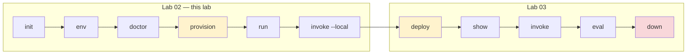

# 🧪 Lab 02 — Run your first agent locally

> ⏱️ **30 min** · 📋 **Requires:** [Lab 01](01-setup.md) · 💰 **~$0.02** · ☁️ **Creates 2 Azure resources**

Scaffold a hosted-agent sample, provision a Foundry project, and talk to the agent on your laptop.

## What you'll learn

- Pick a verified sample from the CLI catalog.
- Initialize a project from a unified `azure.yaml`.
- Set the environment values `azd provision` does not set for you.
- Check the project with `doctor` *before* creating anything billable.
- Run the local agent server and invoke it through `azd`.



<sub>🟡 costs money · 🔴 destroys everything</sub>

> Every verified command and output block in this lab came from a real Azure run on
> 2026-08-08 with `azd 1.30.0` / `azure.ai.agents 1.0.0-beta.9`.

## Steps

### 1. Pick a sample

The CLI ships a curated catalog. The full list and the current counts live in
[sample-catalog.md](../reference/sample-catalog.md) — this page deliberately does not restate
them, because they change without warning.

```bash
azd ai agent sample list --language python
azd ai agent sample list --language dotnetCsharp
```

> [!IMPORTANT]
> **The catalog is served from GitHub and grows without an extension release.** Between
> 2026-08-12 and 2026-08-14 it gained three Python samples while `azure.ai.agents` stayed at
> `1.0.0-beta.9`. So match on the `Manifest:` URL, never on a count or a position. What did
> *not* move across those two runs: six `featured` samples, exactly one `recommended`, and
> this lab's sample 5th in the list.

Each sample prints as three lines. The list is ordered **six `featured` samples first, then the
rest**, each group alphabetical by title — so the entry this lab uses is 5th, not 1st:

<details open>
<summary>✅ Verified output — the entry this lab uses, plus the closing line; entry captured 2026-08-12, closing line re-captured 2026-08-14</summary>

```text
Sample: Basic agent (Responses, Agent Framework, Python)
Description: A basic Agent Framework agent hosted by Foundry using the Responses protocol.
Manifest: https://github.com/microsoft-foundry/foundry-samples/blob/main/samples/python/hosted-agents/agent-framework/responses/01-basic/azure.yaml
```

The last line of the command, after every entry:

```text
Run `azd ai agent sample list --output json` for the machine-readable form (includes ready-to-run initCommand).
```
</details>

> [!WARNING]
> **Two different samples are called `01-basic`.** They differ only by protocol:
>
> | Title | Path | |
> |---|---|---|
> | Basic agent (**Responses**, Agent Framework, Python) | `agent-framework/responses/01-basic` | ✅ this lab |
> | Basic agent (**Invocations**, Agent Framework, Python) | `agent-framework/invocations/01-basic` | ❌ different wire protocol |
>
> Match on the whole `Manifest:` URL, never on `01-basic` alone. Pick the invocations variant
> and every output below will differ. They are printed **adjacent**, 4th and 5th — that held on
> both the 2026-08-12 and 2026-08-14 catalogs. Four more titles — Hello World, Note-taking,
> LangGraph Chat and Foundry Toolbox — also ship in both protocols, so this is the rule, not an
> exception.

> [!NOTE]
> **The text form hides the two fields that tell you which sample to start with.** `featured`
> and `recommended` exist only in the JSON below; exactly one entry carries
> `"recommended": true`, and it is the one this lab uses. Nothing in the text output marks it.

> [!TIP]
> `--language` takes the *short* form (`python`, `dotnetCsharp`).
> `--runtime` elsewhere takes the *full* token (`python_3_13`). They are not interchangeable —
> a bare `python` will fail as a runtime.

Machine-readable form, which is how you get the `manifestUrl` to feed into `init`:

```bash
azd ai agent sample list --language python --output json
```

`-o, --output` accepts **only `json` and `text`**, and defaults to `text` — the form above.
One entry of the 21, verbatim:

```json
{
  "title": "Basic agent (Responses, Agent Framework, Python)",
  "description": "A basic Agent Framework agent hosted by Foundry using the Responses protocol.",
  "languages": [
    "python"
  ],
  "type": "azure.yaml",
  "manifestUrl": "https://github.com/microsoft-foundry/foundry-samples/blob/main/samples/python/hosted-agents/agent-framework/responses/01-basic/azure.yaml",
  "tags": [
    "example",
    "Responses Protocol",
    "featured",
    "recommended"
  ],
  "featured": true,
  "recommended": true,
  "initCommand": "azd ai agent init -m \"https://github.com/microsoft-foundry/foundry-samples/blob/main/samples/python/hosted-agents/agent-framework/responses/01-basic/azure.yaml\""
}
```

The JSON carries two fields the text form does not: **`recommended`**, which is how you tell
the starting sample from the rest, and **`initCommand`**, a ready-to-paste command.

Full catalog: [sample-catalog.md](../reference/sample-catalog.md).

### 2. `init` — scaffold

```bash
mkdir my-agent && cd my-agent

azd ai agent init --no-prompt \
  -m "https://github.com/microsoft-foundry/foundry-samples/blob/main/samples/python/hosted-agents/agent-framework/responses/01-basic/azure.yaml" \
  --deploy-mode code \
  --runtime python_3_13 \
  --entry-point main.py
```

<details open>
<summary>✅ Verified output — captured 2026-08-12; the ASCII banner above <code>v1.0.0-beta.9</code> is omitted</summary>

```text
v1.0.0-beta.9
Visit the docs at https://aka.ms/azd-ai-agent-docs

Downloading sample from GitHub...
  AGENTS.md
  CLAUDE.md
  README.md
  azure.yaml
  src/agent-framework-agent-basic-responses/.azdignore
  src/agent-framework-agent-basic-responses/.dockerignore
  src/agent-framework-agent-basic-responses/.env.example
  src/agent-framework-agent-basic-responses/Dockerfile
  src/agent-framework-agent-basic-responses/main.py
  src/agent-framework-agent-basic-responses/requirements.txt
Adopting the sample's azure.yaml as your project manifest...

Initializing an app to run on Azure (azd init)

  (✓) Done: Initialized git repository
  (✓) Done: Copying template code from local path to: …/my-agent/agent-framework-agent-basic-responses


Installing required extensions...
  (-) Skipped: Installing azure.ai.agents extension (version 1.0.0-beta.9 already installed)
Missing Azure environment values: AZURE_SUBSCRIPTION_ID, AZURE_LOCATION. Continuing because --no-prompt was specified.
Set the missing values before running azd provision or azd deploy:
  azd env set AZURE_SUBSCRIPTION_ID <subscription-id>
  azd env set AZURE_LOCATION <region>
  # Optional: azd env set AZURE_AI_DEPLOYMENTS_LOCATION <region>

Adopted the sample's azure.yaml as the project manifest at azure.yaml.

Next:
  cd agent-framework-agent-basic-responses
  enter your new project folder

  azd env set AZURE_SUBSCRIPTION_ID <value>
  required before provisioning Azure resources

  azd env set AZURE_LOCATION <value>
  required before provisioning Azure resources

  azd provision
  set up your Foundry project, models, and connections

  azd deploy
  when ready to deploy to Azure
```
</details>

> [!NOTE]
> **That `Next:` block only exists on a terminal.** Redirect `init` to a file and it disappears,
> while a handful of progress lines that a terminal overwrites appear instead. The same is true
> of `provision`, `run` and `invoke` later in this lab. If you are capturing output to compare
> against these blocks, capture it through a pty (`script -qec '…' /dev/null`), not `>`.

**What you get:**

```text
my-agent/
└── agent-framework-agent-basic-responses/   ← init makes its own folder here
    ├── azure.yaml                ← the contract; read this first
    ├── AGENTS.md  CLAUDE.md  README.md
    ├── .gitignore
    ├── .git/                     ← init runs `git init` here, not in my-agent/
    ├── .azure/                   ← azd environment state (gitignored)
    └── src/agent-framework-agent-basic-responses/
        ├── main.py
        ├── requirements.txt
        ├── Dockerfile            ← only used in container mode
        ├── .env.example
        ├── .azdignore  .dockerignore
        └── .venv/                ← created later by `run`
```

> [!IMPORTANT]
> **`init` nests a second folder named after the sample — `cd` into it before anything else.**
> Creating `my-agent/` and running `init` inside it does *not* put `azure.yaml` in `my-agent/`;
> it puts it in `my-agent/agent-framework-agent-basic-responses/`. Every later command
> (`azd env set`, `azd provision`, `azd deploy`) must run from that inner folder, or azd reports
> that no project exists. This is not a subtlety the CLI leaves you to discover — the first line
> of its own `Next:` block is that `cd`.

So the next command is not optional:

```bash
cd agent-framework-agent-basic-responses
```

Confirm you are in the right place before continuing — this must list `azure.yaml`:

```bash
ls azure.yaml
```

`init` also creates **and selects** an azd environment, named `<project>-dev`, so you do not
run `azd env new`:

```bash
azd env list
```

```text
NAME                                       DEFAULT   LOCAL     REMOTE
agent-framework-agent-basic-responses-dev  true      true      false
```

> [!NOTE]
> **`--agent-name` does not rename the scaffold.** When `-m` points at a sample's unified
> `azure.yaml`, that file is *adopted verbatim*, so the folder and service keep the sample's
> name. To rename, edit `name:` in `azure.yaml` before deploying — the Foundry agent identity
> comes from there.

#### Two manifest flavours

`init` accepts either. Knowing which you have explains most `init` errors.

| Flavour | Detected by | Behaviour |
|---|---|---|
| **Unified `azure.yaml`** (current) | declares a service with `host: azure.ai.agent` | adopted as your project manifest |
| **Agent manifest** (`agent.manifest.yaml`) | AgentManifest shape, has `template:` | an `azure.yaml` is *generated* from it |

A `must contain 'template' field` error means an **old extension** is trying to read a new
unified manifest as an agent manifest. Fix the version, not the file.

### 3. `env` — point at your subscription

```bash
azd env set AZURE_SUBSCRIPTION_ID "$(az account show --query id -o tsv)"
azd env set AZURE_LOCATION eastus2
```

Command substitution keeps the ID out of your screen and your shell history. Fish users:
`azd env set AZURE_SUBSCRIPTION_ID (az account show --query id -o tsv)`.

Values land in `.azure/<env-name>/.env` — for this project,
`.azure/agent-framework-agent-basic-responses-dev/.env`. azd creates it mode `0600`, and
`.gitignore` line 1 is `.azure`, so it is where secrets belong — never in `azure.yaml`. Confirm
both facts yourself:

```bash
ls -l .azure/*/.env
git check-ignore -v .azure/*/.env
```

`azd env set` also accepts `AZURE_AI_DEPLOYMENTS_LOCATION`, which `init` mentions as optional.
Leave it unset unless model capacity forces you to split the model into another region — see
[Lab 01 § 8](01-setup.md#8-region-and-quota).

### 4. `doctor` — check before you spend money

Everything so far was free. The next command creates billable Azure resources, so confirm the
project is sound first. `--local-only` keeps it offline and fast.

```bash
azd ai agent doctor --local-only
```

<details open>
<summary>✅ Verified output — captured 2026-08-09, before provisioning</summary>

```text
azd ai agent doctor

Local
   (✓) azd extension reachable
   (✓) azure.yaml present and parseable
   (✓) azd environment selected
   (✓) agent service in azure.yaml
   (x) FOUNDRY_PROJECT_ENDPOINT set
       FOUNDRY_PROJECT_ENDPOINT is not set in the current azd environment
       fix: Run `azd provision` to create the Foundry project, or `azd env set FOUNDRY_PROJECT_ENDPOINT <https://...>` to point at an existing one.
   (✓) agent definition valid (per service)
   (✓) manual env vars set
   (-) Manifest toolboxes have endpoint env vars set -- skipped (no toolbox resources declared in any service's agent.manifest.yaml.)

Authentication
   (-) authentication -- skipped (remote check excluded by --local-only)

Remote
   (-) Foundry project endpoint reachable -- skipped (remote check excluded by --local-only)
   (-) Developer has required role on Foundry project -- skipped (remote check excluded by --local-only)
   (-) Hosted agents are active -- skipped (remote check excluded by --local-only)
   (-) Manifest connections exist on Foundry project -- skipped (remote check excluded by --local-only)

6 passed, 1 failed, 6 skipped

To fix:

  Review the fix: notes above for each failed check.

Then re-run `azd ai agent doctor` to verify.
```
</details>

**This is the expected state here, not a problem.** `FOUNDRY_PROJECT_ENDPOINT` is the *only*
red check, and it cannot be anything else — `azd provision` in the next step is what writes it.
If any check *above* it is red, stop and fix that one first; see
[Lab 01 § 7](01-setup.md#7-verify-everything) for how the cascade works.

> [!WARNING]
> **`doctor` does not check the two values § 3 just set.** Verified 2026-08-12: running it
> *before* `azd env set` gives the identical `6 passed, 1 failed, 6 skipped` — `manual env vars
> set` stays green with `AZURE_SUBSCRIPTION_ID` and `AZURE_LOCATION` both unset. A clean
> `doctor` means the *project* is sound, not that `provision` will succeed. That is what the
> `init` output's `Set the missing values before running azd provision` line is for.

<details>
<summary>If instead you see <code>4 passed, 1 failed, 8 skipped</code> — no environment selected</summary>

`init` creates and selects an azd environment for you, so this should not happen. It does if
you deleted `.azure/`, copied the project without it, or are in the wrong folder.

```text
   (x) azd environment selected
       Failed to get current environment: rpc error: code = Unknown desc = default environment not found
       fix: Create one with `azd env new <name>` or select an existing one with `azd env select <name>`.
   (-) FOUNDRY_PROJECT_ENDPOINT set -- skipped (environment check failed or skipped)
   (-) manual env vars set -- skipped (no azd environment selected (cannot resolve agent.yaml variables))

4 passed, 1 failed, 8 skipped

To fix, run these commands in order:

  1. azd env new  -- create or select an azd environment
```

✅ Verified — excerpt. Follow the `fix:` line, then re-run § 3 to set your values again.
</details>

> [!TIP]
> Drop `--local-only` and `doctor` also probes Azure — endpoint reachability, your role
> assignment, and whether hosted agents are running. There is nothing to reach yet, so save it
> for [Lab 03](03-deploy.md#4-doctor--check-local-and-remote-state).

### 5. `provision` — create Azure resources

```bash
azd provision --no-prompt
```

<details open>
<summary>✅ Verified output — 1 min 24 s, captured 2026-08-12</summary>

```text
Provisioning Azure resources (azd provision)
Provisioning Azure resources can take some time.

Subscription: MCAPS-… (<your-subscription-id>)
Location: East US 2


SUCCESS: Your application was provisioned in Azure in 1 minute 24 seconds.
You can view the resources created under the resource group rg-agent-framework-agent-basic-responses-dev-31d0dd95 in Azure Portal:
https://portal.azure.com/#@/resource/subscriptions/<your-subscription-id>/resourceGroups/rg-agent-framework-agent-basic-responses-dev-31d0dd95/overview
```
</details>

> [!CAUTION]
> **Both the `Subscription:` line and that portal URL contain your subscription ID** — the real
> line reads `Subscription: <name> (<guid>)`. Redact them before pasting `provision` output into
> an issue, a screenshot or a chat.

> [!NOTE]
> On a terminal the middle of that run is a spinner: `Reading subscription and location from
> environment…`, `Preparing Foundry provisioning template…`, `Starting ARM deployment "azd-foundry-…"…`
> and a repeating `Foundry deployment in progress` are drawn and overwritten in place, leaving
> only what you see above. Redirect to a file and you get all of them, one per line.

The portal URL is the quickest way to read your resource group name; `azd` also stores it:

```bash
azd env get-values | grep AZURE_RESOURCE_GROUP
az resource list -g <rg> --query "[].{name:name,Type:type}" -o table
```

```text
Name                                                Type
--------------------------------------------------  ---------------------------------------------
cog-iatj4r7bthn5a                                   Microsoft.CognitiveServices/accounts
cog-iatj4r7bthn5a/agent-framework-agent-basic-resp  Microsoft.CognitiveServices/accounts/projects
```

> [!TIP]
> `Type:type` is capitalised on purpose. Lowercase `type` is one of the two keys `-o table`
> silently drops — see [Lab 01 § 4](01-setup.md#4-sign-in).

Three different naming rules are at work here, and knowing which is which saves you from
comparing your output against this page character by character:

| Thing | Rule | This run |
|---|---|---|
| Cognitive Services account | `cog-` + random | `cog-iatj4r7bthn5a` — **yours will differ** |
| Foundry project | your **azd environment** name, cut to 32 characters | `agent-framework-agent-basic-resp` |
| Resource group | `rg-` + your azd environment name | `rg-agent-framework-agent-basic-responses-dev-…` |

The environment here is `agent-framework-agent-basic-responses-dev`, whose first 32 characters
are `agent-framework-agent-basic-resp`. Verified by prediction: an environment named
`lab03-verify` produces the project `lab03-verify` and the group `rg-lab03-verify`.

> [!NOTE]
> **The suffix is a random salt, written by `init` before Azure is ever contacted.**
> `azd ai agent init` puts an 8-character `AZD_RESOURCE_TOKEN_SALT` in the environment and
> derives `AZURE_RESOURCE_GROUP` as `rg-<AZURE_ENV_NAME>-<salt>`; `azd env new` writes no salt,
> which is why `rg-lab03-verify` has none. Verified by cancelling `init` at its first prompt:
> the environment already held exactly three values — the salt, the environment name and the
> group name built from both — and a later `provision` created that exact group. Two
> consecutive `init` runs of the same sample produced `21507901` then `aa8a1e14`, with the group
> name following each time. The salt is stable across `provision`/`down`/`provision` of one
> environment.

Provision writes the Foundry coordinates back into your environment — `azd env get-values`
printed **24** values after this step. The one that matters:

```bash
azd env get-values | grep FOUNDRY_PROJECT_ENDPOINT
```

```text
FOUNDRY_PROJECT_ENDPOINT="https://cog-iatj4r7bthn5a.services.ai.azure.com/api/projects/agent-framework-agent-basic-resp"
```

#### Did it work? `doctor` again, without `--local-only`

Now there is something to reach, so drop the flag. **Exactly one check should be red**, and it
names the command that fixes it:

```bash
azd ai agent doctor
```

<details open>
<summary>✅ Verified output — captured 2026-08-12, after <code>provision</code>, before <code>deploy</code></summary>

```text
Local
   (✓) azd extension reachable
   (✓) azure.yaml present and parseable
   (✓) azd environment selected
   (✓) agent service in azure.yaml
   (✓) FOUNDRY_PROJECT_ENDPOINT set
   (✓) agent definition valid (per service)
   (✓) manual env vars set
   (-) Manifest toolboxes have endpoint env vars set -- skipped (no toolbox resources declared in any service's agent.manifest.yaml.)

Authentication
   (✓) authentication

Remote
   (✓) Foundry project endpoint reachable
   (✓) Developer has required role on Foundry project
   (x) Hosted agents are active
       1 of 1 agents have not been deployed:
       fix: Run `azd deploy` to deploy the missing agents.
   (-) Manifest connections exist on Foundry project -- skipped (no connection resources declared in any service's agent.manifest.yaml.)

10 passed, 1 failed, 2 skipped

To fix, run these commands in order:

  1. azd deploy  -- deploy the agent(s)

Then re-run `azd ai agent doctor` to verify.
```
</details>

`Hosted agents are active` stays red until [Lab 03](03-deploy.md) deploys the container. Note
that the last skip now reads *no connection resources declared* rather than *excluded by
`--local-only`* — the check ran and found nothing to check.

#### 🐛 Gotcha: the model name is *not* set for you

`azure.yaml` declares `AZURE_AI_MODEL_DEPLOYMENT_NAME: ${AZURE_AI_MODEL_DEPLOYMENT_NAME}` and
`main.py` requires it — but `provision` only writes `AI_PROJECT_DEPLOYMENTS` (a JSON blob).
The plain variable is left unset (`azd env get-values | grep -c AZURE_AI_MODEL_DEPLOYMENT_NAME`
returns `0`), so the very next step crashes with a Python traceback ending in:

```text
RuntimeError: Model deployment name is not configured. Set AZURE_AI_MODEL_DEPLOYMENT_NAME or FOUNDRY_MODEL_NAME.
Agent stopped.
```

Set it once, using the deployment name from `azure.yaml`:

```bash
azd env set AZURE_AI_MODEL_DEPLOYMENT_NAME gpt-5.4-mini
```

### 6. `run` — the local loop

```bash
azd ai agent run --no-client
```

<details open>
<summary>✅ Verified output — captured 2026-08-12; long log lines are wrapped here, not in the terminal</summary>

```text
Detected python project. Start command: python main.py
Setting up Python environment...
Using CPython 3.14.3
Creating virtual environment at: .venv
Activate with: source .venv/bin/activate.fish
Installing dependencies (requirements.txt)...
  ✓ Dependencies installed (requirements.txt)
Starting agent on http://localhost:8088 (Ctrl+C to stop)

2026-08-12 18:05:25,118 INFO azure.ai.agentserver: Tracing configured successfully via microsoft-opentelemetry distro.
2026-08-12 18:05:25,118 INFO azure.ai.agentserver: Responses protocol: storage_provider=InMemoryResponseProvider, default_model=(not set), default_fetch_history_count=100, shutdown_grace_period=10s
…/site-packages/agent_framework_foundry_hosting/_responses.py:486: ExperimentalWarning: [SESSION_STORE] SessionStore is experimental and may change or be removed in future versions without notice.
2026-08-12 18:05:25,360 INFO azure.ai.agentserver: AgentServerHost starting on 0.0.0.0:8088
2026-08-12 18:05:25,367 INFO azure.ai.agentserver: AgentServerHost started
2026-08-12 18:05:25,367 INFO azure.ai.agentserver: Platform environment: is_hosted=False, agent_name=(not set), agent_version=(not set), port=8088, session_id=(not set), sse_keepalive_interval=disabled, ws_ping_interval=disabled
2026-08-12 18:05:25,368 INFO azure.ai.agentserver: Connectivity: project_endpoint=https://cog-….services.ai.azure.com, otlp_endpoint=(not set), appinsights_configured=False
2026-08-12 18:05:25,370 INFO azure.ai.agentserver: Host options: shutdown_timeout=30s, protocols=azure-ai-agentserver-core/2.1.0b1 (python/3.14), azure-ai-agentserver-responses/1.0.0b9 (python/3.14)
2026-08-12 18:05:25,628 WARNING azure.ai.agentserver.core._experimental: Method azure.ai.agentserver.core.tasks._enablement.resilient_tasks_enabled: This is an experimental method, and may change at any time. …
2026-08-12 18:05:25,628 INFO azure.ai.agentserver: TaskManager initialized (recovery deferred; enabled=False, tasks_declared=False)
[2026-08-12 18:05:25 +0900] [588027] [INFO] Running on http://0.0.0.0:8088 (CTRL + C to quit)
2026-08-12 18:05:25,629 INFO hypercorn.error: Running on http://0.0.0.0:8088 (CTRL + C to quit)
2026-08-12 18:05:25,703 INFO azure.ai.agentserver: Inbound GET /invocations/docs/openapi.json started

Agent ready. In another terminal, try:
2026-08-12 18:05:25,705 INFO azure.ai.agentserver: 127.0.0.1:36468 "GET /invocations/docs/openapi.json 1.1" 404 9 1570μs
2026-08-12 18:05:25,706 WARNING azure.ai.agentserver: Inbound GET /invocations/docs/openapi.json completed with status 404 in 2.3ms

Next:
  azd ai agent invoke --local '<payload>'
  send a sample request to the running agent

  curl http://localhost:<port>/invocations/docs/openapi.json
  tip: inspect the spec to learn the agent's exact payload
```
</details>

Things worth noticing:

- **azd downloads its own Python** (`CPython 3.14.3` via `uv`). Verified on a machine whose
  system Python is 3.12.3 — it is genuinely irrelevant. This is *not* the `runtime: python_3_13`
  in `azure.yaml`; that one is the **hosted** runtime Azure will use in [Lab 03](03-deploy.md).
  Local and hosted Python versions are set independently and need not match.
- The `Activate with:` line names your shell (`activate.fish` above, `activate` under bash).
  You do not need to activate anything — `azd` runs inside that venv for you.
- The venv is created **inside `src/<project>/`**, next to `requirements.txt` — not at the repo
  root. If you make one somewhere else, azd will quietly build a second one.
- Wait for **`Running on http://0.0.0.0:8088`**. `Starting agent…` is not ready yet.
- `azd ai agent run` opens **two azd-owned ports**: the agent on **8088** (`--port`) and the
  Agent Inspector UI on **8087** (`--inspector-port`). Drop `--no-client` to open Inspector.
- `Agent ready.` and the `Next:` block are **terminal-only**, like `init`'s.
- Stopping it with Ctrl+C prints `Stopping agent...` then `Agent stopped.` — verified
  2026-08-14 by sending `SIGINT` to a running server. If the process dies on its own instead,
  you get `Agent stopped.` alone, with no `Stopping agent...` before it.
- `azd ai agent run` has **no reload**. Editing `main.py` while it runs changes nothing until
  you stop it and start it again. This matters in [Lab 04](04-add-tools.md#5-add-your-own-tool).

> [!WARNING]
> **Do not follow the CLI's own `curl` tip — it 404s for this agent.**
> `/invocations/docs/openapi.json` is registered only by the **Invocations** protocol package
> (`azure/ai/agentserver/invocations/_invocation.py`). This sample speaks **Responses**, which
> serves `POST /responses` and publishes no OpenAPI document, so the path cannot work. The CLI
> proves it one line earlier: it probes that URL at startup and logs its own `404`. Use
> `azd ai agent invoke --local` or the Inspector instead.

> [!CAUTION]
> **The agent prints OpenTelemetry spans and metrics as JSON on stdout.** In a captured run,
> 373 of 732 lines were span JSON. Every span carries
> `microsoft.foundry.project.id`, which is the **full ARM resource ID including your
> subscription ID**, and the `chat` span carries the prompt, the reply and token counts.
> Treat this log as sensitive.

> [!WARNING]
> Run this in a **real foreground terminal** (or a proper background job manager).
> Backgrounding it with `&`/`nohup` in a throwaway shell gets it SIGHUP'd and it dies silently.

> [!NOTE]
> **Two scary tracebacks you can ignore — and they are not the same thing.** Both are spans
> against `169.254.169.254`, the Azure instance metadata service, which does not exist on a dev
> machine. Verified 2026-08-12:
>
> | When | URL | Client | Timeout | What it is |
> |---|---|---|---|---|
> | at startup | `/metadata/instance/**compute**` | `python-requests` | 0.2 s | the OpenTelemetry distro's Azure-VM resource detector, tagging traces with VM metadata |
> | on first invoke | `/metadata/**identity**/oauth2/token` | `azsdk-python-identity` | 1 s | `DefaultAzureCredential` trying managed identity |
>
> Only the second is about authentication, and it resolves itself — the very next log line is
> `DefaultAzureCredential acquired a token from AzureCliCredential`, i.e. your `az login`.
> Neither failure affects the reply.

> [!IMPORTANT]
> **"Local" describes your code, not the model.** The agent process runs on your machine, but
> every turn calls
> `POST https://<account>.services.ai.azure.com/api/projects/<project>/openai/v1/responses`
> and is **billed per token** — the emitted span records `gen_ai.usage.input_tokens` and
> `output_tokens`. `run` and `invoke --local` need `provision` to have happened for exactly
> this reason.

### 7. `invoke --local` — talk to it

In a second terminal:

```bash
azd ai agent invoke --local "In one short sentence, what is Microsoft Foundry?"
```

<details open>
<summary>✅ Verified output — captured 2026-08-12</summary>

```text
Target:       localhost:8088 (local)
Message:      "In one short sentence, what is Microsoft Foundry?"
Session:      a7fd3a20-87ab-4e78-ab64-6a5838792c1d
Conversation: f6f160be-bc2f-4269-92e3-79546c7d02b6

[local] Microsoft Foundry is Microsoft’s platform for building, customizing, and deploying AI applications and agents using foundation models.

Server responded in 9.518s (first byte: 9.517s)

Next:
  azd deploy
  deploy the agent to Azure

  azd ai agent monitor --follow
  view logs after deploying
```
</details>

> [!IMPORTANT]
> **Local invoke does not print the same header as remote invoke.** Compare the block above with
> the [remote invoke in Lab 03](03-deploy.md#3-invoke--call-the-deployed-agent) and four fields
> differ:
>
> | | `--local` | remote |
> |---|---|---|
> | First field | `Target:` — host and port | `Agent:` — the agent name |
> | `Session:` | once, a plain UUID | twice: `(new -- server will assign)`, then the server's ID |
> | `Conversation:` | a plain UUID | prefixed `conv_…` |
> | `Trace ID:` | **absent** | present |
> | Reply prefix | literally `[local]` | `[<agent-name>]` |
>
> The prefix is `[local]`, not your agent's name, because the local server never receives one —
> its startup log reads `agent_name=(not set)` even though `azure.yaml` sets `name:`.
> **No `Trace ID` means nothing to paste into the portal**, which is the practical reason to
> deploy before you start debugging traces.

> `curl http://localhost:8088/` returns **404** — that is correct. There is no root route;
> the protocol lives under the Responses API paths. Use `invoke` or the Inspector.

## ✅ Checkpoint

You should now be able to run this in the second terminal and see this:

```bash
azd ai agent invoke --local "In one short sentence, what is Microsoft Foundry?"
```

```text
Target:       localhost:8088 (local)
Message:      "In one short sentence, what is Microsoft Foundry?"
Session:      a7fd3a20-87ab-4e78-ab64-6a5838792c1d
Conversation: f6f160be-bc2f-4269-92e3-79546c7d02b6

[local] Microsoft Foundry is Microsoft’s platform for building, customizing, and deploying AI applications and agents using foundation models.

Server responded in 9.518s (first byte: 9.517s)
```

The IDs, the wording of the answer and the timing will differ. The **field names, their order,
the `[local]` prefix and the absence of a `Trace ID` line** should not.

If you see something else, jump to *If that didn't work* below.

## 🔧 If that didn't work

| Symptom | Cause | Fix |
|---|---|---|
| `RuntimeError: Model deployment name is not configured.` | `azd provision` never sets `AZURE_AI_MODEL_DEPLOYMENT_NAME`. | Run `azd env set AZURE_AI_MODEL_DEPLOYMENT_NAME gpt-5.4-mini`. |
| `KeyError: 'FOUNDRY_PROJECT_ENDPOINT'` in a traceback, then `Agent stopped.` | You ran `azd ai agent run` before `azd provision`, so nothing has written the endpoint into your azd environment yet. `main.py` reads it with `os.environ[...]`, which raises rather than defaulting. | Run § 5 first. Confirm with `azd env get-values \| grep FOUNDRY_PROJECT_ENDPOINT`. Reproduced 2026-08-14. |
| Large traceback mentioning `169.254.169.254` at **startup** | The OpenTelemetry Azure-VM resource detector, not authentication. | Ignore it. |
| Large traceback mentioning `169.254.169.254` on **first invoke** | `DefaultAzureCredential` probed for a managed identity that does not exist on a laptop. | Ignore it — the next log line shows it falling back to `AzureCliCredential`. |
| `invoke --local` cannot connect | The server is not ready or is not running on port 8088. | Wait for `Running on http://0.0.0.0:8088`; check `--port` if you changed it. |
| You looked for `azd ai agent logs` | That command does not exist. | Use `azd ai agent monitor` after deployment. |

Everything else: [troubleshooting](../reference/troubleshooting.md).

## ✏️ Exercise

Before running anything, predict what `azd env get-values | grep AZURE_AI_MODEL_DEPLOYMENT_NAME`
prints before and after you set the model deployment name.

<details>
<summary>Solution</summary>

Before you set it, it prints nothing because `provision` does not write that plain variable.
After this command:

```bash
azd env set AZURE_AI_MODEL_DEPLOYMENT_NAME gpt-5.4-mini
```

it prints:

```text
AZURE_AI_MODEL_DEPLOYMENT_NAME="gpt-5.4-mini"
```
</details>

## → Next

Before you go on, **stop the local server** — Ctrl+C in the terminal running
`azd ai agent run`. Nothing in [Lab 03](03-deploy.md) needs it, it holds ports 8088 and 8087,
and if you leave it up it will still be pointing at a Foundry project that Lab 03 deletes.

Leave the **Azure** resources alone: Lab 03 deploys to the same project and tears it down at
the end. Your azd environment, with `FOUNDRY_PROJECT_ENDPOINT` and
`AZURE_AI_MODEL_DEPLOYMENT_NAME` set, is what Lab 03 starts from.

[Lab 03 — Deploy and clean up](03-deploy.md)

---

<sub>[← Setup](01-setup.md) · [🧪 Tutorial index](README.md) · [Deploy →](03-deploy.md)</sub>
