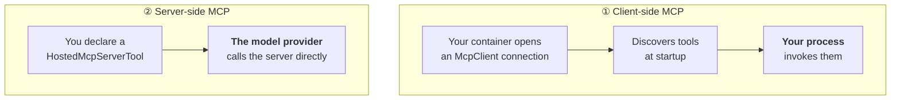

# 🧪 Lab 05 — Add a Foundry Toolbox

> ⏱️ **35 min** · 📋 **Requires:** [Lab 04](04-add-tools.md) · 💰 **model/tool usage** · ☁️ **Creates 2 Azure resources + 1 toolbox definition**

Connect an agent to tools that run outside your container through Foundry Toolbox and MCP.

## What you'll learn

- Use a Foundry Toolbox instead of local functions.
- Create and set a toolbox endpoint for an agent.
- Distinguish toolbox creation from toolbox usability.
- Explain when MCP runs client-side, server-side, or behind a toolbox.

## Steps

### 1. Pick the right sample

Python uses the verified Foundry Toolbox sample:

```bash
mkdir 03-toolbox && cd 03-toolbox
azd ai agent init -m "https://github.com/microsoft-foundry/foundry-samples/blob/main/samples/python/hosted-agents/agent-framework/responses/04-foundry-toolbox/azure.yaml"
```

C# has a live MCP sample:

```bash
mkdir 03-mcp && cd 03-mcp
azd ai agent init -m "https://github.com/microsoft-foundry/foundry-samples/blob/main/samples/csharp/hosted-agents/agent-framework/mcp-tools/azure.yaml"
```

> [!WARNING]
> The Python catalog advertises a `03-mcp` sample at
> `…/agent-framework/responses/03-mcp/azure.yaml`, but that path **404s** (verified
> 2026-08-08). The Python track here uses the `04-foundry-toolbox` sample instead.

Local sample READMEs: [Python](../../samples/python/03-mcp-toolbox/) and
[C#](../../samples/csharp/03-mcp-toolbox/).

> [!IMPORTANT]
> **`init` nests a folder named after the sample — `cd` into it before anything else.** The
> `mkdir` above is not where `azure.yaml` lands. Read the
> `Copying template code from local path to:` line in your own output for the name, then `cd`
> into it and confirm with `ls azure.yaml`. Running `azd provision` from the outer folder fails
> with `ERROR: no project exists; to create a new project, run 'azd init'`. Full explanation in
> [Lab 02 § 2](02-first-agent.md#2-init--scaffold).

### 2. Inspect the Python toolbox code

External tools make the server async because tool connections are I/O-bound.

```python
import asyncio
from agent_framework_foundry_hosting import FoundryToolbox, ResponsesHostServer

async def main():
    credential = DefaultAzureCredential()

    toolbox = FoundryToolbox(credential)

    client = FoundryChatClient(
        project_endpoint=os.environ["FOUNDRY_PROJECT_ENDPOINT"],
        model=os.environ["AZURE_AI_MODEL_DEPLOYMENT_NAME"],
        credential=credential,
    )

    agent = Agent(
        client=client,
        instructions="You are a friendly assistant. Keep your answers brief.",
        tools=toolbox,
        default_options={"store": False},
    )

    await ResponsesHostServer(agent).run_async()

if __name__ == "__main__":
    asyncio.run(main())
```

| Change vs local tools | Why |
|---|---|
| `async def main()` + `run_async()` | tool connections are I/O-bound |
| `tools=toolbox` | the toolbox enumerates its own tools |
| shared `credential` | one identity for model and tools |

`azure.yaml` adds one variable:

```yaml
environmentVariables:
    - name: AZURE_AI_MODEL_DEPLOYMENT_NAME
      value: ${AZURE_AI_MODEL_DEPLOYMENT_NAME}
    - name: TOOLBOX_ENDPOINT
      value: ${TOOLBOX_ENDPOINT}
```

### 3. Provision and set the model name

```bash
azd provision
azd env set AZURE_AI_MODEL_DEPLOYMENT_NAME gpt-5.4-mini
```

### 4. Install the toolbox extension if needed

`azd ai toolbox` lives in a separate extension from `azd ai agent`.

```bash
azd extension install azure.ai.toolboxes
```

If you did not install it up front, the first toolbox command prompts interactively:

```text
Command 'ai toolbox' was not found, but there's an available extension that provides it
Id: azure.ai.toolboxes   Name: Foundry Toolboxes (Beta)
```

### 5. Create the toolbox

The vendored `src/toolbox-agent/toolbox.yaml` declares `web_search`, `code_interpreter`, and
four MCP servers.

```bash
cd src/toolbox-agent
azd ai toolbox create agent-tools --from-file ./toolbox.yaml
```

<details open>
<summary>✅ Verified output</summary>

```text
2026/08/08 17:07:15 toolbox create: resolved project endpoint https://cog-56mzb54ouruu6.services.ai.azure.com/api/projects/rdpy (source=azdEnv)
Created toolbox agent-tools at version 1.
Endpoint: https://cog-56mzb54ouruu6.services.ai.azure.com/api/projects/rdpy/toolboxes/agent-tools/versions/1/mcp?api-version=v1
exit_code=0
```
</details>

Set the endpoint printed by `create` or `show`:

```bash
azd ai toolbox show agent-tools
azd env set TOOLBOX_ENDPOINT "<endpoint from show>"
```

The endpoint shape is version-pinned: `/toolboxes/<name>/versions/<n>/mcp`. Toolbox versions
are immutable; adding or removing a connection creates a new version. Promote one with:

```bash
azd ai toolbox publish <toolbox> <version>
azd ai toolbox versions <toolbox>
```

### 6. Do not trust a green `create`

This is the important finding: **`azd ai toolbox create` can succeed with exit code 0 even when
the Foundry project has none of the connections referenced by `toolbox.yaml`.**

Three of the six tools in the Python sample reference project connections by name:
`ghmcppat`, `langmcpconn`, and `foundrymcpconn`.

```bash
./scripts/list-foundry-connectors.sh        # or .ps1 on Windows
```

Creation packages a definition. It does **not** prove every referenced tool can run. Bad
connection names fail later, at **invoke time**, which is much harder to debug.

For a first run, trim `toolbox.yaml` to tools that need no connection: `web_search`,
`code_interpreter`, and the no-auth `noauth_mcp` server.

### 7. Check wiring, run, and invoke

```bash
azd ai agent doctor
```

`doctor` has a dedicated check: **Manifest toolboxes have endpoint env vars set**. It is
`failed` when the manifest declares a toolbox but `TOOLBOX_ENDPOINT` is missing.

```bash
azd ai agent run --no-client
azd ai agent invoke --local "Search for the latest Microsoft Foundry release notes."
```

### 8. Deploy

```bash
azd deploy
azd ai agent invoke "Search for the latest Microsoft Foundry release notes."
```

> [!IMPORTANT]
> External tools need **permissions**. The deployed agent uses its own managed identity
> (`instance_identity.principal_id` from `azd ai agent show --output json`), not your user
> account. If a tool works locally but fails once deployed, grant that principal the role it
> needs.

### 9. Compare C# MCP patterns

The C# sample wires two MCP patterns side by side against Microsoft Learn.



| | Client-side | Server-side |
|---|---|---|
| Connection | your container → MCP server | provider → MCP server |
| Invoked by | your process | the Responses API |
| Discovery | `ListToolsAsync()` at startup | declared by name |
| Network path | reachable from your container | reachable from Azure |
| Control | full — intercept, log, wrap | minimal |

Always set `AllowedTools`, and keep human approval on for anything that writes, spends or
sends.

### 10. Clean up

```bash
azd down --force --purge
```

## ✅ Checkpoint

You should now be able to run `doctor` and see the toolbox endpoint check pass.

```bash
azd ai agent doctor
```

<!-- illustrative: exact pass/skip counts vary with project state and connection trimming. -->
```text
Local
   (✓) azd extension reachable
   (✓) azure.yaml present and parseable
   (✓) azd environment selected
   (✓) agent service in azure.yaml
   (✓) FOUNDRY_PROJECT_ENDPOINT set
   (✓) agent definition valid (per service)
   (✓) manual env vars set
   (✓) Manifest toolboxes have endpoint env vars set

Authentication
   (✓) authentication

Remote
   (✓) Foundry project endpoint reachable
   (✓) Developer has required role on Foundry project
   (✓) Hosted agents are active
```

If you see something else, jump to *If that didn't work* below.

## 🔧 If that didn't work

| Symptom | Cause | Fix |
|---|---|---|
| Toolbox command prompts to install an extension | `azure.ai.toolboxes` is separate from `azure.ai.agents`. | Run `azd extension install azure.ai.toolboxes`. |
| `doctor` fails the toolbox endpoint check | `TOOLBOX_ENDPOINT` is missing or stale. | Run `azd ai toolbox show agent-tools`, then `azd env set TOOLBOX_ENDPOINT "<endpoint>"`. |
| `toolbox create` succeeded but invoke fails | The toolbox references project connections that do not exist. | List connections and trim or fix `toolbox.yaml`; then create a new version. |
| Works locally but fails after deploy | The hosted agent's managed identity lacks permission. | Grant roles to `instance_identity.principal_id` from `azd ai agent show --output json`. |

Everything else: [troubleshooting](../reference/troubleshooting.md).

## ✏️ Exercise

Run or inspect `azd ai toolbox create` and predict: does exit code `0` prove every tool in the
box can be invoked?

<details>
<summary>Solution</summary>

No. The verified live run showed `Created toolbox agent-tools at version 1` and `exit_code=0`
against a project missing the named connections. Creation validates enough to package a toolbox
definition. Connection references are resolved later when the agent invokes a tool, so the real
proof is `doctor` plus an actual invoke that exercises the tool.
</details>

## → Next

[Reference — look up commands and troubleshooting](../reference/README.md)

---

<sub>[← Add tools](04-add-tools.md) · [🧪 Tutorial index](README.md) · [Evaluate →](06-evaluate.md)</sub>
