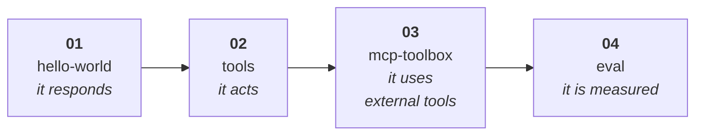

# 🧪 Samples — the progressive ladder

Four steps, each adding exactly one idea. Same ladder in **Python** and **C#**.



| # | Sample | New idea | Upstream template |
|---|---|---|---|
| **01** | [hello-world](python/01-hello-world/) | a hosted agent is just an HTTP server | `agent-framework/responses/01-basic` |
| **02** | [tools](python/02-tools/) | local Python/C# functions as tools | `agent-framework/responses/02-tools` |
| **03** | [mcp-toolbox](python/03-mcp-toolbox/) | MCP servers + Foundry Toolbox | `agent-framework/responses/03-mcp`, `04-foundry-toolbox` |
| **04** | [eval](python/04-eval/) | measure quality, then improve it | `azd ai agent eval` |

## Languages

| | Python | C# |
|---|---|---|
| Path | [`samples/python/`](python/) | [`samples/csharp/`](csharp/) |
| Runtime | `python_3_13` / `python_3_14` | `dotnet_10` |
| Entry point | `main.py` | `<Project>.dll` |
| Deps | `requirements.txt` | `.csproj` |
| Upstream samples | 21 | 13 |

Python has broader third-party framework coverage (LangGraph, OpenAI Agents SDK, Pydantic AI,
Claude Agent SDK, Copilot SDK). C# focuses on Agent Framework.

---

## Before you start

```bash
azd version                 # must be >= 1.27.1
azd extension upgrade --all
az login && azd auth login
```

Full setup → [docs/setup](../docs/setup/README.md).

---

## Two ways to use these samples

### A. Read them here, scaffold from upstream *(recommended)*

Each sample folder explains the concept and annotates the code. To get a **runnable, fully
wired project**, scaffold the upstream template:

```bash
mkdir my-agent && cd my-agent
azd ai agent init -m "<manifestUrl from the sample README>"
```

This guarantees you get the current manifest format, `Dockerfile`, `.agentignore` and
`.env.example` that match your installed extension version.

### B. Copy the files

Every sample folder is self-contained (`azure.yaml` + source + deps). Copy it, then:

```bash
azd env set AZURE_SUBSCRIPTION_ID <id>
azd env set AZURE_LOCATION eastus2
azd provision
azd env set AZURE_AI_MODEL_DEPLOYMENT_NAME gpt-5.4-mini
azd ai agent run
```

> [!NOTE]
> Option A is preferred because the toolkit is in **preview** and manifest details shift between
> extension versions. The samples here are pinned to `azure.ai.agents 1.0.0-beta.9`.

---

## The loop you will repeat

```bash
azd ai agent run --no-client            # terminal 1  → http://localhost:8088
azd ai agent invoke --local "hello"     # terminal 2
azd deploy                              # ship it
azd ai agent invoke "hello"             # test for real
azd down --force --purge                # ⚠️ always clean up
```

---

## 💰 Cost

The ladder creates **one** Cognitive Services account + project and a `gpt-5.4-mini`
`GlobalStandard` deployment at capacity 10. Charges are token-based plus hosted-agent compute
(`0.5 vCPU / 1Gi` in these samples).

Verified timings: provision **1m25s**, deploy **2m3s**, teardown **2m11s**.

> [!CAUTION]
> Always finish with `azd down --force --purge`. Without `--purge` the account is soft-deleted
> for 48 h and keeps its name, which blocks re-provisioning.
