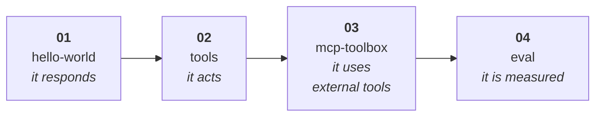

# 🧪 Samples — the progressive ladder

These folders are meant to be cloned and run. Start with the checked-in sample; scaffold from
upstream only when you want the newest preview template instead of this repo's verified shape.



| # | Python | C# | New idea |
|---|---|---|---|
| **01** | [hello-world](python/01-hello-world/) | [hello-world](csharp/01-hello-world/) | a hosted agent is just an HTTP server |
| **02** | [tools](python/02-tools/) | [tools](csharp/02-tools/) | local functions as tools |
| **03** | [mcp-toolbox](python/03-mcp-toolbox/) | [mcp-toolbox](csharp/03-mcp-toolbox/) | MCP servers / Foundry Toolbox |
| **04** | [eval](python/04-eval/) | [eval](python/04-eval/) | measure quality, then improve it |

C# has three code rungs. Step 04 is `azd ai agent eval`, which is CLI-level and
language-agnostic; the C# overview explains that rather than duplicating the same eval folder.

## Before you start

```bash
azd version                 # must be >= 1.27.1
azd extension upgrade --all
az login && azd auth login
```

Full setup: [docs/tutorial/01-setup.md](../docs/tutorial/01-setup.md).

## Default path: clone and run this repo

Each sample folder is self-contained: `azure.yaml`, source, dependencies, Dockerfile, and local
`.env.example` where that runtime uses one.

```bash
git clone https://github.com/shinyay/getting-started-with-foundry-toolkit.git
cd getting-started-with-foundry-toolkit/samples/python/01-hello-world
azd env set AZURE_SUBSCRIPTION_ID <id>
azd env set AZURE_LOCATION eastus2
azd provision
azd env set AZURE_AI_MODEL_DEPLOYMENT_NAME gpt-5.4-mini
azd ai agent run --no-client
```

In a second terminal:

```bash
azd ai agent invoke --local "hello"
```

Then deploy or clean up:

```bash
azd deploy
azd ai agent invoke "hello"
azd down --force --purge
```

## Alternative: scaffold from upstream

Use upstream scaffolding when your installed extension is newer than this repo's pinned,
verified preview shape (`azure.ai.agents 1.0.0-beta.9`) and you want the latest manifest,
Dockerfile, ignore files, and generated env files.

```bash
mkdir my-agent && cd my-agent
azd ai agent init -m "<manifestUrl from the sample README>"
```

Tradeoff: upstream gives you the current template for your extension version; this repo gives
you a known, annotated, verified ladder. If the preview format shifts, scaffold upstream first
and compare it with the corresponding folder here.

## The loop you will repeat

```bash
azd ai agent run --no-client            # terminal 1 → http://localhost:8088
azd ai agent invoke --local "hello"     # terminal 2
azd deploy                              # ship it
azd ai agent invoke "hello"             # test the hosted version
azd down --force --purge                # always clean up
```

## 💰 Cost

The ladder creates one Cognitive Services account plus project and a `gpt-5.4-mini`
`GlobalStandard` deployment at capacity 10. Charges are token-based plus hosted-agent compute
(`0.5 vCPU / 1Gi` in these samples).

Verified timings from the Python `01-hello-world` reference run (2026-08-08): provision
**1m20s**, deploy **2m21s**, first invoke **14.242s**, teardown **1m46s**. Every measured figure
in this repo lives in one place — [reference → Verified runs](../docs/reference/README.md#verified-runs).

> [!CAUTION]
> Always finish with `azd down --force --purge`. Without `--purge`, the account is soft-deleted
> for 48 hours and keeps its name, which blocks re-provisioning.
