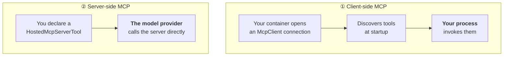

# 03 · MCP tools (C#)

> **New idea:** tools you didn't write — and **two different places they can run**.

This is the best sample in the whole catalog for understanding MCP, because it wires up both
patterns side by side against the same server (Microsoft Learn).

```bash
mkdir 03-mcp && cd 03-mcp
azd ai agent init -m "https://github.com/microsoft-foundry/foundry-samples/blob/main/samples/csharp/hosted-agents/agent-framework/mcp-tools/azure.yaml"
```

> The Python catalog advertises an equivalent `03-mcp` sample, but that URL **404s**
> (verified 2026-08-08). This C# sample is live — it is currently the best MCP reference in
> the catalog.

---

## Two layers of MCP



| | ① Client-side | ② Server-side |
|---|---|---|
| Connection | your container → MCP server | provider → MCP server |
| Invoked by | your process | the Responses API |
| Discovery | `ListToolsAsync()` at startup | declared by name |
| Network path | must be reachable **from your container** | must be reachable **from Azure** |
| Control | full — intercept, log, wrap | minimal |
| Latency | one extra hop through you | direct |
| Use when | private servers, auth you control, need to observe calls | public servers, lowest latency |

---

## The code

```csharp
// ── ① Client-side: your process connects and invokes ──────────────────
await using var learnMcp = await McpClient.CreateAsync(new HttpClientTransport(new()
{
    Endpoint = new Uri("https://learn.microsoft.com/api/mcp"),
    Name = "Microsoft Learn (client)",
}));

var clientTools = await learnMcp.ListToolsAsync();

// ── ② Server-side: the provider connects and invokes ──────────────────
AITool serverTool = new HostedMcpServerTool(
    serverName: "microsoft_learn_hosted",
    serverAddress: "https://learn.microsoft.com/api/mcp")
{
    AllowedTools = ["microsoft_docs_search"],                       // ← allowlist
    ApprovalMode = HostedMcpServerToolApprovalMode.NeverRequire     // ← no human gate
};

// ── Both at once ──────────────────────────────────────────────────────
List<AITool> allTools = [.. clientTools.Cast<AITool>(), serverTool];

AIAgent agent = new AIProjectClient(projectEndpoint, new DefaultAzureCredential())
    .AsAIAgent(model: deployment, instructions: """…""", name: "mcp-tools", tools: allTools);
```

Note `await using` — the client connection is disposed at shutdown. And `#pragma warning disable
MEAI001`: `HostedMcpServerTool` is still **experimental**.

### `AllowedTools` and `ApprovalMode`

| Property | Why it matters |
|---|---|
| `AllowedTools` | allowlist. Without it the model can reach *every* tool the server exposes |
| `ApprovalMode = NeverRequire` | no human gate — appropriate for read-only docs search, **not** for writes |

> [!WARNING]
> An MCP server is remote code you don't control. Always set `AllowedTools`, and keep human
> approval on for anything that writes, spends or sends.

---

## Extra packages

```xml
<PackageReference Include="ModelContextProtocol" Version="1.2.0" />
<PackageReference Include="Microsoft.Extensions.AI.OpenAI" Version="10.6.0" />
```

---

## Run it

```bash
azd provision
azd env set AZURE_AI_MODEL_DEPLOYMENT_NAME gpt-5.4-mini
azd ai agent run --no-client
```

Startup prints what was discovered:

```text
Connecting to Microsoft Learn MCP server (client-side)...
Client-side MCP tools: microsoft_docs_search, microsoft_docs_fetch
Server-side MCP tool: microsoft_docs_search (via HostedMcpServerTool)
```

```bash
azd ai agent invoke --local "How do I deploy a hosted agent to Microsoft Foundry?"
```

---

## Deploy

```bash
azd deploy
azd ai agent invoke "What is the Responses protocol?"
azd ai agent monitor -f
```

> [!IMPORTANT]
> **Network reachability differs between the two patterns.** Client-side MCP needs the server
> reachable from *your container*; server-side MCP needs it reachable from *Azure*. A private
> MCP server behind your corporate network works client-side but not server-side.
>
> And remember the deployed agent authenticates as its **own managed identity**
> (`instance_identity.principal_id` from `azd ai agent show --output json`), not your user
> account.

---

## Clean up

```bash
azd down --force --purge
```

---

## MCP in VS Code

Agent Builder makes MCP first-class: a featured catalog, connect-existing (`stdio` or HTTP+SSE),
scaffold a new server in Python/TypeScript (`F5` → *Debug in Agent Builder*), and reuse tools
already installed in VS Code. See
[guide-gui §4](../../../docs/guide-gui/README.md#4-agent-builder--prompt-agents).

---

👉 Next: [04 · Evaluation](../../python/04-eval/) — language-agnostic.

---

## Provenance

This sample is **adapted from upstream**, not invented here. Exact mapping so you can diff it:

| | |
|---|---|
| **Upstream path** | [`csharp/hosted-agents/agent-framework/mcp-tools`](https://github.com/microsoft-foundry/foundry-samples/tree/main/samples/csharp/hosted-agents/agent-framework/mcp-tools) |
| **Upstream source dir** | `src/mcp-tools` |
| **Source dir here** | `src/mcp-tools` |
| **Deviations** | `azure.yaml` reindented/reordered; directory name unchanged from upstream. |

Everything under `src/` other than `azure.yaml` is **byte-identical** to upstream output.
Regenerate the original at any time with `azd ai agent init -m "<upstream azure.yaml URL>"`.
