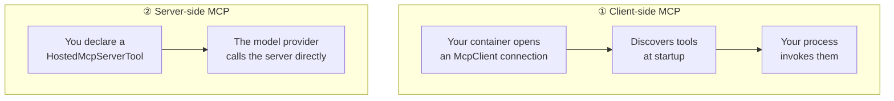

# 03 · MCP tools (C#)

> ⏱️ **25 min** · 📋 **Requires:** [02 · Tools](../02-tools/) · 💰 **token + hosted-agent compute** · ☁️ **Creates 2 Azure resources**

Use Microsoft Learn MCP tools from both your container and the model provider side.

## What you'll learn

- Distinguish client-side MCP from server-side hosted MCP tools.
- Allowlist remote MCP tools instead of exposing an entire server.
- Understand why network reachability differs locally and in Azure.
- Follow the language-agnostic eval step after the C# code ladder.

## Steps

### 1. Open this sample

```bash
cd samples/csharp/03-mcp-toolbox
```

The Python catalog advertises an equivalent `03-mcp` sample, but that URL **404s** (verified
2026-08-08). This C# sample is live and is the MCP reference in the ladder.

### 2. Inspect the two MCP layers



| | Client-side | Server-side |
|---|---|---|
| Connection | your container → MCP server | provider → MCP server |
| Invoked by | your process | the Responses API |
| Discovery | `ListToolsAsync()` at startup | declared by name |
| Network path | reachable from your container | reachable from Azure |
| Control | intercept, log, wrap | minimal |

### 3. Inspect the code

```csharp
await using var learnMcp = await McpClient.CreateAsync(new HttpClientTransport(new()
{
    Endpoint = new Uri("https://learn.microsoft.com/api/mcp"),
    Name = "Microsoft Learn (client)",
}));

var clientTools = await learnMcp.ListToolsAsync();

AITool serverTool = new HostedMcpServerTool(
    serverName: "microsoft_learn_hosted",
    serverAddress: "https://learn.microsoft.com/api/mcp")
{
    AllowedTools = ["microsoft_docs_search"],
    ApprovalMode = HostedMcpServerToolApprovalMode.NeverRequire
};

List<AITool> allTools = [.. clientTools.Cast<AITool>(), serverTool];
```

Always set `AllowedTools`. Keep human approval on for anything that writes, spends, or sends.
`HostedMcpServerTool` is still experimental, so the source suppresses `MEAI001`.

### 4. Provision and run locally

```bash
azd env set AZURE_SUBSCRIPTION_ID <id>
azd env set AZURE_LOCATION eastus2
azd provision
azd env set AZURE_AI_MODEL_DEPLOYMENT_NAME gpt-5.4-mini
azd ai agent run --no-client
```

Startup prints the discovered tool names. This block is illustrative, not a verified capture:

```text
Connecting to Microsoft Learn MCP server (client-side)...
Client-side MCP tools: microsoft_docs_search, microsoft_docs_fetch
Server-side MCP tool: microsoft_docs_search (via HostedMcpServerTool)
```

Then invoke from a second terminal:

```bash
azd ai agent invoke --local "How do I deploy a hosted agent to Microsoft Foundry?"
```

### 5. Deploy, monitor, and clean up

```bash
azd deploy
azd ai agent invoke "What is the Responses protocol?"
azd ai agent monitor -f
azd down --force --purge
```

Client-side MCP needs the server reachable from your container; server-side MCP needs it
reachable from Azure. A private MCP server behind a corporate network can work in one pattern
and fail in the other.

## ✅ Checkpoint

From this directory, verify that the manifest points at a real source folder:

```bash
python3 -c "import os,yaml; d=yaml.safe_load(open('azure.yaml')); s=d['services']['mcp-tools']; print(s['project'], os.path.isdir(s['project']))"
```

```text
src/mcp-tools True
```

If you see something else, jump to *If that didn't work* below.

## 🔧 If that didn't work

| Symptom | Cause | Fix |
|---|---|---|
| Client-side MCP fails locally. | The container cannot reach the MCP endpoint. | Check network access to `https://learn.microsoft.com/api/mcp`. |
| Server-side MCP fails after deploy. | Azure/provider-side reachability differs from local container reachability. | Use a public endpoint or switch to client-side MCP for private servers. |
| Tool list is broader than expected. | No allowlist or the wrong allowlist was used. | Keep `AllowedTools = ["microsoft_docs_search"]` for this sample. |

## ✏️ Exercise

Predict which side is more likely to work with a private MCP server reachable only from your
corporate network: client-side or server-side.

<details>
<summary>Solution</summary>

Client-side is more likely if the deployed container has the needed network path. Server-side
requires the model provider/Azure service path to reach the server directly.
</details>

## Provenance

This sample is **adapted from upstream**, not invented here. Exact mapping so you can diff it:

| | |
|---|---|
| **Upstream path** | [`csharp/hosted-agents/agent-framework/mcp-tools`](https://github.com/microsoft-foundry/foundry-samples/tree/main/samples/csharp/hosted-agents/agent-framework/mcp-tools) |
| **Upstream source dir** | `src/mcp-tools` |
| **Source dir here** | `src/mcp-tools` |
| **Deviations** | `azure.yaml` reindented/reordered; directory name unchanged from upstream. |

Everything under `src/` other than `azure.yaml` is **byte-identical** to upstream output.
Regenerate the original at any time with `azd ai agent init -m "<upstream azure.yaml URL>"`.

## → Next

[04 · Evaluation](../../python/04-eval/)
