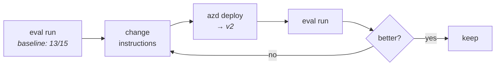

# 04 · Evaluation

> **New idea:** stop guessing whether a prompt change helped. Get a number.

This step needs a **deployed** agent (any of 01–03).

---

## Generate an eval suite

```bash
azd ai agent eval generate --no-prompt \
  --gen-instruction "Generate 5 short factual questions a developer new to Microsoft Foundry would ask an assistant agent."
```

One of these is **required** — a bare `eval generate` fails:

| Flag | Use |
|---|---|
| `--gen-instruction` | describe the tests in prose *(easiest)* |
| `--gen-instruction-file` | same, from a file |
| `--config` | full YAML config |
| `--dataset` + `--evaluators` | bring your own |

What lands on disk:

```text
src/<project>/
├── eval.yaml                                    ← the suite definition
├── datasets/smoke-core/smoke-core_dg.jsonl      ← LLM-authored test cases
├── evaluators/smoke-core/rubric_dimensions.json ← weighted rubric
└── .agent_configs/baseline/metadata.yaml        ← the config being measured
```

---

## `eval.yaml`

```yaml
name: smoke-core
agent:
    name: hello-world
    kind: hosted
    version: "1"
    config: .agent_configs/baseline/metadata.yaml
dataset:
    name: smoke-core
    version: "1.0"
    local_uri: datasets/smoke-core
evaluators:
    - name: smoke-core
      version: "1"
      local_uri: evaluators/smoke-core/rubric_dimensions.json
options:
    eval_model: gpt-5.4-mini
max_samples: 15
```

`agent.version` pins **which deployed version** is measured — so you can compare `:1` against
`:2` rather than overwriting your baseline.

---

## The dataset is intents, not strings

```json
{
  "id": 1,
  "description": "Test whether the assistant answers a very short identity question at the
   correct level of specificity, using only what is supported by the assistant spec…"
}
```

Each row is a *scenario to generate*, not a fixed prompt. Cases are synthesised from your
agent's own `description` and instructions, so they stay relevant as the agent changes.

## The rubric is weighted dimensions

Real generated output (see [`evaluators/rubric_dimensions.json`](evaluators/rubric_dimensions.json)):

| Dimension | Weight | Checks |
|---|---:|---|
| `foundry_answer_accuracy` | 10 | factually correct, no unsupported claims |
| `procedural_accuracy` | 6 | correct steps, no invented UI labels or paths |
| `scope_discipline` | 5 | stays on topic, no tangents |
| `general_quality` | 5 | catch-all (`always_applicable: true`) |
| `beginner_friendly_clarity` | 4 | plain language |
| `uncertainty_hygiene` | 3 | hedges instead of asserting false precision |

**Edit this file.** It is the highest-leverage knob in the whole eval system — it encodes what
"good" means for *your* agent.

---

## Run it

```bash
azd ai agent eval run --no-prompt
```

<details open>
<summary>✅ Verified output — 3 min 15 s</summary>

```text
Eval run started
   Eval: eval_8733d703d074418c826f4d9529c6b635
   Run:  evalrun_3f2742f28aa343d5a8e8408c246058e7
   Report: https://ai.azure.com/nextgen/r/…/evaluations/eval_…/run/evalrun_…

(✓) Done  Eval run  (3m 15s)

Name:       smoke-core
Status:     Completed
Agent:      hello-world v1

Results:    15 total, 13 passed, 2 failed, 0 errored

Per-criteria results:
  smoke-core: 13 passed, 2 failed, 0 errored
```
</details>

13/15 on a stock sample is normal — the generated rubric is deliberately strict. The value is
the **repeatable number**, not the absolute score.

> [!TIP]
> Open the **Report URL**. The portal shows per-case pass/fail *with the rubric's reasoning*,
> which is what actually tells you how to improve.

---

## The improvement loop



```bash
azd ai agent eval list      # history
azd ai agent eval show      # one run in detail
azd ai agent eval update    # push edited rubric/dataset
```

---

## Let the optimizer do it

`optimize` runs that loop for you — generating candidate instructions and scoring each:

```bash
azd ai agent optimize \
  --agent hello-world \
  --eval-model gpt-5.4-mini \
  --optimize-model gpt-5.4 \
  --evaluator smoke-core \
  --max-candidates 5
```

| Flag | Notes |
|---|---|
| `--eval-model` | **required** — scores candidates |
| `--optimize-model` | **required** — writes them; gpt-5 family recommended |
| `--evaluator` | repeatable |
| `--max-candidates` | ≥1, default 5 |
| `--no-wait` | submit and return |

> [!IMPORTANT]
> Agent Optimizer requires the **`responses`** protocol. `invocations` agents cannot use it.

---

## GUI equivalent

**Monitor → Evaluation** in VS Code: built-in + custom evaluators, datasets, metrics. Mock tool
responses defined in Agent Builder are **reusable here**, giving deterministic tool behaviour
while you tune instructions.

There is **no GUI equivalent of `optimize`** — that is CLI-only.

---

## Clean up

```bash
azd down --force --purge
```

---

## 🎓 You've finished the ladder

| Step | You learned |
|---|---|
| 01 | an agent is an HTTP server speaking a protocol |
| 02 | tools are decorated functions; docstrings are prompts |
| 03 | external tools need identity and permissions |
| 04 | quality is measurable, and improvement can be automated |

**Where to go next**

- [Reference](../../../docs/reference/) — schema, CLI, env vars, troubleshooting
- [Sample catalog](../../../docs/reference/sample-catalog.md) — 34 upstream samples, incl.
  LangGraph, OpenAI Agents SDK, Claude Agent SDK, workflows, human-in-the-loop
- [GUI guide](../../../docs/guide-gui/README.md) — the same journey in VS Code
